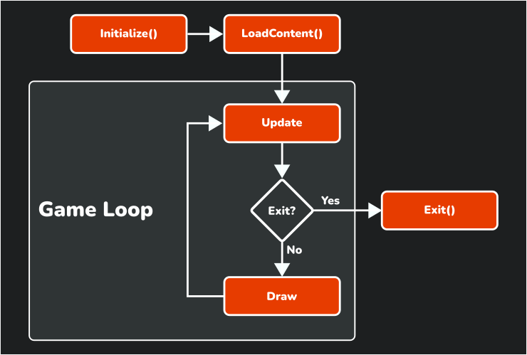

import GameLoopDemo from '../../../components/GameLoopDemo.astro';
import pong from '../../../assets/session01/pong.gif';

Quick Pong introduction. Show GIF of final Pong game. Link to source code.

## Today's Goal

"Make it work". We end up with a working, very basic game. The implementation will be
"naive" in the sense that it doesn't consider good practices in terms of architecture and
design, but it keeps things simple and gets us to a working prototype relatively quickly.

By the end of the session, we will have a basic Pong game with:

- A basic update loop
- Rendering
- Collision detection
- Input
- Basic state management
- Audio

## MonoGame

- [What is MonoGame?](https://docs.monogame.net/articles/tutorials/building_2d_games/01_what_is_monogame/index.html)
- [Getting Started](https://docs.monogame.net/articles/tutorials/building_2d_games/02_getting_started/index.html)
- [The Game1 File](https://docs.monogame.net/articles/tutorials/building_2d_games/03_the_game1_file/index.html)

## Game Loop

- [Game Loop Pattern](https://gameprogrammingpatterns.com/game-loop.html)
- [Update Method Pattern](https://gameprogrammingpatterns.com/update-method.html)

_Figure 1-1: Lifecycle of a MonoGame game_

For a more comprehensible explanation of the MonoGame game loop, see
[What is the Game Loop](https://docs.monogame.net/articles/getting_to_know/whatis/game_loop/index.html).

You own the loop (unlike in Unity). This means that you have to manually call update, it is
not done for you.

### Try it

Lower the tick rate and compare the two lanes. Both simulations run at the same rate. The
bottom lane blends the last two ticks using `accumulator / dt`, so its motion looks smooth
even when the simulation updates only a few times per second.

<GameLoopDemo />

## Content Pipeline

## Drawing Sprites

- MG Coordinate System

- [What is a sprite?](https://docs.monogame.net/articles/getting_to_know/whatis/graphics/WhatIs_Sprite.html)

## Drawing Text

## DeltaTime & Velocity

## Game State

## Encapsulation

## Collision Detection

## Sound Effects

You can make your own 8-bit style sound effects using [bfxr.net](https://www.bfxr.net/).

## Knowledge Test

What is the difference between a game engine and a framework?

A game engine is a complete solution for game development, while a framework is a set of
tools and libraries that provide a foundation for game development.

