import pong from '../../../assets/session01/pong.gif';


## Today's Goal

Make a **table tennis game**, like Pong: two paddles, one ball, and the first to ten points
wins.

**"Make it work."** We end up with a working, very basic game. The implementation is
deliberately _naive_. It ignores good architecture and design practices, which keeps things
simple and gets us to a working prototype quickly. The rest of the course is about making
games like this one _better_ as they grow.

<figure class="original">

<figcaption>The original: <em>Pong</em> (Atari, 1972). Image: pong74ls, derivative work by WikiJunkie, <a href="https://commons.wikimedia.org/wiki/File:Pong_Game_Test2.gif">CC BY 3.0</a>, via Wikimedia Commons.</figcaption>
</figure>

This session is about the game loop. Every game runs the same cycle many times a second.
It reads the input, updates the game and draws it. MonoGame runs that loop for us, and we fill
it in, first all in `Game1`, and later with the Update Method pattern. By the end of the
session, we will have a game with:

- An update loop
- Primitive graphics
- Collision detection
- Hardcoded input
- Crude state management
- Homemade 8-bit audio

**Source code:** [gar-games/01-pong](https://github.com/Metamate/gar-games/tree/main/01-pong)

## Prepare

- [Building 2D Games](https://docs.monogame.net/articles/tutorials/building_2d_games/index.html), MonoGame's own tutorial. It builds one game from
  start to finish, so the sessions link the chapters that match their topics, and the rest is
  there when you need it.
- [01: What Is MonoGame?](https://docs.monogame.net/articles/tutorials/building_2d_games/01_what_is_monogame)
- [03: The Game1 File](https://docs.monogame.net/articles/tutorials/building_2d_games/03_the_game1_file)
- [Game Loop](https://gameprogrammingpatterns.com/game-loop.html) (Game Programming Patterns)
- [Update Method](https://gameprogrammingpatterns.com/update-method.html) (Game Programming Patterns)
- Optional: [02: Getting Started](https://docs.monogame.net/articles/tutorials/building_2d_games/02_getting_started),
  for background. Install only the tooling [below](#monogame--tooling): our projects
  build their content with `Builder.cs`, so you don't need the MonoGame templates, the
  VS Code extension or the MGCB Editor.

## MonoGame & Tooling

MonoGame is a _framework_. It gives us libraries for graphics, input, audio, content loading
and math, but it has no editor, scene graph or entity system, as a game engine has. We
write those parts ourselves, which makes it a good fit for a course about game architecture.

Tooling used in the course:

- [.NET 10 SDK](https://dotnet.microsoft.com/download)
- VS Code with the C# Dev Kit extension
- Git
- The course's games, in one repository on GitHub:
  [gar-games](https://github.com/Metamate/gar-games). Each game's code is split into steps,
  one project per exercise.

## Game Loop

Every game runs a loop: process input, update the simulation, render, repeat. In MonoGame,
the `Game` class runs the loop and calls your `Update` and `Draw` overrides.

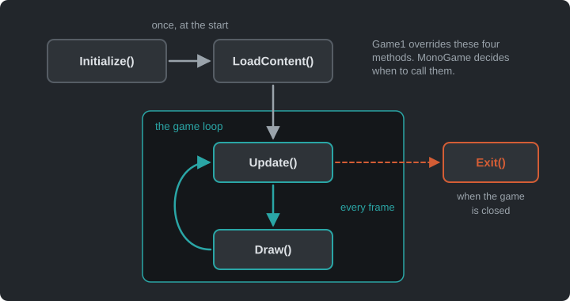

Nothing calls `Update` on your objects for you. `Game1` gets one `Update` and one `Draw`
call per frame, and everything else in your game only runs if you call it from there. For more detail, see
[What is the Game Loop](https://docs.monogame.net/articles/getting_to_know/whatis/game_loop/index.html).

`Update` changes the state of the world, and `Draw` only reads that state and renders it.
Because they are kept apart, the simulation and the rendering can run at different rates,
which is the idea behind a fixed timestep.

Rendering itself uses a _double buffer_: we draw into a back buffer that isn't visible,
and MonoGame presents it (`GraphicsDevice.Present()`, called at the end of `Draw`) so the
player never sees a half-drawn frame. See
[Double Buffer](https://gameprogrammingpatterns.com/double-buffer.html) for the pattern.

### Fixed vs. variable timestep

- **Variable timestep:** update once per rendered frame and scale all movement by the
  elapsed time (`deltaTime`). Simple, but the simulation behaves slightly differently at
  different frame rates. A long frame (the window is dragged, the computer stalls) gives a
  large `deltaTime`, and a fast object can jump straight through a thin wall in one step.
- **Fixed timestep:** update the simulation in fixed-size steps (e.g. 60 per second),
  running zero, one or several steps per rendered frame. This makes the simulation
  deterministic and stable, at the cost of some complexity. If one step takes longer than
  the time it simulates, the game falls further behind every frame; engines limit how many
  steps they catch up, and MonoGame then runs the game in slow motion. MonoGame uses a
  fixed timestep by default (`IsFixedTimeStep = true`).

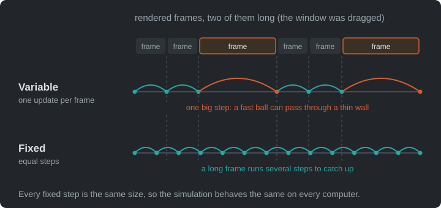

## Content Pipeline

Raw assets (fonts, images, sounds) aren't loaded directly. When the game builds, the
**content builder** converts them into an optimized format (`.xnb` files) for the target
platform, and at runtime we load them with `Content.Load<T>("name")` in `LoadContent`.

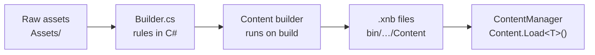
```mermaid
flowchart LR
    A["Raw assets<br/>Assets/"] --> B["Builder.cs<br/>rules in C#"] --> C["Content builder<br/>runs on build"] --> D[".xnb files<br/>bin/…/Content"] --> E["ContentManager<br/>Content.Load&lt;T&gt;()"]
```

The rules for building assets are ordinary C# in `Content/Builder/Builder.cs`. For Pong, we
need fonts and sounds:

```csharp title="Builder.cs"
public class Builder : ContentBuilder
{
    public override IContentCollection GetContentCollection()
    {
        var content = new ContentCollection();

        // A .spritefont describes a font (e.g. a .ttf next to it), a size and a set of
        // characters. The builder renders those characters into a texture.
        content.Include<WildcardRule>("*.spritefont", new FontDescriptionImporter(), new FontDescriptionProcessor
        {
            PremultiplyAlpha = true,
            TextureFormat = TextureProcessorOutputFormat.Compressed,
        });

        // Short sounds become sound effects, loaded fully into memory.
        content.Include<WildcardRule>("*.wav", new WavImporter(), new SoundEffectProcessor
        {
            Quality = ConversionQuality.Best,
        });

        return content;
    }
}
```

Each game project imports `Content/BuildContent.targets`, which runs the builder before
compiling. To add an asset, put it in `Content/Assets`; if no rule matches it, add one. All
Pong steps share that folder, and step 3 swaps the plain `sans` font for the retro `font`
in code. See
[Content Builder Project](https://docs.monogame.net/articles/getting_started/content_pipeline/content_builder_project.html).

## Drawing to the Screen

- MonoGame's 2D coordinate system has its origin in the **top-left** corner, with Y
  pointing **down**.

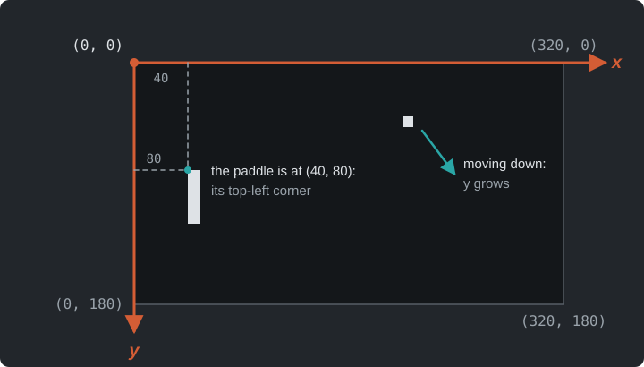

- All 2D drawing goes through a `SpriteBatch`, between `Begin()` and `End()`. `Draw` doesn't
  draw straight away. The sprite batch collects the calls, and `End()` sends them to the
  graphics card in as few batches as it can. A batch ends whenever the texture changes, which
  is why [Snake](../03-snake/#texture-atlases) puts its images in one texture. `Begin()` takes
  the settings for everything up to `End()`: the transform matrix, the texture filtering and
  the blending.
- Pong doesn't need image assets, but we still need a texture to draw rectangles. A 1×1
  white texture stretched to any `Rectangle` does the job:

```csharp
_pixel = new Texture2D(GraphicsDevice, 1, 1);
_pixel.SetData([Color.White]);

_spriteBatch.Draw(_pixel, new Rectangle(x, y, width, height), Color.White);
```

- Text is drawn with a `SpriteFont` asset and `SpriteBatch.DrawString()`.
  `MeasureString` gives the size the text will have, which is what you need to centre it:

```csharp
Vector2 size = _font.MeasureString("Hello, MonoGame!");

_spriteBatch.Begin();
_spriteBatch.DrawString(_font, "Hello, MonoGame!", new Vector2(640 - size.X / 2, 360 - size.Y / 2), Color.White);
_spriteBatch.End();
```

- The window's size is set on the `GraphicsDeviceManager` in the constructor, with
  `PreferredBackBufferWidth` and `PreferredBackBufferHeight`.
- **Texture filtering:** use `SamplerState.PointClamp` for crisp pixel art when scaling up.

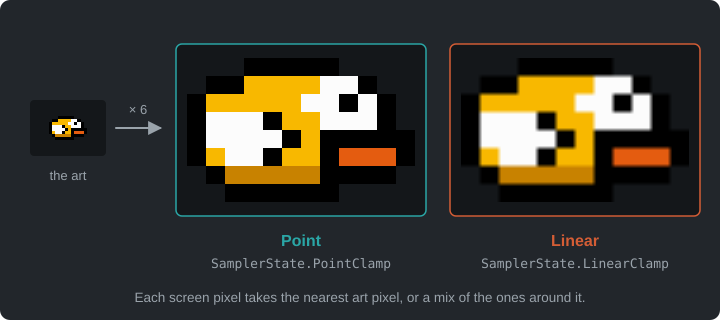

See [What is a sprite?](https://docs.monogame.net/articles/getting_to_know/whatis/graphics/WhatIs_Sprite.html).

### Virtual resolution

_Step `Pong2`_

We render the game at a fixed internal resolution, 320×180, and scale it to the window with
a transform matrix passed to `SpriteBatch.Begin()`. The game logic never needs to know how
big the window is.

`Pong2` scales by the smaller of the two ratios (window width / 320, window height / 180),
so nothing is stretched, and centres the result with `GraphicsDevice.Viewport`. Black bars
fill the rest. It recalculates when `Window.ClientSizeChanged` fires. The window opens at
1280×720, four times the virtual size. At a whole-number scale, every pixel comes out the
same size.

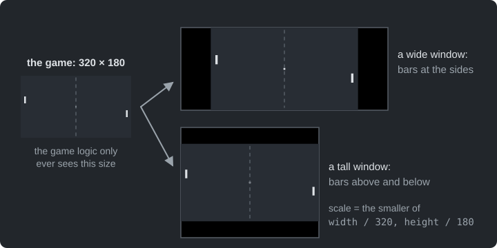

**Try it** (`Pong2`): drag the window wide, then tall. Where do the bars go? Swap
`PointClamp` for `LinearClamp`, and look at the edges of the text. Then set the virtual size
to 640×360. How big is the text now?

## Input

We poll the keyboard every frame:

```csharp
KeyboardState keyboard = Keyboard.GetState();

if (keyboard.IsKeyDown(Keys.W))
    _player1Y -= PaddleSpeed * deltaTime;
if (keyboard.IsKeyDown(Keys.S))
    _player1Y += PaddleSpeed * deltaTime;
```

MonoGame has no built-in "was this key _just_ pressed?". We emulate it by comparing with
last frame's state:

```csharp
bool enterPressed = keyboard.IsKeyDown(Keys.Enter) && !_previousKeyboard.IsKeyDown(Keys.Enter);
_previousKeyboard = keyboard;
```

## Delta Time & Velocity

`deltaTime` is the time since the last update, in seconds:

```csharp
float deltaTime = (float)gameTime.ElapsedGameTime.TotalSeconds;
```

Multiplying movement by `deltaTime` makes speed independent of frame rate. A paddle moving
at 200 units per second moves 200 units per second, whether the game runs at 30 or 144 FPS.
_Velocity_ (a direction and a speed, e.g. a `Vector2`) lets the ball keep moving without
input.

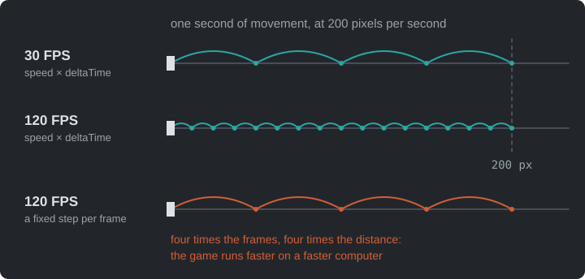

## Encapsulation & the Update Method Pattern

Our first version puts everything in `Game1`. As soon as we have a paddle and a ball, we
move their data and behaviour into `Paddle` and `Ball` classes, each with its own `Update`
and `Draw` methods. `Game1` then just calls them. This is the
[Update Method](https://gameprogrammingpatterns.com/update-method.html) pattern: each
object knows how to simulate one frame of its own behaviour.

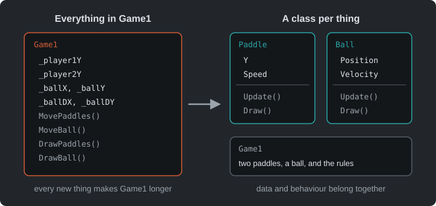

It has costs too. Objects are updated one after another, so the order matters. An object
updated early sees the others as they were last frame, and one updated late sees them
already moved. Objects that interact, like the ball and the paddles, need a reference to
each other, or a place like `Game1` that checks them together. Every object is updated every
frame even when it has nothing to do. And adding or removing objects while looping over them
needs care ([Angry Birds](../08-angry-birds/#destroying-safely) shows how).

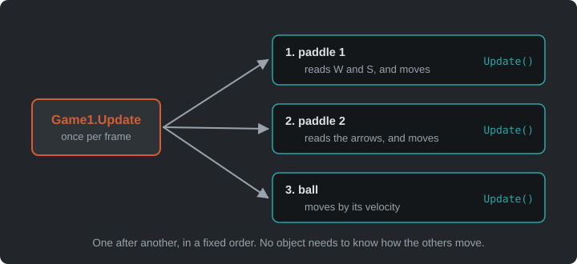

## Collision Detection (AABB)

Axis-Aligned Bounding Boxes are rectangles that never rotate. Two of them overlap if they
overlap on both axes:

```csharp
public static bool AABB(Rectangle a, Rectangle b)
{
    return a.Left < b.Right &&
           a.Right > b.Left &&
           a.Top < b.Bottom &&
           a.Bottom > b.Top;
}
```

(MonoGame provides the same check as `Rectangle.Intersects()`, but it's worth writing
yourself once.)

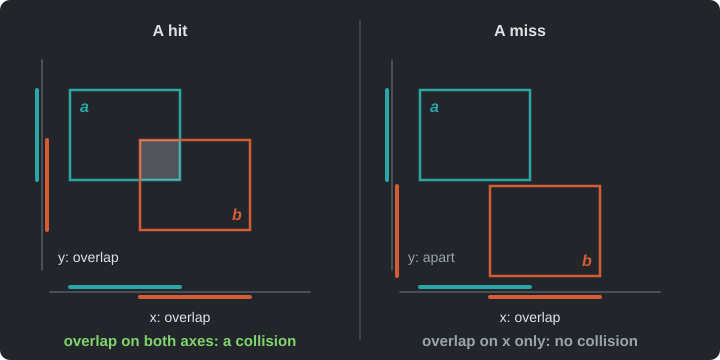

Detecting the hit is half of it. The ball also has to respond. Flip its horizontal velocity,
and move it back to the paddle's edge, or it is still inside the paddle on the next frame
and bounces again. In `Pong7`, where the ball hits the paddle sets its new angle. The middle
sends it straight back and the ends send it off steeply, so the player can aim:

```csharp
float offset = ballCentreY - paddleCentreY;
float newVelocityY = offset / (paddle.Height / 2f) * 110;
```

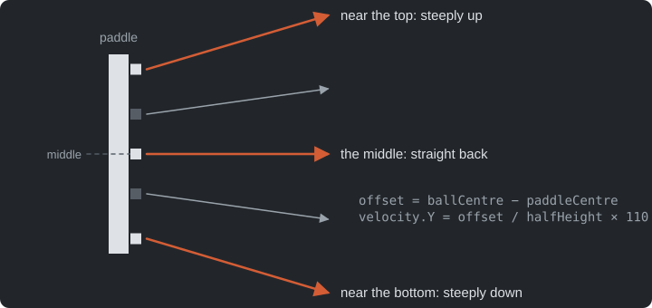

## Game State

_Steps `Pong7` → `Pong10`_

Pong has distinct phases: _start_, _serve_, _play_ and _done_. `Pong8` keeps the score and
shows it in a bigger font, `Pong9` adds a _serve_ mode (the player who was scored on serves
next), and `Pong10` a _done_ mode when a player reaches 10 points. The modes are a simple
`string` field and `if`-checks in `Update` and `Draw`. That is fine for four states, but every
new state means another `if` in each method. In [Flappy Bird](../02-flappy-bird/) we replace
it with a state machine.

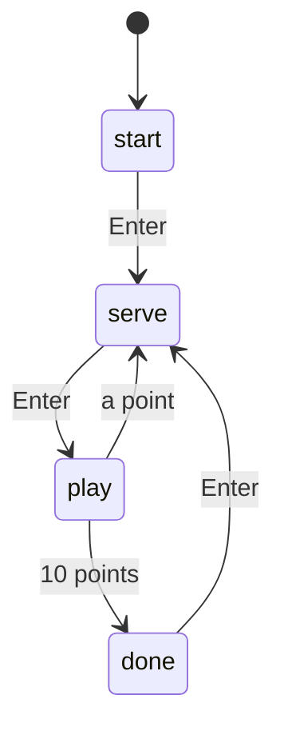
```mermaid
stateDiagram-v2
    [*] --> start
    start --> serve : Enter
    serve --> play : Enter
    play --> serve : a point
    play --> done : 10 points
    done --> serve : Enter
```

**Try it** (`Pong10`): make a game end at 3 points. Then add a _paused_ mode that `P` toggles
during play. Which methods did you have to change?

## Sound Effects

_Step `Pong11`_

`SoundEffect` is for short clips (hits, jumps, clicks). They are loaded fully into memory
and several can play at once. Longer music uses `Song`, as in [Flappy Bird](../02-flappy-bird/).
`Pong11` plays a sound for a paddle hit, a wall hit and a point.

Make your own 8-bit sounds with [bfxr.net](https://www.bfxr.net/).

**Try it** (`Pong11`): `Play` also takes a volume, a pitch and a pan. Raise the paddle sound's
pitch as the ball speeds up.

## Exercises

Build Pong step by step:

0. **An empty game:** clone [gar-games](https://github.com/Metamate/gar-games), open
   `01-pong/Pong0` (an empty MonoGame game set up with the content builder) and run it from
   the `01-pong` folder with `dotnet run --project Pong0`. Do the exercises in `Pong0`;
   step `PongN` is a solution to exercise N, to compare with when you're done.
1. **Text on screen:** draw "Hello, MonoGame!" centred on a black 1280×720 window. The
   font is already in `Content/Assets`: load it with `Content.Load<SpriteFont>("sans")`,
   and centre the text with `MeasureString`.
2. **Virtual resolution:** bring your game up to `Pong2`. Copy the virtual size constants,
   the matrix field and `UpdateScreenScaleMatrix`, call it from `Initialize` and when
   `Window.ClientSizeChanged` fires, and pass the matrix and `SamplerState.PointClamp` to
   `Begin`. Centre the text in 320×180.
3. **Rectangles from a pixel:** draw two paddles (5×20) and a ball (4×4), stretched from one
   white pixel. Switch to the retro font (`"font"`, also in `Content/Assets`) and the
   background colour `(40, 45, 52)`.
4. **Input and delta time:** W/S and Up/Down move the paddles, at the same speed whatever
   the frame rate. To check it, set `TargetElapsedTime = TimeSpan.FromSeconds(1 / 30.0)` in
   the constructor. Does a paddle still cross the screen in the same time? And without the
   multiplication by delta time?
5. **A moving ball:** launch the ball in a random direction on Enter. A `string` field
   remembers the game's mode (`"start"` or `"play"`), and the start mode shows "Press
   Enter to launch the ball". Keep the paddles on screen (`Math.Clamp`).
6. **The Update Method:** refactor into `Paddle` and `Ball` classes using the Update Method
   pattern. The game must behave as it did before. In which order does `Game1` update the
   three objects, and would another order change anything?
7. **Collisions and the bounce:** bounce off paddles and walls with AABB. Where the ball
   hits the paddle sets the new angle: straight back from the middle, steeply from the
   ends. Speed up the ball by 10% on each paddle hit.

**Going further (optional):** carry on from your own game with what `Pong8` to `Pong11`
show: scoring in a bigger font (`"font-big"`), a serve mode, a winner at 10 points, and
sound effects for paddle hits, wall hits and points (in `Content/Assets/sounds`, or made
with bfxr).

## Apply It to Your Project

- Which games would you like to make? Pick two or three candidates for your course project.
- For each, what updates every frame, and what is drawn? That's its game loop.
- Could you build a naive prototype of the core idea first, like this Pong, before worrying
  about architecture?

## Check Yourself

<details>
<summary>What is the difference between a game engine and a game framework?</summary>

An engine is a complete environment: editor, scene and object model, and a loop that calls
your scripts. A framework like MonoGame is a set of libraries. You write the game's
structure yourself, including the loop's contents.

</details>

<details>
<summary>Why do we multiply movement by deltaTime?</summary>

So that movement per second is the same no matter how many frames are rendered per second.

</details>

<details>
<summary>Why is a string field a fragile way to store game state?</summary>

Typos aren't caught by the compiler, every `Update`/`Draw` needs an `if`-chain over all
states, and adding a state means editing all of those chains.

</details>

Related exam questions: [1](../../exam/#1-game-loop--update-method),
[4](../../exam/#4-command-pattern--input-handling),
[6](../../exam/#6-sprites-texture-atlases-animation--rendering),
[7](../../exam/#7-tilemaps-collision-detection--procedural-generation).
