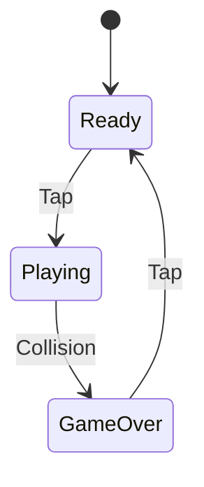
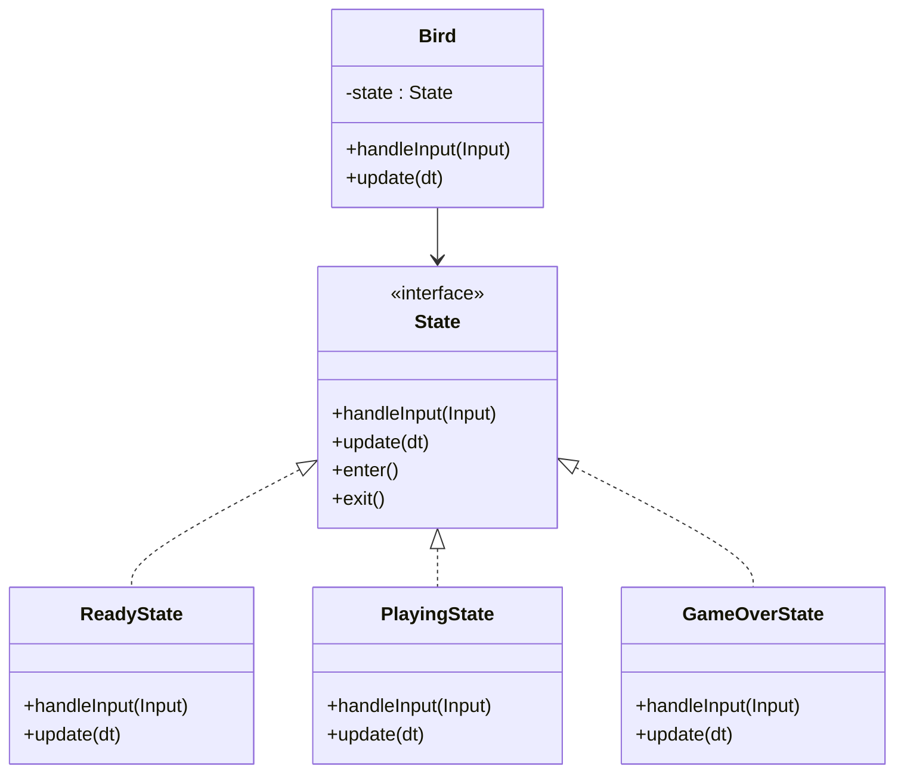

- Images (Sprites)
- Infinite Scrolling
- "Games Are Illusions"
- Class libraries
- Procedural Generation
- Managing State, State Machines
  - State Pattern
- Interfaces ?
- State pattern here or wait for great mario example? (maybe basic here and then involve into state machine)
- Singleton pattern (through the game library core class)
- Service Locator (built-in through GameServices object on Game class)

## Today's Goal

We look at state management and building out our "game engine" through a class library /
building a game engine of reusable components.

## Game Architecture & Design

- [Architecture, Performance, and Games](https://gameprogrammingpatterns.com/architecture-performance-and-games.html)

## Singleton Pattern

- [Singleton](https://gameprogrammingpatterns.com/singleton.html)

## Service Locator Pattern

- [Service Locator](https://gameprogrammingpatterns.com/service-locator.html) - maybe later?

## State Pattern

- [State Pattern](https://gameprogrammingpatterns.com/state.html)





### Code sample

The bird delegates input and updates to whichever state object it currently holds.
Switching behaviour means swapping the object, not adding another branch to an `if`-chain.

```csharp title="IState.cs"
namespace FlappyBirdStatePattern;

public interface IState
{
    void HandleInput(Bird bird, string input);
    void Update(Bird bird, double dt);
    void Enter(Bird bird);
    void Exit(Bird bird);
}
```

```csharp title="Bird.cs"
using System;

namespace FlappyBirdStatePattern;

public class Bird
{
    private IState _state;

    public Bird()
    {
        // Initial state
        _state = new ReadyState();
        _state.Enter(this);
    }

    public void SetState(IState state)
    {
        _state.Exit(this);
        _state = state;
        _state.Enter(this);
    }

    public void HandleInput(string input)
    {
        _state.HandleInput(this, input);
    }

    public void Update(double dt)
    {
        _state.Update(this, dt);
    }
}
```

```csharp title="States.cs"
using System;

namespace FlappyBirdStatePattern;

public class ReadyState : IState
{
    public void Enter(Bird bird)
    {
        Console.WriteLine("Bird enters Ready State.");
    }

    public void Exit(Bird bird)
    {
        Console.WriteLine("Bird exits Ready State.");
    }

    public void HandleInput(Bird bird, string input)
    {
        if (input == "Tap")
        {
            Console.WriteLine("Tap detected! Starting game...");
            bird.SetState(new PlayingState());
        }
    }

    public void Update(Bird bird, double dt)
    {
        Console.WriteLine("Ready State: Hovering...");
    }
}

public class PlayingState : IState
{
    public void Enter(Bird bird)
    {
        Console.WriteLine("Bird enters Playing State.");
    }

    public void Exit(Bird bird)
    {
        Console.WriteLine("Bird exits Playing State.");
    }

    public void HandleInput(Bird bird, string input)
    {
        if (input == "Tap")
        {
            Console.WriteLine("Flap!");
        }
        else if (input == "Collision")
        {
            Console.WriteLine("Collision detected! Game Over.");
            bird.SetState(new GameOverState());
        }
    }

    public void Update(Bird bird, double dt)
    {
        Console.WriteLine("Playing State: Flying and applying gravity...");
    }
}

public class GameOverState : IState
{
    public void Enter(Bird bird)
    {
        Console.WriteLine("Bird enters Game Over State.");
    }

    public void Exit(Bird bird)
    {
        Console.WriteLine("Bird exits Game Over State.");
    }

    public void HandleInput(Bird bird, string input)
    {
        if (input == "Tap")
        {
            Console.WriteLine("Tap detected! Restarting game...");
            bird.SetState(new ReadyState());
        }
    }

    public void Update(Bird bird, double dt)
    {
        Console.WriteLine("Game Over State: Waiting for restart...");
    }
}
```

Driving it from a simulated game loop:

```csharp title="Program.cs"
using System;
using FlappyBirdStatePattern;

class Program
{
    static void Main(string[] args)
    {
        Console.WriteLine("Flappy Bird State Pattern Demo");
        Console.WriteLine("------------------------------");

        Bird bird = new Bird();

        // Simulate game loop
        Console.WriteLine("\n--- Game Loop Start ---");

        // 1. Initial State (Ready)
        bird.Update(0.16);

        // 2. Start Game
        Console.WriteLine("\n> User inputs 'Tap'");
        bird.HandleInput("Tap");
        bird.Update(0.16);

        // 3. Playing
        Console.WriteLine("\n> User inputs 'Tap'");
        bird.HandleInput("Tap");
        bird.Update(0.16);

        // 4. Collision
        Console.WriteLine("\n> User inputs 'Collision'");
        bird.HandleInput("Collision");
        bird.Update(0.16);

        // 5. Game Over
        Console.WriteLine("\n> User inputs 'Tap' (Restart)");
        bird.HandleInput("Tap");
        bird.Update(0.16);

        Console.WriteLine("\n--- Game Loop End ---");
    }
}
```
