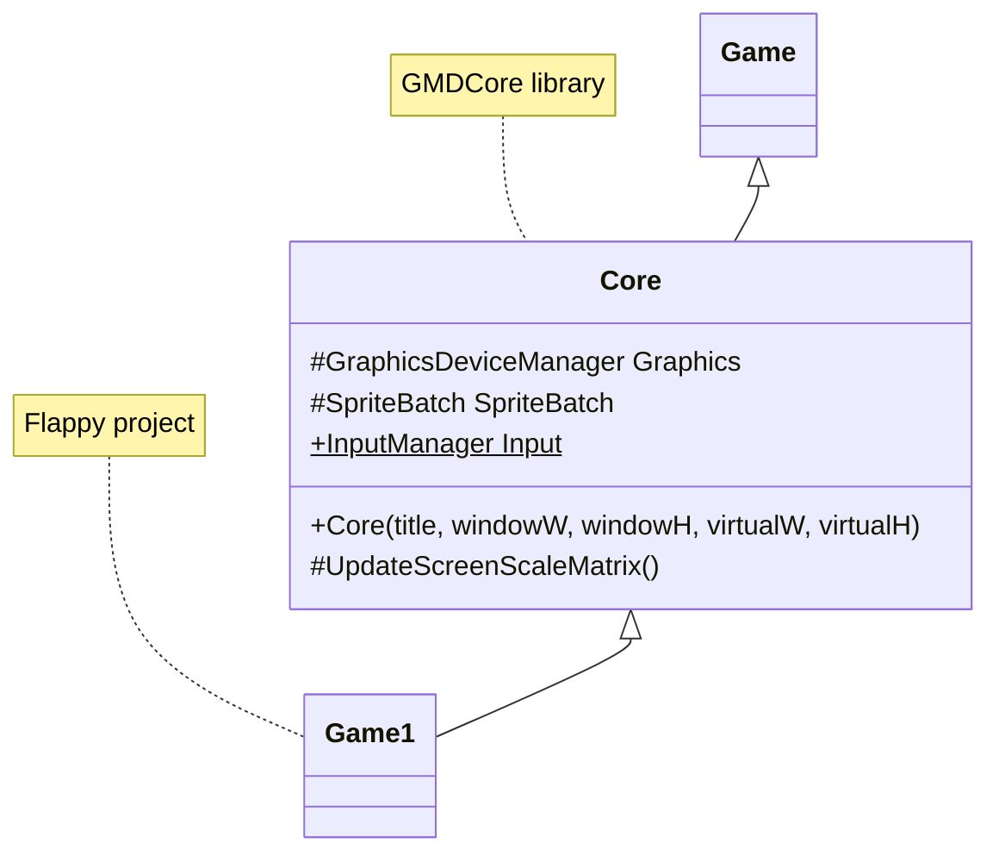
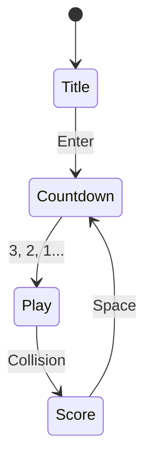

## Today's Goal

Make a **Flappy Bird** clone.

Pong worked, but everything lived in `Game1` and game state was a string. Today we start
organizing: we create **GMDCore**, a class library of reusable code that grows throughout
the course, and replace the string-based state with a proper **state machine**.

New concepts: class libraries, textures, parallax scrolling, procedural generation,
interfaces, state machines and the Singleton pattern.

**Source code:** [Metamate/gmd2-flappy](https://github.com/Metamate/gmd2-flappy)

The code is split into steps, one project per exercise (`Flappy0` → `Flappy12`), so you can compare
your solution with each step, and compare neighbouring steps to see exactly what changed.

## Prepare

- [04: Creating a Class Library](https://docs.monogame.net/articles/tutorials/building_2d_games/04_creating_a_class_library)
- [Content Builder Project](https://docs.monogame.net/articles/getting_started/content_pipeline/content_builder_project.html)
- [06: Working with Textures](https://docs.monogame.net/articles/tutorials/building_2d_games/06_working_with_textures)
- [Architecture, Performance, and Games](https://gameprogrammingpatterns.com/architecture-performance-and-games.html)
- [Interfaces (C#)](https://learn.microsoft.com/en-us/dotnet/csharp/fundamentals/types/interfaces)
- [Singleton](https://gameprogrammingpatterns.com/singleton.html)

## Game Architecture

What is _good_ software architecture? A good architecture makes **change** cheap. The key
to that is **decoupling**: when you change one part of the code, you shouldn't have to
understand or touch many other parts.

- **Coupling:** how much one module depends on another. Aim for low.
- **Cohesion:** how closely related the responsibilities inside one module are. Aim for
  high.

Decoupling isn't free. Abstractions cost time to write and understand, and sometimes cost
performance. Good architecture is about choosing _where_ flexibility is worth that cost.

## Class Libraries: GMDCore

Code that isn't specific to one game (screen scaling, input helpers, and later sprites,
tilemaps, state machines…) goes into a **MonoGame Game Library** project called `GMDCore`.
Each game references it, and its `Game1` derives from `Core` instead of `Game`.



Every session from now on, ask: **does this belong to the game, or to the core?** Where
you draw that line is an architectural decision.

## Images & Parallax Scrolling

An image is just a `Texture2D`, loaded with `Content.Load<Texture2D>()` and drawn with
`SpriteBatch.Draw()`.

**Parallax scrolling** creates an illusion of depth by moving layers at different speeds:
the background scrolls slower than the ground. Each layer loops by wrapping its offset
with `%` at its "looping point".

**Games are illusions.** The bird never moves horizontally; the world scrolls past it.

## Where Do Assets Live?

How does the `Bird` class get its texture? There are several options, each with a
trade-off:

1. A `public static` field on `Game1`: easy, but breaks encapsulation and bloats `Game1`.
2. Inject the `Texture2D` (or `ContentManager`) into each entity: explicit, but tedious.
3. A static `ContentManager` on `Core`: global access to loading.
4. A static `Art` class holding references to all loaded assets.

We use option 4 today. Note that it is _global state_, which is exactly what the Singleton
discussion below is about.

## Procedural Generation

Instead of designing levels by hand, we generate them with code: pipe pairs spawn on a
timer at a random height, based on the previous pair's height and clamped to the screen.
Pairs that scroll off-screen are flagged and removed.

## Input: InputManager

The "was just pressed" check from Pong moves into GMDCore as a `KeyboardInfo` class
(`IsKeyDown`, `IsKeyUp`, `WasKeyJustPressed`, `WasKeyJustReleased`), wrapped by an
`InputManager` that `Core` updates every frame.

## State Machines

Recall Pong's `string` state. Every `Update` and `Draw` was an `if`-chain over every state,
and adding a state meant editing all of them. Instead, we make each state an object that
implements a common **interface**:



```csharp title="IState.cs"
public interface IState
{
    void Enter();
    void Exit();
    void Update(GameTime gameTime);
    void Draw(SpriteBatch spriteBatch);
}
```

```csharp title="StateMachine.cs"
public class StateMachine(Game1 game)
{
    private IState _currentState;

    public TitleState TitleState { get; } = new TitleState(game);
    public PlayState PlayState { get; } = new PlayState(game);

    public void ChangeState(IState newState)
    {
        _currentState?.Exit();
        _currentState = newState;
        _currentState.Enter();
    }

    public void Update(GameTime gameTime) => _currentState?.Update(gameTime);

    public void Draw(SpriteBatch spriteBatch) => _currentState?.Draw(spriteBatch);
}
```

Each state contains only its own behaviour, and `Game1` just forwards `Update` and `Draw`
to the state machine. `Enter()` and `Exit()` give each state a place to set up and clean up
(for example, `PlayState.Enter()` resets the bird, pipes and score so every retry starts
clean).

This is a _game-level_ state machine. In [Super Mario Bros](../05-super-mario-bros/) we
apply the same idea to entities (the State pattern), and in [Pokemon](../08-pokemon/) we
stack states on top of each other.

## Singleton Pattern

> "Ensure a class has one instance, and provide a global point of access to it."
> — Gang of Four, _Design Patterns_

```csharp
public class Singleton
{
    private static Singleton _instance;
    public static Singleton Instance => _instance ??= new Singleton();

    private Singleton() { }
}
```

Singletons are everywhere in game code because they are convenient. They are also
controversial:

- They are **global state**: any code can reach them, so any code can depend on them.
- Dependencies become hidden, which makes code hard to reason about and to test.
- "Only one instance" is rarely a real requirement; usually we just want easy access.

> "Friends don't let friends create singletons."
> — Robert Nystrom, _Game Programming Patterns_

**Discuss:** our `Art` class and `Core.Input` are static, not singletons. What is the
difference, and do they have the same problems? We come back to this with the Service
Locator pattern in [Pokemon](../08-pokemon/).

## Exercises

1. **Class Library:** create `GMDCore` with a `Core` class deriving from `Game`. Move the
   screen scaling from Pong into it, and add a constructor taking title, window size and
   virtual size.
2. **Consume the library:** create "Flappy" from the
   [gar-starter](https://github.com/Metamate/gar-starter) template, reference `GMDCore`,
   derive `Game1` from `Core`, and use a 512×288 virtual resolution in a 1280×720 window.
3. **Background & parallax:** add the background and ground images to an `images` folder in
   your `Assets` folder, and scroll them at different speeds (looping points: background 413,
   ground 512).
4. **Bird & assets:** add a `Bird` class and a static `Art` class for asset references.
5. **Gravity & flap:** add gravity. Add `KeyboardInfo` and `InputManager` to GMDCore, and
   flap on `WasKeyJustPressed(Keys.Space)`.
6. **Infinite pipes:** spawn pipes on a timer at random heights.
7. **Pipe pairs:** wrap pipes in a `PipePair` with a gap. Vary the gap height smoothly and
   remove pairs that leave the screen.
8. **Collisions:** stop the game when the bird hits a pipe, the ground or the ceiling. Can
   you make collisions more forgiving?
9. **State machine:** add `IState`, a `StateMachine`, a `TitleState` and a `PlayState`.
10. **Scoring:** score when passing a pipe pair, and add a `ScoreState`. How does the score
    state get the score?
11. **Countdown:** add a `CountdownState` between title/score and play.
12. **Audio:** add background music (`Song` + `MediaPlayer.Play`) and flap, hurt and score
    sounds, organized in an `Audio` class.

## Check Yourself

<details>
<summary>What problem does a state machine solve compared to a string or enum field?</summary>

Each state's behaviour is in one place instead of spread across `if`-chains. You can add a
state without editing the others, and `Enter`/`Exit` give reliable places for setup and
cleanup.

</details>

<details>
<summary>What happens if you forget to call Exit() when switching state?</summary>

Anything the old state set up is never cleaned up: music keeps playing, event
subscriptions stay alive, timers keep running.

</details>

<details>
<summary>Why is Singleton considered an anti-pattern by many game programmers?</summary>

It is global state in disguise. It hides dependencies, couples code together and makes
testing and reasoning harder, and the "exactly one instance" guarantee is rarely needed.

</details>

Related exam questions: [2](../../exam/#2-state-pattern--state-stack),
[3](../../exam/#3-singleton--service-locator),
[7](../../exam/#7-tilemaps-collision-detection--procedural-generation).
