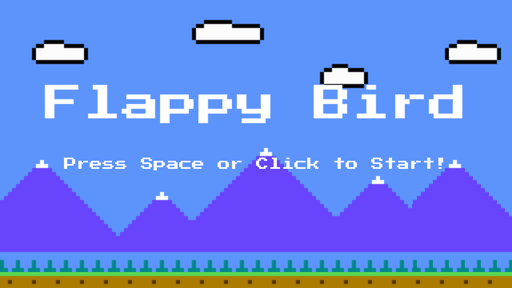
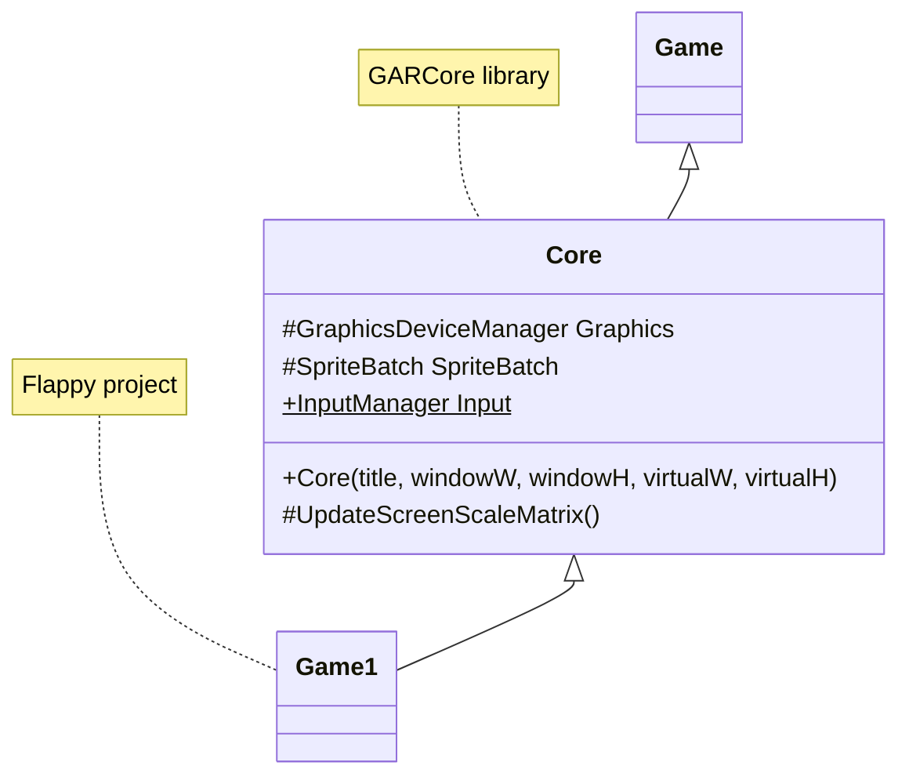
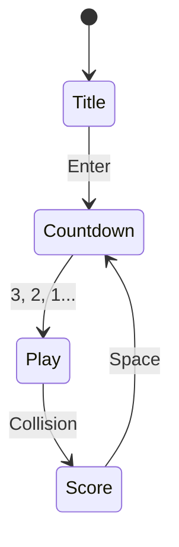

## Today's Goal

Make a **Flappy Bird** clone.

<figure class="original">

<figcaption>The original: <em>Flappy Bird</em> (dotGears, 2013). Screenshot © dotGears.</figcaption>
</figure>

Pong worked, but everything lived in `Game1`, and the game's mode was a string. This
session is about structuring the code before the game gets any bigger. We start
**GARCore**, a class library for the code every game needs, which grows through the rest of
the course. And we replace the string with a **state machine**.

Other new things in this session are textures, parallax scrolling, procedural generation,
interfaces and the Singleton pattern.

**Source code:** [gar-games/02-flappy-bird](https://github.com/Metamate/gar-games/tree/main/02-flappy-bird)

## Prepare

- [04: Creating a Class Library](https://docs.monogame.net/articles/tutorials/building_2d_games/04_creating_a_class_library),
  for background. It creates the library with the MonoGame templates; ours comes ready
  in the gar-starter template ([exercise 1](#exercises)).
- [Content Builder Project](https://docs.monogame.net/articles/getting_started/content_pipeline/content_builder_project.html)
- [06: Working with Textures](https://docs.monogame.net/articles/tutorials/building_2d_games/06_working_with_textures)
- [Architecture, Performance, and Games](https://gameprogrammingpatterns.com/architecture-performance-and-games.html)
- [Interfaces (C#)](https://learn.microsoft.com/en-us/dotnet/csharp/fundamentals/types/interfaces)
- [Singleton](https://gameprogrammingpatterns.com/singleton.html)

## Game Architecture

Good software architecture makes **change** cheap. Much of that comes from
**decoupling**. When you change one part of the code, you shouldn't have to understand or
touch many other parts.

- **Coupling:** how much one module depends on another. Aim for low.
- **Cohesion:** how closely related the responsibilities inside one module are. Aim for
  high.

Decoupling isn't free. Abstractions cost time to write and understand, and sometimes cost
performance. Good architecture is about choosing _where_ flexibility is worth that cost.

## Class Libraries: GARCore

Code that isn't specific to one game (screen scaling, input helpers, and later sprites,
tilemaps, state machines…) goes into an ordinary .NET class library, `GARCore`, that
references MonoGame. Each game references the library, and its `Game1` derives from
`Core` instead of `Game`.

The reference only goes one way. Flappy uses GARCore, but nothing in GARCore may use a
class from Flappy. If `Core` needed Flappy's `Bird`, no other game could use the library.


```mermaid
classDiagram
    class Game
    class Core {
        #GraphicsDeviceManager Graphics
        #SpriteBatch SpriteBatch
        +InputManager Input$
        +Core(title, windowW, windowH, virtualW, virtualH)
        #UpdateScreenScaleMatrix()
    }
    class Game1
    Game <|-- Core
    Core <|-- Game1
    note for Core "GARCore library"
    note for Game1 "Flappy project"
```

From now on we ask the same question in every session. Does this code belong to the
game, or to the core?

## Images & Parallax Scrolling

An image is just a `Texture2D`, loaded with `Content.Load<Texture2D>()` and drawn with
`SpriteBatch.Draw()`.

**Parallax scrolling** creates an illusion of depth by moving layers at different speeds:
the background scrolls slower than the ground. Each layer loops by wrapping its offset
with `%` at its "looping point".

The bird never actually moves sideways. The world scrolls past it, and the player sees
a bird flying.

_Steps `Flappy0` → `Flappy2`_

`Flappy1` draws the background and the ground; `Flappy2` scrolls them, the background at 30
pixels per second and the ground at 60, looping at 413 and 512.

**Try it** (`Flappy2`): make the ground scroll at 120 and the background at 15. Then swap the
two speeds. What happens to the sense of depth?

## Where Do Assets Live?

How does the `Bird` class get its texture? There are several options, each with a
trade-off:

1. A `public static` field on `Game1`: easy, but breaks encapsulation and bloats `Game1`.
2. Inject the `Texture2D` (or `ContentManager`) into each entity: explicit, but tedious.
3. A static `ContentManager` on `Core`: global access to loading.
4. A static `Art` class holding references to all loaded assets.

We use option 4 today. It is _global state_, and the Singleton section below discusses
what that costs.

## Procedural Generation

_Steps `Flappy5` → `Flappy7`_

Instead of designing levels by hand, we generate them with code. `Flappy6` spawns a pipe every
2 seconds at a random height, scrolling at the ground's speed. `Flappy7` wraps two pipes in a
`PipePair` with a 90-pixel gap, and lets the gap drift. Each pair's height is the previous
pair's plus a small random step, clamped to the screen. Pairs that scroll off-screen are
flagged and removed.

**Try it** (`Flappy7`): make the gap 60 pixels and spawn a pair every 1.5 seconds. Is it still
fair? Which numbers in `SpawnPipePair` make the drift gentler?

## Input: InputManager

The "was just pressed" check from Pong moves into GARCore as a `KeyboardInfo` class
(`IsKeyDown`, `IsKeyUp`, `WasKeyJustPressed`, `WasKeyJustReleased`). A `MouseInfo` class does
the same for the mouse (`IsLeftButtonDown`, `WasLeftButtonJustPressed`, `Position`). Both are
wrapped by an `InputManager` that `Core` updates every frame, so any code can ask
`Core.Input.Keyboard` or `Core.Input.Mouse`. The bird flaps on Space _or_ a left click.

The mouse position is in **window** coordinates. Because the game is drawn at a
virtual resolution and scaled to the window, a click at the window's centre is not at
(256, 144) in the game unless you convert it. We don't need positions for Flappy Bird, but
several later games have to convert between coordinate spaces like this.

## State Machines

In Pong, the state was a `string`. Every `Update` and `Draw` was an `if`-chain over the
states, and adding a state meant editing all of them. Now each state becomes an object
that implements a common **interface**:


```mermaid
stateDiagram-v2
    [*] --> Title
    Title --> Countdown : Enter
    Countdown --> Play : 3, 2, 1...
    Play --> Score : Collision
    Score --> Countdown : Space
```

```csharp title="IState.cs"
public interface IState
{
    void Enter();
    void Exit();
    void Update(GameTime gameTime);
    void Draw(SpriteBatch spriteBatch);
}
```

```csharp title="StateMachine.cs"
public class StateMachine(Game1 game)
{
    private IState _currentState;

    public TitleState TitleState { get; } = new TitleState(game);
    public PlayState PlayState { get; } = new PlayState(game);

    public void ChangeState(IState newState)
    {
        _currentState?.Exit();
        _currentState = newState;
        _currentState.Enter();
    }

    public void Update(GameTime gameTime) => _currentState?.Update(gameTime);

    public void Draw(SpriteBatch spriteBatch) => _currentState?.Draw(spriteBatch);
}
```

Each state contains only its own behaviour, and `Game1` passes `Update` and `Draw` on to
the state machine. `Enter()` and `Exit()` give each state a place to set up and clean up
(for example, `PlayState.Enter()` resets the bird, pipes and score so every retry starts
clean).

### Passing data, and a countdown

_Steps `Flappy9` → `Flappy11`_

`Flappy10` scores a point for each pair the bird passes, and adds a `ScoreState`. The score
state needs the score, which belongs to the play state, so it reads it through the state machine
(`game.GameState.PlayState.Score`). `Flappy11` adds a `CountdownState` between the title or
score and play: 3, 2, 1, then play.

**Try it** (`Flappy11`): make the countdown start at 5 and tick every 0.3 seconds. Then show a
best score on the score screen. Where does the best score live, so that it survives the next
game?

This is a _game-level_ state machine. In [Pac-Man](../05-pac-man/) we apply the same idea
to objects in the game (the State pattern), and in [Pokemon](../10-pokemon/) we stack
states on top of each other.

## Singleton Pattern

> "Ensure a class has one instance, and provide a global point of access to it."
> — Gang of Four, _Design Patterns_

```csharp
public class Singleton
{
    private static Singleton _instance;
    public static Singleton Instance => _instance ??= new Singleton();

    private Singleton() { }
}
```

Singletons are everywhere in game code because they are convenient. They are also
controversial:

- They are **global state**: any code can reach them, so any code can depend on them.
- Dependencies become hidden, which makes code hard to reason about and to test.
- Games rarely need to guarantee "only one instance". Usually we only want easy access.

> "Friends don't let friends create singletons."
> — Robert Nystrom, _Game Programming Patterns_

In the finished game (`Flappy12`), `Audio` is a Singleton, used as
`Audio.Instance.PlayFlap()`, while `Art` and `Core.Input` are static. Both give global
access, but `Audio` is an object, so it could implement an interface or be passed to the
code that needs it.

**Discuss:** do `Audio` and `Art` have the same problems? Which one would be easier to
replace with a muted version for testing? [Pokemon](../10-pokemon/) picks this up again
with the Service Locator pattern.

## Exercises

1. **A class library:** create your own repository from the
   [gar-starter](https://github.com/Metamate/gar-starter) template, and rename `MyGame` to
   `Flappy` (its README shows how). It comes with an empty class library, `GARCore`. Find
   the two places that connect it to the game: the `ProjectReference` in `Flappy.csproj`
   and the line in the `.slnx`. Which way does the reference point? Then write a `Core`
   class in `GARCore`, deriving from `Game`: move the screen scaling from Pong into it, with
   a constructor taking title, window size and virtual size. Nothing in it may mention
   Flappy.
2. **A game on the library:** derive `Game1` from `Core`, with a 512×288 virtual resolution
   in a 1024×576 window (2×, so every pixel is the same size).
3. **The bird and the Art class:** bring your game up to `Flappy2`: copy the `images` folder
   from `gar-games/02-flappy-bird/Content/Assets` into your `Content/Assets` (later, copy
   `fonts` and `audio` the same way; the starter's builder already handles all of them), and
   the drawing and scrolling from `Flappy2`'s `Game1`. Then add a `Bird` class and a static
   `Art` class for asset references.
4. **Gravity and an input manager:** add gravity (980 pixels per second, per second). Add
   `KeyboardInfo`, `MouseInfo` and `InputManager` to GARCore, and flap on
   `WasKeyJustPressed(Keys.Space)` or `WasLeftButtonJustPressed`: a flap sets the
   vertical velocity to 300 upwards.
5. **Hitboxes:** bring your game up to `Flappy7` (the `Pipe` and `PipePair` classes and the
   spawning in `Game1`), then stop the game when the bird hits a pipe, the ground or the
   ceiling. Can you make collisions more forgiving?
6. **A state machine:** add `IState`, a `StateMachine`, a `TitleState` and a `PlayState`.
7. **Audio as a Singleton:** bring your game up to `Flappy11` (the score and countdown
   states), then add background music (`Song` + `MediaPlayer.Play`) and flap, hurt and score
   sounds, organized in an `Audio` class made a Singleton (`Audio.Instance.PlayFlap()`).

**Going further (optional):** a cave flyer. Hold the button to rise and let go to fall, through a cave whose ceiling and floor are generated as you go. What changes, and what stays: the states, the scrolling, the spawning?

## Apply It to Your Project

- Which code in your game could be reused by another game? That belongs in a class library,
  like GARCore.
- Which states does your game have (title, play, pause, game over)? Draw them as a state
  diagram, with what triggers each transition.
- Is anything in your game global? Does it need to be?

## Check Yourself

<details>
<summary>What problem does a state machine solve compared to a string or enum field?</summary>

Each state's behaviour is in one place. You can add a
state without editing the others, and `Enter`/`Exit` give reliable places for setup and
cleanup.

</details>

<details>
<summary>What happens if you forget to call Exit() when switching state?</summary>

Anything the old state set up is never cleaned up. Music keeps playing, event
subscriptions stay alive and timers keep running.

</details>

<details>
<summary>Why is Singleton considered an anti-pattern by many game programmers?</summary>

It is global state. It hides dependencies, couples code together and makes testing and
reasoning harder, and games rarely need the guarantee of a single instance.

</details>

Related exam questions: [2](../../exam/#2-state-pattern--state-stack),
[3](../../exam/#3-singleton--service-locator),
[4](../../exam/#4-command-pattern--input-handling),
[6](../../exam/#6-sprites-texture-atlases-animation--rendering),
[7](../../exam/#7-tilemaps-collision-detection--procedural-generation).
