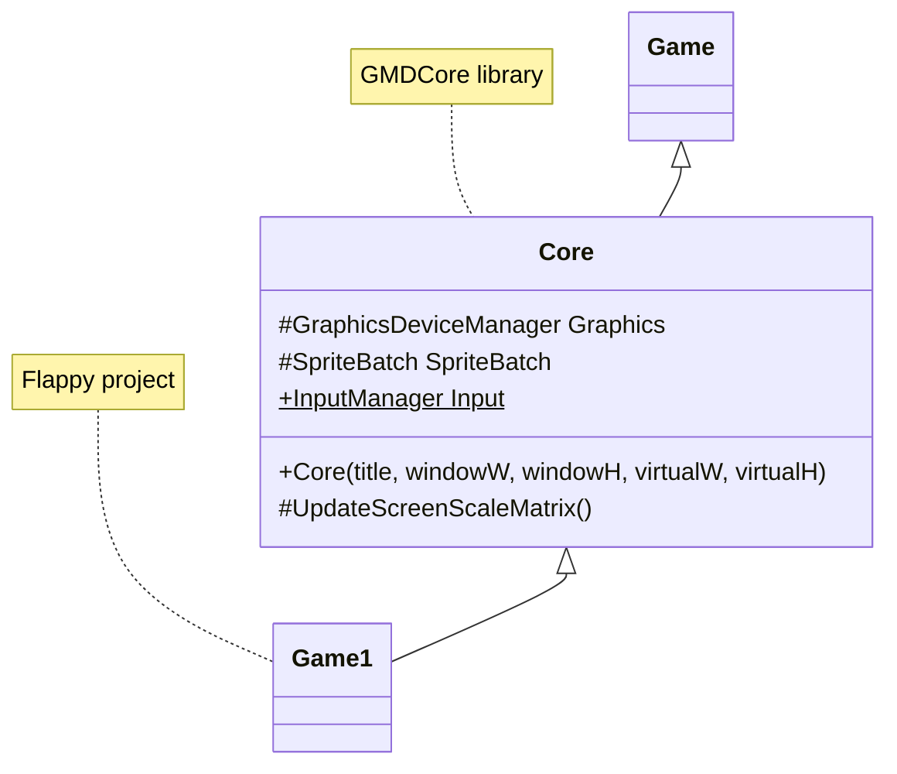
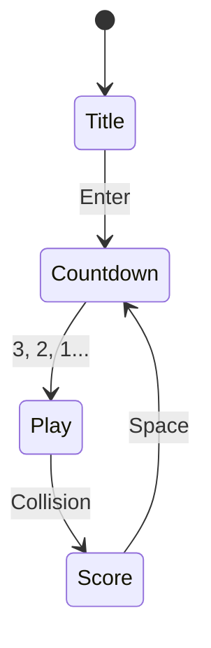

## Today's Goal

Make a **Flappy Bird** clone.

Pong worked, but everything lived in `Game1` and game state was a string. Today we start
organizing: we create **GMDCore**, a class library of reusable code that grows throughout
the course, and replace the string-based state with a proper **state machine**.

New concepts: class libraries, textures, parallax scrolling, procedural generation,
interfaces, state machines and the Singleton pattern.

**Source code:**
[gar-games/02-flappy](https://github.com/Metamate/gar-games/tree/main/02-flappy). Its README
lists the steps (`Flappy0` to `Flappy12`, one project per exercise below), maps the code,
and says how to run it. Compare your solution with the matching step, and neighbouring steps
to see exactly what changed.

## Prepare

- [04: Creating a Class Library](https://docs.monogame.net/articles/tutorials/building_2d_games/04_creating_a_class_library),
  for background. It uses the MonoGame templates; we make the same library without them
  ([exercise 1](#exercises)).
- [Content Builder Project](https://docs.monogame.net/articles/getting_started/content_pipeline/content_builder_project.html)
- [06: Working with Textures](https://docs.monogame.net/articles/tutorials/building_2d_games/06_working_with_textures)
- [Architecture, Performance, and Games](https://gameprogrammingpatterns.com/architecture-performance-and-games.html)
- [Interfaces (C#)](https://learn.microsoft.com/en-us/dotnet/csharp/fundamentals/types/interfaces)
- [Singleton](https://gameprogrammingpatterns.com/singleton.html)

## Game Architecture

What is _good_ software architecture? A good architecture makes **change** cheap. The key
to that is **decoupling**: when you change one part of the code, you shouldn't have to
understand or touch many other parts.

- **Coupling:** how much one module depends on another. Aim for low.
- **Cohesion:** how closely related the responsibilities inside one module are. Aim for
  high.

Decoupling isn't free. Abstractions cost time to write and understand, and sometimes cost
performance. Good architecture is about choosing _where_ flexibility is worth that cost.

## Class Libraries: GMDCore

Code that isn't specific to one game (screen scaling, input helpers, and later sprites,
tilemaps, state machines…) goes into a **class library** called `GMDCore`: an ordinary
.NET class library that references MonoGame.
Each game references it, and its `Game1` derives from `Core` instead of `Game`.


```mermaid
classDiagram
    class Game
    class Core {
        #GraphicsDeviceManager Graphics
        #SpriteBatch SpriteBatch
        +InputManager Input$
        +Core(title, windowW, windowH, virtualW, virtualH)
        #UpdateScreenScaleMatrix()
    }
    class Game1
    Game <|-- Core
    Core <|-- Game1
    note for Core "GMDCore library"
    note for Game1 "Flappy project"
```

Every session from now on, ask: **does this belong to the game, or to the core?** Where
you draw that line is an architectural decision.

## Images & Parallax Scrolling

An image is just a `Texture2D`, loaded with `Content.Load<Texture2D>()` and drawn with
`SpriteBatch.Draw()`.

**Parallax scrolling** creates an illusion of depth by moving layers at different speeds:
the background scrolls slower than the ground. Each layer loops by wrapping its offset
with `%` at its "looping point".

**Games are illusions.** The bird never moves horizontally; the world scrolls past it.

## Where Do Assets Live?

How does the `Bird` class get its texture? There are several options, each with a
trade-off:

1. A `public static` field on `Game1`: easy, but breaks encapsulation and bloats `Game1`.
2. Inject the `Texture2D` (or `ContentManager`) into each entity: explicit, but tedious.
3. A static `ContentManager` on `Core`: global access to loading.
4. A static `Art` class holding references to all loaded assets.

We use option 4 today. Note that it is _global state_, which is exactly what the Singleton
discussion below is about.

## Procedural Generation

Instead of designing levels by hand, we generate them with code: pipe pairs spawn on a
timer at a random height, based on the previous pair's height and clamped to the screen.
Pairs that scroll off-screen are flagged and removed.

## Input: InputManager

The "was just pressed" check from Pong moves into GMDCore as a `KeyboardInfo` class
(`IsKeyDown`, `IsKeyUp`, `WasKeyJustPressed`, `WasKeyJustReleased`). A `MouseInfo` class does
the same for the mouse (`IsLeftButtonDown`, `WasLeftButtonJustPressed`, `Position`). Both are
wrapped by an `InputManager` that `Core` updates every frame, so any code can ask
`Core.Input.Keyboard` or `Core.Input.Mouse`. The bird flaps on Space _or_ a left click.

Note that the mouse position is in **window** coordinates. Because the game is drawn at a
virtual resolution and scaled to the window, a click at the window's centre is not at
(256, 144) in the game unless you convert it. We don't need positions for Flappy Bird, but
this difference between coordinate spaces comes back in several later games.

## State Machines

Recall Pong's `string` state. Every `Update` and `Draw` was an `if`-chain over every state,
and adding a state meant editing all of them. Instead, we make each state an object that
implements a common **interface**:


```mermaid
stateDiagram-v2
    [*] --> Title
    Title --> Countdown : Enter
    Countdown --> Play : 3, 2, 1...
    Play --> Score : Collision
    Score --> Countdown : Space
```

```csharp title="IState.cs"
public interface IState
{
    void Enter();
    void Exit();
    void Update(GameTime gameTime);
    void Draw(SpriteBatch spriteBatch);
}
```

```csharp title="StateMachine.cs"
public class StateMachine(Game1 game)
{
    private IState _currentState;

    public TitleState TitleState { get; } = new TitleState(game);
    public PlayState PlayState { get; } = new PlayState(game);

    public void ChangeState(IState newState)
    {
        _currentState?.Exit();
        _currentState = newState;
        _currentState.Enter();
    }

    public void Update(GameTime gameTime) => _currentState?.Update(gameTime);

    public void Draw(SpriteBatch spriteBatch) => _currentState?.Draw(spriteBatch);
}
```

Each state contains only its own behaviour, and `Game1` just forwards `Update` and `Draw`
to the state machine. `Enter()` and `Exit()` give each state a place to set up and clean up
(for example, `PlayState.Enter()` resets the bird, pipes and score so every retry starts
clean).

This is a _game-level_ state machine. In [Pac-Man](../05-pac-man/) we apply the same idea
to objects in the game (the State pattern), and in [Pokemon](../10-pokemon/) we stack
states on top of each other.

## Singleton Pattern

> "Ensure a class has one instance, and provide a global point of access to it."
> — Gang of Four, _Design Patterns_

```csharp
public class Singleton
{
    private static Singleton _instance;
    public static Singleton Instance => _instance ??= new Singleton();

    private Singleton() { }
}
```

Singletons are everywhere in game code because they are convenient. They are also
controversial:

- They are **global state**: any code can reach them, so any code can depend on them.
- Dependencies become hidden, which makes code hard to reason about and to test.
- "Only one instance" is rarely a real requirement; usually we just want easy access.

> "Friends don't let friends create singletons."
> — Robert Nystrom, _Game Programming Patterns_

In the finished game (`Flappy12`), `Audio` is a Singleton, used as
`Audio.Instance.PlayFlap()`, while `Art` and `Core.Input` are static. Both give global
access, but `Audio` is an object: it could implement an interface or be passed to the code
that needs it.

**Discuss:** do `Audio` and `Art` have the same problems? Which one would be easier to
replace with a muted version for testing? We come back to this with the Service Locator
pattern in [Pokemon](../10-pokemon/).

## Exercises

1. **A class library:** create your own repository from the
   [gar-starter](https://github.com/Metamate/gar-starter) template, and rename `MyGame` to
   `Flappy` (its README shows how). Then add the library next to the game, from the
   repository's folder:

   ```
   dotnet new classlib -o GMDCore
   dotnet add GMDCore package MonoGame.Framework.DesktopGL --version "3.8.*"
   dotnet sln Flappy.slnx add GMDCore/GMDCore.csproj
   dotnet add Flappy reference GMDCore/GMDCore.csproj
   ```

   Delete `GMDCore/Class1.cs`, and the `<Nullable>enable</Nullable>` line in
   `GMDCore.csproj` (the course's code doesn't use nullable annotations, so it would only
   give you warnings). Then write a `Core` class deriving from `Game`: move the screen
   scaling from Pong into it, with a constructor taking title, window size and virtual size.
2. **A game on the library:** derive `Game1` from `Core`, with a 512×288 virtual resolution
   in a 1280×720 window.
3. **Drawing images and parallax scrolling:** copy the `images` folder from
   `gar-games/02-flappy/Content/Assets` into your `Content/Assets` (later, copy `fonts` and
   `audio` the same way; the starter's builder already handles all of them). Draw the
   background and the ground, and scroll them at different speeds: 30 and 60 pixels per
   second, looping at 413 and 512.
4. **The bird and the Art class:** add a `Bird` class and a static `Art` class for asset references.
5. **Gravity and an input manager:** add gravity (980 pixels per second, per second). Add
   `KeyboardInfo`, `MouseInfo` and `InputManager` to GMDCore, and flap on
   `WasKeyJustPressed(Keys.Space)` or `WasLeftButtonJustPressed`: a flap sets the
   vertical velocity to 300 upwards.
6. **Spawning on a timer:** spawn a pipe every 2 seconds at a random height, scrolling at
   the ground's speed.
7. **A drifting gap:** wrap pipes in a `PipePair` with a 90-pixel gap. Vary the gap height smoothly and
   remove pairs that leave the screen.
8. **Hitboxes:** stop the game when the bird hits a pipe, the ground or the ceiling. Can
   you make collisions more forgiving?
9. **A state machine:** add `IState`, a `StateMachine`, a `TitleState` and a `PlayState`.
10. **Passing data between states:** score when passing a pipe pair, and add a `ScoreState`. How does the score
    state get the score?
11. **A countdown state:** add a `CountdownState` between title/score and play.
12. **Audio as a Singleton:** add background music (`Song` + `MediaPlayer.Play`) and flap, hurt and score
    sounds, organized in an `Audio` class made a Singleton (`Audio.Instance.PlayFlap()`).

**Going further (optional):** a cave flyer. Hold the button to rise and let go to fall, through a cave whose ceiling and floor are generated as you go. What changes, and what stays: the states, the scrolling, the spawning?

## Apply It to Your Project

- Which code in your game could be reused by another game? That belongs in a class library,
  like GMDCore.
- Which states does your game have (title, play, pause, game over)? Draw them as a state
  diagram, with what triggers each transition.
- Is anything in your game global? Does it need to be?

## Check Yourself

<details>
<summary>What problem does a state machine solve compared to a string or enum field?</summary>

Each state's behaviour is in one place instead of spread across `if`-chains. You can add a
state without editing the others, and `Enter`/`Exit` give reliable places for setup and
cleanup.

</details>

<details>
<summary>What happens if you forget to call Exit() when switching state?</summary>

Anything the old state set up is never cleaned up: music keeps playing, event
subscriptions stay alive, timers keep running.

</details>

<details>
<summary>Why is Singleton considered an anti-pattern by many game programmers?</summary>

It is global state in disguise. It hides dependencies, couples code together and makes
testing and reasoning harder, and the "exactly one instance" guarantee is rarely needed.

</details>

Related exam questions: [2](../../exam/#2-state-pattern--state-stack),
[3](../../exam/#3-singleton--service-locator),
[4](../../exam/#4-command-pattern--input-handling),
[6](../../exam/#6-sprites-texture-atlases-animation--rendering),
[7](../../exam/#7-tilemaps-collision-detection--procedural-generation).
