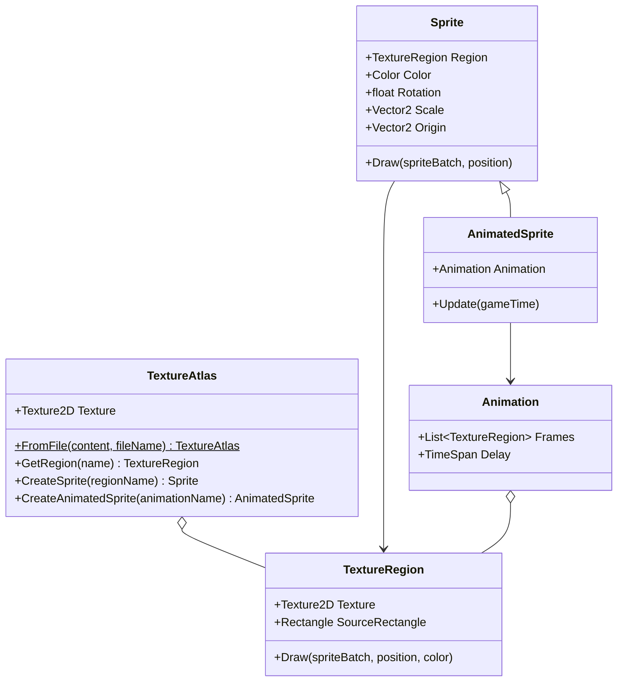

## Today's Goal

Make a **Snake** game.

This time we don't start from scratch. We start from a working codebase and focus on a few
systems that we add to GMDCore:

- Texture atlases
- Sprites & animation
- Input and the Command pattern
- Collision detection
- Tilemaps

**Source code:** [Metamate/gmd2-snake](https://github.com/Metamate/gmd2-snake)

The code is split into steps, one project per concept. Each section below names the step
that introduces it. Compare neighbouring steps to see exactly what changed.

| Step | Topic |
| --- | --- |
| `Snake0` | Starting point: drawing parts of an image with hardcoded rectangles |
| `Snake1` | Texture atlas |
| `Snake2` | Sprites |
| `Snake3` | Animation |
| `Snake4` | Input, polled directly in the `Snake` class |
| `Snake5` | Command pattern |
| `Snake6` | Undo & redo |
| `Snake7` | Collision detection |
| `Snake8` | Tilemap (the finished game) |

## Prepare

- [07: Optimizing Texture Rendering](https://docs.monogame.net/articles/tutorials/building_2d_games/07_optimizing_texture_rendering)
- [08: The Sprite Class](https://docs.monogame.net/articles/tutorials/building_2d_games/08_the_sprite_class)
- [09: The AnimatedSprite Class](https://docs.monogame.net/articles/tutorials/building_2d_games/09_the_animatedsprite_class)
- [10: Handling Input](https://docs.monogame.net/articles/tutorials/building_2d_games/10_handling_input)
- [11: Input Management](https://docs.monogame.net/articles/tutorials/building_2d_games/11_input_management)
- [12: Collision Detection](https://docs.monogame.net/articles/tutorials/building_2d_games/12_collision_detection)
- [13: Working With Tilemaps](https://docs.monogame.net/articles/tutorials/building_2d_games/13_working_with_tilemaps)
- [Command Pattern](https://gameprogrammingpatterns.com/command.html)

## Content

Snake uses the same [content builder](../01-pong/#content-pipeline) as Pong and Flappy Bird,
with all steps sharing one assets folder, `Content/Assets`. Its rules build the images into
textures and copy our own XML definitions as they are, because our code reads those itself:

```csharp title="Builder.cs"
// Images are built into textures. Magenta pixels become transparent (color keying).
content.Include<WildcardRule>("*.png", new TextureImporter(), new TextureProcessor
{
    ColorKeyEnabled = true,
    ColorKeyColor = Color.Magenta,
    GenerateMipmaps = false,
    PremultiplyAlpha = true,
});

// The atlas and tilemap definitions are read by our own code at runtime,
// so they are copied as they are instead of being built.
content.IncludeCopy<WildcardRule>("*.xml");
```

## Texture Atlases

_Steps `Snake0` → `Snake1`_

Loading `mario1.png`, `mario2.png`, `ground1.png`… as separate textures means the GPU must
switch texture between draws, which breaks batching. A **texture atlas** (sprite sheet)
packs many images into one texture.

`Snake0` draws parts of the atlas by passing hardcoded source rectangles to
`SpriteBatch.Draw()`. That doesn't scale. In `Snake1`, an XML atlas definition gives each
rectangle a name, and a **texture region** is a named rectangle within the atlas:

```xml
<TextureAtlas>
    <Texture>images/atlas</Texture>
    <Regions>
        <Region name="snake-1" x="0" y="0" width="20" height="20" />
        <Region name="bat-1" x="20" y="0" width="20" height="20" />
    </Regions>
</TextureAtlas>
```

```csharp
TextureAtlas atlas = TextureAtlas.FromFile(Content, "images/atlas-definition.xml");
TextureRegion snake = atlas.GetRegion("snake-1");
```



## Sprites & Animation

_Steps `Snake2` and `Snake3`_

A `Sprite` wraps a texture region together with everything needed to draw it: color mask,
rotation, scale, origin, sprite effects and layer depth. `Snake2` scales the bat and spins
it around its centre (`CenterOrigin()`).

An **animation** is a list of regions and a frame delay, also defined in the atlas XML. An
`AnimatedSprite` is a `Sprite` that accumulates elapsed time in `Update()` and advances to
the next frame when the delay has passed (`Snake3`).

## Input & the Command Pattern

_Steps `Snake4` → `Snake6`_

In `Snake4`, the `Snake` class reads the keyboard itself:

```csharp
private void HandleInput()
{
    if (Core.Input.Keyboard.WasKeyJustPressed(Keys.W))
    {
        TryMove(-Vector2.UnitY);
    }
    else if (Core.Input.Keyboard.WasKeyJustPressed(Keys.S))
    {
        TryMove(Vector2.UnitY);
    }
    // ...
}
```

Physical keys are hardwired to actions, inside gameplay code. Rebinding keys, adding a
gamepad or letting an AI control the snake all mean editing the `Snake` class.

### Commands

The **Command pattern** turns the action into an object:

> "A command is a reified method call." — Robert Nystrom

```csharp
public interface ICommand
{
    void Execute();
}

public class MoveCommand(Snake snake, Vector2 direction) : ICommand
{
    public void Execute()
    {
        if (snake.IsValidMove(direction))
        {
            snake.Move(direction);
        }
    }
}
```

In `Snake5`, an `InputHandler` binds each button to a command. The snake no longer knows
the keyboard exists:

```csharp
public ICommand ButtonW { get; set; }
public ICommand ButtonS { get; set; }
// ...

public void HandleInput()
{
    if (Core.Input.Keyboard.WasKeyJustPressed(Keys.W))
    {
        ButtonW.Execute();
    }
    // ...
}
```

Because bindings are just objects, changing what a button does is an assignment. Pressing
`R` executes a `ReverseInputCommand`, which swaps the bindings so up becomes down and left
becomes right:

```csharp
public void ReverseInput()
{
    (ButtonW, ButtonS) = (ButtonS, ButtonW);
    (ButtonA, ButtonD) = (ButtonD, ButtonA);
}
```

### Undo & redo

In `Snake6`, commands can also be undone:

```csharp
public interface ICommand
{
    void Execute();
    void Undo();
}
```

A `CommandInvoker` executes commands and keeps them on an undo stack. Undoing pops a
command, calls `Undo()` and pushes it onto a redo stack (`Q` and `E` in the game). Two
details matter:

- Each action now creates a **new command object**, because each one must remember what
  _it_ did. In `Snake5`, one shared command per button was enough.
- Only **valid** moves are executed. Otherwise, undoing a move that was blocked by a wall
  would move the snake backwards even though it never moved forwards.

### What commands buy us

- **Rebinding:** swap the command bound to a button at runtime.
- **Undo/redo:** commands that know how to reverse themselves can be kept in a history.
- **Replay:** a deterministic game plus a recorded list of commands can be replayed.
- **The same interface for players and AI:** an AI can issue the same commands as the
  player.

## Collision Detection

_Step `Snake7`_

- **Distance-based / circles:** two circles overlap if the distance between their centres
  is less than the sum of their radii. Compare _squared_ values
  (`Vector2.DistanceSquared`) to avoid a square root.
- **AABB:** built into MonoGame as `Rectangle.Intersects()` and `Rectangle.Contains()`.
- **Complex polygons:** precise, but expensive. Rarely worth it in 2D games.

MonoGame has no circle type, so GMDCore has a `Circle` struct with `Intersects(Circle)`.
Both the snake and the bat expose their `Bounds` as a `Circle`.

**Collision response** is what happens _after_ a hit:

- **Blocking:** push objects apart or prevent the move (the snake can't leave the room).
- **Triggering:** something happens (the snake eats the bat, and a new bat appears).
- **Bouncing:** reflect the velocity off the surface (the bat uses `Vector2.Reflect` with
  the wall's normal).

**Performance:** checking every pair of `n` objects costs `n × (n − 1) / 2` checks. 100
objects means 4,950 checks every frame. Real engines split this into a cheap **broad
phase** that finds _possible_ pairs, and a precise **narrow phase** for those pairs only.
We return to this in [Geometry Wars](../11-geometry-wars/).

## Tilemaps

_Step `Snake8`_

A **tileset** is an atlas of equally sized tiles. A **tilemap** is a grid of indices into
that tileset, defined in XML:

```xml
<Tilemap>
    <Tileset region="0 40 80 80" tileWidth="20" tileHeight="20">images/atlas</Tileset>
    <Tiles>
        00 01 02 01 03
        04 05 06 05 07
        08 09 10 09 11
        04 09 09 09 07
        12 13 14 13 15
    </Tiles>
</Tilemap>
```

The level is data, not code. In `Snake8`, the room's walls are the tilemap's outer ring of
tiles, so the playable area shrinks by one tile on each side. Collision with a static grid
is also cheap: to find what is at a position, divide by the tile size. No need to check
every tile.

## Exercises

Start from `Snake8`.

1. **Custom tilemap:** find or create a tileset and apply it to the game (texture atlas and
   XML tilemap definition). Change sprites and animations if you like.
2. **Classic Snake:** add a tail that grows when the snake eats the bat. Colliding with the
   tail or a wall ends the game. Make the snake move continuously on a timer, and add a
   score. (Continuous movement makes undo pointless; remove it.)
3. **Commands:**
   - Make eating a bat reverse the controls for five seconds, by swapping commands, without
     touching the `Snake` class.
   - Add input buffering: with continuous movement, a quick Up-then-Left between two ticks
     shouldn't lose the second key press. Queue direction commands and consume one per
     tick.
4. **Replay (stretch):** record every executed command with its tick number. After game
   over, replay the run from the start.

## Apply It to Your Project

- What are the _actions_ in your game? List them separately from the keys and buttons
  that trigger them.
- Would your game benefit from rebinding, undo or replays?

## Check Yourself

<details>
<summary>Why prefer a texture atlas over many individual image files?</summary>

Drawing from one texture lets SpriteBatch batch many sprites into few draw calls. Switching
textures between draws breaks the batch and costs performance.

</details>

<details>
<summary>What problems come from polling the keyboard directly inside gameplay code?</summary>

Keys are hardcoded throughout the game, so rebinding, supporting a gamepad or letting an
AI drive the same entity means editing gameplay code in many places.

</details>

<details>
<summary>Why compare squared distances in circle collision?</summary>

Square roots are relatively expensive, and comparing squared values gives the same answer.

</details>

Related exam questions: [4](../../exam/#4-command-pattern--input-handling),
[6](../../exam/#6-sprites-texture-atlases-animation--rendering),
[7](../../exam/#7-tilemaps-collision-detection--procedural-generation).
