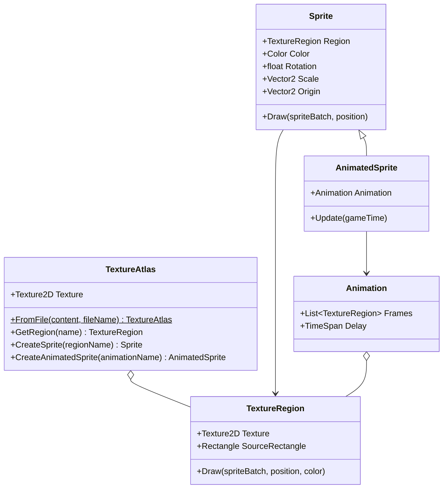

## Today's Goal

Make a **Snake** game.

This time we don't start from scratch. We start from a working codebase, and the main
topic is **assets as data**: which images, animations and rooms the game uses is described
in data files, not hardcoded. Along the way:

- Texture atlases, sprites & animation
- Movement on a fixed tick
- Input as actions, and input buffering

**Source code:** [gar-games/03-snake](https://github.com/Metamate/gar-games/tree/main/03-snake)

The code is split into steps, one project per concept. Each section below names the step
that introduces it. Compare neighbouring steps to see exactly what changed.

| Step | Topic |
| --- | --- |
| `Snake0` | Starting point: drawing parts of an image with hardcoded rectangles |
| `Snake1` | Texture atlas |
| `Snake2` | Sprites |
| `Snake3` | Animation |
| `Snake4` | The room, drawn from a tilemap definition |
| `Snake5` | Fixed-tick movement: the snake moves by itself, one cell per tick |
| `Snake6` | Input as actions |
| `Snake7` | Input buffering |
| `Snake8` | The bat: collision, eating and growing |
| `Snake9` | Game over (the finished game) |

## Prepare

- [07: Optimizing Texture Rendering](https://docs.monogame.net/articles/tutorials/building_2d_games/07_optimizing_texture_rendering)
- [08: The Sprite Class](https://docs.monogame.net/articles/tutorials/building_2d_games/08_the_sprite_class)
- [09: The AnimatedSprite Class](https://docs.monogame.net/articles/tutorials/building_2d_games/09_the_animatedsprite_class)
- [11: Input Management](https://docs.monogame.net/articles/tutorials/building_2d_games/11_input_management)
- [12: Collision Detection](https://docs.monogame.net/articles/tutorials/building_2d_games/12_collision_detection)

## Assets as Data

Snake uses the same [content builder](../01-pong/#content-pipeline) as Pong and Flappy Bird,
with all steps sharing one assets folder, `Content/Assets`. Next to the images, it contains
XML files that _describe_ the assets: which part of the image is the snake, how its
animation runs, and which tile goes where in the room. The builder copies those files as
they are, because our own code reads them:

```csharp title="Builder.cs"
// Images are built into textures. Magenta pixels become transparent (color keying).
content.Include<WildcardRule>("*.png", new TextureImporter(), new TextureProcessor
{
    ColorKeyEnabled = true,
    ColorKeyColor = Color.Magenta,
    GenerateMipmaps = false,
    PremultiplyAlpha = true,
});

// The atlas and tilemap definitions are read by our own code at runtime,
// so they are copied as they are instead of being built.
content.IncludeCopy<WildcardRule>("*.xml");
```

Why bother? Because data can change without the code changing. A new animation frame, a
faster bat or a different room is an edit to an XML file, not to C#. An artist or designer
can make it without touching the game's code, and the code stays smaller and more general.

## Texture Atlases

_Steps `Snake0` → `Snake1`_

Loading `mario1.png`, `mario2.png`, `ground1.png`… as separate textures means the GPU must
switch texture between draws, which breaks batching. A **texture atlas** (sprite sheet)
packs many images into one texture.

`Snake0` draws parts of the atlas by passing hardcoded source rectangles to
`SpriteBatch.Draw()`. That doesn't scale. In `Snake1`, an XML atlas definition gives each
rectangle a name, and a **texture region** is a named rectangle within the atlas:

```xml
<TextureAtlas>
    <Texture>images/atlas</Texture>
    <Regions>
        <Region name="snake-1" x="0" y="0" width="20" height="20" />
        <Region name="bat-1" x="20" y="0" width="20" height="20" />
    </Regions>
</TextureAtlas>
```

```csharp
TextureAtlas atlas = TextureAtlas.FromFile(Content, "images/atlas-definition.xml");
TextureRegion snake = atlas.GetRegion("snake-1");
```



## Sprites & Animation

_Steps `Snake2` and `Snake3`_

A `Sprite` wraps a texture region together with everything needed to draw it: color mask,
rotation, scale, origin, sprite effects and layer depth. `Snake2` scales the bat and spins
it around its centre (`CenterOrigin()`).

An **animation** is a list of regions and a frame delay, also defined in the atlas XML:

```xml
<Animation name="bat-animation" delay="200">
    <Frame region="bat-1" />
    <Frame region="bat-2" />
    <Frame region="bat-1" />
    <Frame region="bat-3" />
</Animation>
```

An `AnimatedSprite` is a `Sprite` that accumulates elapsed time in `Update()` and advances
to the next frame when the delay has passed (`Snake3`).

## The Room

_Step `Snake4`_

The room is data too. A tilemap definition lists which tile of the atlas goes in each cell:

```xml
<Tilemap>
    <Tileset region="0 40 80 80" tileWidth="20" tileHeight="20">images/atlas</Tileset>
    <Tiles>
        00 01 02 01 02 01 02 01 02 01 02 01 02 01 02 03
        04 05 05 06 05 05 06 05 05 06 05 05 06 05 05 07
        08 09 09 09 09 09 09 09 09 09 09 09 09 09 09 11
        ...
    </Tiles>
</Tilemap>
```

GMDCore's `Tilemap.FromFile` reads it and draws the room. Here the tilemap is only a
picture: the walls are simply the cells outside the room's `Rectangle`. In
[Sokoban](../04-sokoban/), the grid becomes the game's state itself.

## Fixed-Tick Movement

_Step `Snake5`_

A snake doesn't glide: it jumps one cell at a time, several times per second, however fast
the game runs. The `Snake` class keeps its body as a list of **cells** (head first), and
moves on a fixed **tick**:

```csharp title="Snake.cs"
private static readonly TimeSpan TickDuration = TimeSpan.FromMilliseconds(200);

public void Update(GameTime gameTime)
{
    // Collect the time since the last move, and move once for every full tick.
    _elapsed += gameTime.ElapsedGameTime;
    while (_elapsed >= TickDuration)
    {
        _elapsed -= TickDuration;
        Move();
    }
}
```

This is the fixed timestep from [Pong](../01-pong/#fixed-vs-variable-timestep) in
practice: an **accumulator** collects real time, and the simulation advances in fixed-size
steps. Subtracting (instead of resetting `_elapsed` to zero) keeps the leftover time, so the
ticks stay evenly spaced.

Moving is cheap on a grid: add a new head in the current direction and remove the tail.

## Input as Actions

_Steps `Snake5` → `Snake6`_

In `Snake5`, the game reads the keys directly:

```csharp
if (Input.Keyboard.WasKeyJustPressed(Keys.W))
{
    _snake.Turn(Direction.Up);
}
```

Physical keys are hardwired to what they do. Supporting the arrow keys too, a gamepad, or
letting the player choose their keys means finding every place that reads a key.

In `Snake6`, a `GameController` maps keys to the game's **actions**. The rest of the game
asks whether the player wants to go _up_, never which key was pressed:

```csharp title="GameController.cs"
public static class GameController
{
    public static bool Up => WasPressed(Keys.W) || WasPressed(Keys.Up);
    public static bool Down => WasPressed(Keys.S) || WasPressed(Keys.Down);
    public static bool Left => WasPressed(Keys.A) || WasPressed(Keys.Left);
    public static bool Right => WasPressed(Keys.D) || WasPressed(Keys.Right);

    private static bool WasPressed(Keys key) => Core.Input.Keyboard.WasKeyJustPressed(key);
}
```

Now the controls live in one place. In [Sokoban](../04-sokoban/), we go one step further
and turn each action into an object.

## Input Buffering

_Step `Snake7`_

The snake moves right. Quickly press Up, then Left, before the next tick. In `Snake6`, the
second key press overwrites the first, and the snake turns straight back into its own neck.
Input happens every frame, but the snake only acts on a tick, so key presses can be lost
between ticks.

`Snake7` **buffers** the turns in a queue, and each tick uses one:

```csharp title="Snake.cs"
public void Turn(Point direction)
{
    Point current = _turns.Count > 0 ? _turns.Last() : _direction;

    if (_turns.Count < MaxBufferedTurns && direction != current && direction != Opposite(current))
    {
        _turns.Enqueue(direction);
    }
}
```

A new turn is checked against the _last buffered_ direction, not the current one, so no
combination of quick key presses can reverse the snake. The buffer is kept short (two
turns), so the snake never acts on presses the player has long forgotten.

Many games buffer input like this: a jump pressed just before landing, or a combo pressed
slightly early, still counts.

## Eating & Growing

_Step `Snake8`_

A bat flies around the room. When the snake's head touches it, the snake eats it, grows,
and a new bat appears.

- **Distance-based / circles:** two circles overlap if the distance between their centres
  is less than the sum of their radii. Compare _squared_ values
  (`Vector2.DistanceSquared`) to avoid a square root.
- **AABB:** built into MonoGame as `Rectangle.Intersects()` and `Rectangle.Contains()`
  (see [Pong](../01-pong/)).

MonoGame has no circle type, so GMDCore has a `Circle` struct with `Intersects(Circle)`.
Both the snake's head and the bat expose their `Bounds` as a `Circle`.

**Collision response** is what happens _after_ a hit:

- **Triggering:** something happens. The snake eats the bat and grows: on its next move,
  it keeps its tail.
- **Bouncing:** reflect the velocity off the surface. The bat uses `Vector2.Reflect` with
  the wall's normal.

## Game Over

_Step `Snake9`_

Until now, the snake wrapped around to the other side of the room. In `Snake9`, the walls
and the snake's own body are deadly. Both are grid checks, without any shapes:

```csharp
// Hitting a wall or its own body ends the game, and a new one starts.
if (!_room.Contains(_snake.Head) || _snake.IsBitingItself)
{
    _snake.Reset(_room.Center);
    RespawnBat();
}
```

## Exercises

Start from `Snake9`.

1. **Data, not code:** add a second enemy with its own animation (new regions and an
   animation in `atlas-definition.xml`), and change the room layout in
   `tilemap-definition.xml`. How much C# did you need to change?
2. **Speed up:** make the tick shorter each time the snake eats, down to a minimum. Where
   does that rule belong?
3. **New input:** add gamepad support (D-pad and left stick) by changing only
   `GameController`.
4. **Pause:** add a pause action. While paused, the snake doesn't move and turns aren't
   buffered.
5. **Refactor (stretch):** the tick timer lives in `Snake`. Move it into a reusable
   `FixedTimer` class in GMDCore that calls back on every tick, and use it for the snake.

## Apply It to Your Project

- Which of your game's assets and settings are hardcoded, and could live in data files?
- What are the _actions_ in your game? List them separately from the keys and buttons
  that trigger them.
- Does anything in your game happen on a fixed tick rather than every frame?

## Check Yourself

<details>
<summary>Why prefer a texture atlas over many individual image files?</summary>

Drawing from one texture lets SpriteBatch batch many sprites into few draw calls. Switching
textures between draws breaks the batch and costs performance.

</details>

<details>
<summary>Why subtract the tick duration from the accumulator instead of resetting it to zero?</summary>

The leftover time carries over to the next tick. Resetting it would throw away a bit of
time every tick, so the ticks would drift and depend on the frame rate.

</details>

<details>
<summary>What problems come from reading the keyboard directly inside gameplay code?</summary>

Keys are hardcoded throughout the game, so rebinding, supporting a gamepad or letting an
AI drive the same entity means editing gameplay code in many places.

</details>

<details>
<summary>Why check a buffered turn against the last buffered direction?</summary>

The snake only turns on the next tick. Checking against its current direction would allow
two quick turns that together reverse it into its own neck.

</details>

Related exam questions: [1](../../exam/#1-game-loop--update-method),
[4](../../exam/#4-command-pattern--input-handling),
[6](../../exam/#6-sprites-texture-atlases-animation--rendering).
