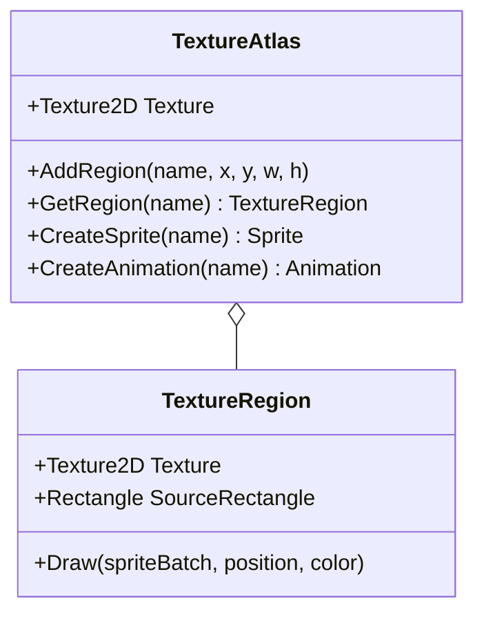

## Today's Goal

Make a **Snake** game.

This time we don't start from scratch. We start from a working codebase and focus on a few
systems that we add to GMDCore:

- Texture atlases
- Sprites & animation
- Input and the Command pattern
- Collision detection
- Tilemaps

**Source code:** [Metamate/gmd2-snake](https://github.com/Metamate/gmd2-snake)

## Prepare

- [07: Optimizing Texture Rendering](https://docs.monogame.net/articles/tutorials/building_2d_games/07_optimizing_texture_rendering)
- [08: The Sprite Class](https://docs.monogame.net/articles/tutorials/building_2d_games/08_the_sprite_class)
- [09: The AnimatedSprite Class](https://docs.monogame.net/articles/tutorials/building_2d_games/09_the_animatedsprite_class)
- [10: Handling Input](https://docs.monogame.net/articles/tutorials/building_2d_games/10_handling_input)
- [11: Input Management](https://docs.monogame.net/articles/tutorials/building_2d_games/11_input_management)
- [12: Collision Detection](https://docs.monogame.net/articles/tutorials/building_2d_games/12_collision_detection)
- [13: Working With Tilemaps](https://docs.monogame.net/articles/tutorials/building_2d_games/13_working_with_tilemaps)
- [Command Pattern](https://gameprogrammingpatterns.com/command.html)

## Texture Atlases

Loading `mario1.png`, `mario2.png`, `ground1.png`… as separate textures means the GPU must
switch texture between draws, which breaks batching. A **texture atlas** (sprite sheet)
packs many images into one texture. A **texture region** is a named rectangle within the
atlas.



## Sprites & Animation

A `Sprite` wraps a texture region together with everything needed to draw it: color mask,
rotation, scale, origin, sprite effects and layer depth.

An **animation** is a list of regions and a frame interval. An `AnimatedSprite` is a
`Sprite` that accumulates elapsed time and advances to the next frame when the interval
has passed.

## Input & the Command Pattern

Snake's input starts out like this:

```csharp
if (IsPressed(Keys.Up)) MoveUp();
if (IsPressed(Keys.Down)) MoveDown();
// ...
```

Physical keys are hardwired to actions. The **Command pattern** turns the action into an
object:

> "A command is a reified method call." — Robert Nystrom

```csharp
public interface ICommand
{
    void Execute();
}

public class MoveCommand(Snake snake, Point direction) : ICommand
{
    public void Execute() => snake.Move(direction);
}
```

Input handling now looks up _which command_ a key is bound to, instead of _which method_
to call:

```csharp
public Dictionary<Keys, ICommand> Bindings { get; } = new();

foreach (var (key, command) in Bindings)
    if (Input.Keyboard.WasKeyJustPressed(key))
        command.Execute();
```

What this buys us:

- **Rebinding:** swap the command bound to a key at runtime.
- **Undo/redo:** commands that know how to reverse themselves (`Undo()`) can be kept in a
  history stack.
- **Replay:** a deterministic game plus a recorded list of commands can be replayed.
- **Same interface for players and AI:** an AI can issue the same commands as the player.

**Input buffering:** in Snake, a quick Up-then-Left between two ticks shouldn't lose the
second key press. Queue direction commands and consume one per movement tick.

## Collision Detection

- **Distance-based / circles:** two circles overlap if the distance between their centres
  is less than the sum of their radii. Compare _squared_ values
  (`Vector2.DistanceSquared`) to avoid a square root.
- **AABB:** built into MonoGame as `Rectangle.Intersects()` and `Rectangle.Contains()`.
- **Complex polygons:** precise, but expensive. Rarely worth it in 2D games.

We add a `Circle` struct with `Intersects(Circle)` to GMDCore.

**Collision response** is what happens _after_ a hit: blocking (push objects apart),
triggering (fire an event, pick up an item) or bouncing (`Vector2.Reflect`).

**Performance:** checking every pair of `n` objects costs `n × (n − 1) / 2` checks. 100
objects means 4,950 checks every frame. Real engines split this into a cheap **broad
phase** that finds _possible_ pairs, and a precise **narrow phase** for those pairs only.
We return to this in [Geometry Wars](../09-geometry-wars/).

## Tilemaps

A **tileset** is an atlas of equally sized tiles. A **tilemap** is a grid of indices into
that tileset:

```text
00 01 02 01 03
04 05 06 05 07
08 09 10 09 11
04 09 09 09 07
12 13 14 13 15
```

The level is data (an XML file), not code. Collision with a static grid is also cheap: to
find what is at a position, divide by the tile size. No need to check every tile.

## Exercises

1. **Custom tilemap:** find or create a tileset and apply it to the game (texture atlas and
   XML tilemap definition). Change sprites and animations if you like.
2. **Classic Snake:** add a tail that grows when the snake eats. Colliding with the tail or
   a wall ends the game. Make the snake move continuously and add a score.
3. **Command pattern:** move input handling to commands bound to keys.
   - Add a "confusion" pickup (or a key) that reverses all direction bindings by swapping
     the commands, without touching the snake's code.
   - Add input buffering, so fast key presses between ticks aren't lost.
4. **Replay (stretch):** record every executed command with its tick number. After game
   over, replay the run from the start.

## Apply It to Your Project

- What are the _actions_ in your game? List them separately from the keys and buttons
  that trigger them.
- Would your game benefit from rebinding, undo or replays?

## Check Yourself

<details>
<summary>Why prefer a texture atlas over many individual image files?</summary>

Drawing from one texture lets SpriteBatch batch many sprites into few draw calls. Switching
textures between draws breaks the batch and costs performance.

</details>

<details>
<summary>What problems come from polling the keyboard directly inside gameplay code?</summary>

Keys are hardcoded throughout the game, so rebinding, supporting a gamepad or letting an
AI drive the same entity means editing gameplay code in many places.

</details>

<details>
<summary>Why compare squared distances in circle collision?</summary>

Square roots are relatively expensive, and comparing squared values gives the same answer.

</details>

Related exam questions: [4](../../exam/#4-command-pattern--input-handling),
[6](../../exam/#6-sprites-texture-atlases-animation--rendering),
[7](../../exam/#7-tilemaps-collision-detection--procedural-generation).
