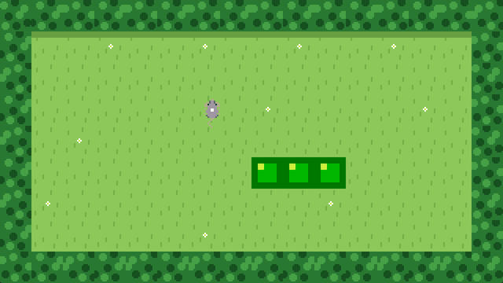
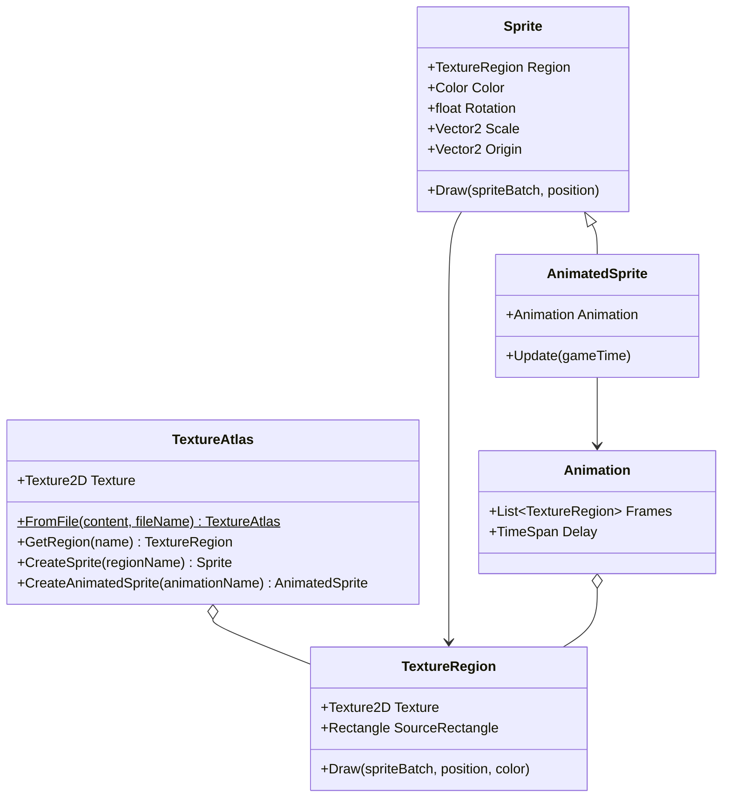

## Today's Goal

Make a **grow-and-avoid game**, like Snake: eat to grow longer, and steer clear of the walls
and your own tail.

<figure class="original">

<figcaption>The original: Snake, a game idea that goes back to <em>Blockade</em> (Gremlin, 1976), and became famous on mobile phones. Image: Ustone07, <a href="https://commons.wikimedia.org/wiki/File:Snake_can_be_completed.gif">CC BY-SA 3.0</a>, via Wikimedia Commons.</figcaption>
</figure>

This time we don't start from scratch. You get a working codebase, and we look at how it
keeps its assets as data. The images, the animations and the room are described in XML
files, and the code reads them from there.

The session also covers texture atlases, sprites and animation, movement on a fixed tick,
and input as actions, with input buffering.

**Source code:** [gar-games/03-snake](https://github.com/Metamate/gar-games/tree/main/03-snake)

## Prepare

- [07: Optimizing Texture Rendering](https://docs.monogame.net/articles/tutorials/building_2d_games/07_optimizing_texture_rendering)
- [08: The Sprite Class](https://docs.monogame.net/articles/tutorials/building_2d_games/08_the_sprite_class)
- [09: The AnimatedSprite Class](https://docs.monogame.net/articles/tutorials/building_2d_games/09_the_animatedsprite_class)
- [11: Input Management](https://docs.monogame.net/articles/tutorials/building_2d_games/11_input_management)
- [12: Collision Detection](https://docs.monogame.net/articles/tutorials/building_2d_games/12_collision_detection)
- [13: Working With Tilemaps](https://docs.monogame.net/articles/tutorials/building_2d_games/13_working_with_tilemaps)
- [22: Snake Game Mechanics](https://docs.monogame.net/articles/tutorials/building_2d_games/22_snake_game_mechanics), grid movement on a fixed tick
- [23: Completing the Game](https://docs.monogame.net/articles/tutorials/building_2d_games/23_completing_the_game), which adds input buffering

## Assets as Data

Snake uses the same [content builder](../01-pong/#content-pipeline) as Pong and Flappy Bird,
with all steps sharing one assets folder, `Content/Assets`. Next to the images, it contains
XML files that _describe_ the assets. They say which part of the image is the snake, how
its animations run, and which tile goes where in the room. The builder copies those files as
they are, because our own code reads them:

```csharp title="Builder.cs"
// Images are built into textures. Magenta pixels become transparent (color keying).
content.Include<WildcardRule>("*.png", new TextureImporter(), new TextureProcessor
{
    ColorKeyEnabled = true,
    ColorKeyColor = Color.Magenta,
    GenerateMipmaps = false,
    PremultiplyAlpha = true,
});

// The atlas and tilemap definitions are read by our own code at runtime,
// so they are copied as they are instead of being built.
content.IncludeCopy<WildcardRule>("*.xml");
```

The benefit is that the data can change while the code stays the same. A new animation
frame, a new sprite or a different room is an edit to an XML file. An artist or designer can
make it without touching the game's code, and the code stays smaller and more general.

## Texture Atlases

_Steps `Snake0` → `Snake1`_

Loading `body.png`, `head1.png`, `food1.png`… as separate textures means the GPU must
switch texture between draws, which breaks batching. A **texture atlas** (sprite sheet)
packs many images into one texture.

`Snake0` draws parts of the atlas by passing hardcoded source rectangles to
`SpriteBatch.Draw()`, which gets hard to maintain as the number of sprites grows. In
`Snake1`, an XML atlas definition gives each rectangle a name, and a **texture region** is
a named rectangle within the atlas:

```xml
<TextureAtlas>
    <Texture>images/atlas</Texture>
    <Regions>
        <Region name="head-1" x="8" y="0" width="7" height="7" />
        <Region name="food-1" x="24" y="0" width="7" height="7" />
    </Regions>
</TextureAtlas>
```

```csharp
TextureAtlas atlas = TextureAtlas.FromFile(Content, "images/atlas-definition.xml");
TextureRegion head = atlas.GetRegion("head-1");
```


```mermaid
classDiagram
    class TextureAtlas {
        +Texture2D Texture
        +FromFile(content, fileName)$ TextureAtlas
        +GetRegion(name) TextureRegion
        +CreateSprite(regionName) Sprite
        +CreateAnimatedSprite(animationName) AnimatedSprite
    }
    class TextureRegion {
        +Texture2D Texture
        +Rectangle SourceRectangle
        +Draw(spriteBatch, position, color)
    }
    class Sprite {
        +TextureRegion Region
        +Color Color
        +float Rotation
        +Vector2 Scale
        +Vector2 Origin
        +Draw(spriteBatch, position)
    }
    class AnimatedSprite {
        +Animation Animation
        +Update(gameTime)
    }
    class Animation {
        +List~TextureRegion~ Frames
        +TimeSpan Delay
    }
    TextureAtlas o-- TextureRegion
    Sprite --> TextureRegion
    Sprite <|-- AnimatedSprite
    AnimatedSprite --> Animation
    Animation o-- TextureRegion
```

**Try it** (`Snake1`): draw the food with its second frame by changing only
`atlas-definition.xml`. Then misspell `food-1` in the XML: what happens, and when?

## Sprites & Animation

_Steps `Snake2` and `Snake3`_

A `Sprite` wraps a texture region together with everything needed to draw it: color mask,
rotation, scale, origin, sprite effects and layer depth. `Snake2` scales the snake's head
four times and spins it around its centre (`CenterOrigin()`).

An **animation** is a list of regions and a frame delay, also defined in the atlas XML:

```xml
<Animation name="head-animation" delay="250">
    <Frame region="head-1" />
    <Frame region="head-1" />
    <Frame region="head-1" />
    <Frame region="head-1" />
    <Frame region="head-1" />
    <Frame region="head-2" />
</Animation>
```

A frame can repeat. Here the head keeps its eyes open for five frames and closes them for
one, so it blinks.

An `AnimatedSprite` is a `Sprite` that accumulates elapsed time in `Update()` and advances
to the next frame when the delay has passed (`Snake3`).

**Try it** (`Snake2` and `Snake3`): make the head bigger and spin it the other way, then
remove `CenterOrigin()` and explain what changes. In the XML only, make the food pulse twice
as fast and the head blink twice as often.

## The Room

_Step `Snake4`_

The room is data too. A tilemap definition lists which tile of the atlas goes in each cell.
The tileset is nine tiles, three by three: the frame's corners and sides around an empty
floor tile in the middle.

```xml
<Tilemap>
    <Tileset region="0 16 24 24" tileWidth="8" tileHeight="8">images/atlas</Tileset>
    <Tiles>
        00 01 01 01 01 01 … 01 01 01 01 02
        03 04 04 04 04 04 … 04 04 04 04 05
        03 04 04 04 04 04 … 04 04 04 04 05
        ...
        06 07 07 07 07 07 … 07 07 07 07 08
    </Tiles>
</Tilemap>
```

GARCore's `Tilemap.FromFile` reads it into a flat array of tile numbers, one per cell, row
after row. The cell in column `x` and row `y` is at index `y * Columns + x`. To draw the room,
the tilemap goes through the array and draws each tile's region at a position worked out from
its index. Sprites each keep their own position; tiles have theirs from the grid, and all of
them come from one texture, so the whole room goes to the graphics card in one batch. A big
level would only draw the cells on screen. Here the tilemap is only a
picture, and the walls are simply the cells outside the room's `Rectangle`. In
[Sokoban](../04-sokoban/), the grid becomes the game's state itself.

**Try it** (`Snake4`): rearrange the room in `tilemap-definition.xml`. Then put a 9 in it:
what happens, and when?

## Fixed-Tick Movement

_Step `Snake5`_

A snake doesn't glide. It jumps one cell at a time, several times per second, however fast
the game runs. The `Snake` class keeps its body as a list of **cells** (head first), and
moves on a fixed **tick**:

```csharp title="Snake.cs"
private static readonly TimeSpan TickDuration = TimeSpan.FromMilliseconds(100);

public void Update(GameTime gameTime)
{
    // Collect the time since the last move, and move once for every full tick.
    _elapsed += gameTime.ElapsedGameTime;
    while (_elapsed >= TickDuration)
    {
        _elapsed -= TickDuration;
        Move();
    }
}
```

This is the fixed timestep from [Pong](../01-pong/#fixed-vs-variable-timestep) in
practice. An **accumulator** collects real time, and the simulation advances in fixed-size
steps. Subtracting (instead of resetting `_elapsed` to zero) keeps the leftover time, so the
ticks stay evenly spaced.

Moving is cheap on a grid. Add a new head in the current direction and remove the tail.

The head has a sprite of its own, and its `Rotation` turns it to face the direction the
snake moves in. It turns around its centre, so it is drawn at its cell's corner plus its
origin:

```csharp title="Snake.cs"
_head.Rotation = MathF.Atan2(_direction.Y, _direction.X);
_head.Draw(spriteBatch, CellPosition(Head) + _head.Origin);
```

## Input as Actions

_Steps `Snake5` → `Snake6`_

In `Snake5`, the game reads the keys directly:

```csharp
if (Input.Keyboard.WasKeyJustPressed(Keys.W))
{
    _snake.Turn(Direction.Up);
}
```

Physical keys are hardwired to what they do. Supporting the arrow keys too, a gamepad, or
letting the player choose their keys means finding every place that reads a key.

In `Snake6`, a `GameController` maps keys to the game's **actions**. The rest of the game
asks whether the player wants to go _up_, never which key was pressed:

```csharp title="GameController.cs"
public static class GameController
{
    public static bool Up => WasPressed(Keys.W) || WasPressed(Keys.Up);
    public static bool Down => WasPressed(Keys.S) || WasPressed(Keys.Down);
    public static bool Left => WasPressed(Keys.A) || WasPressed(Keys.Left);
    public static bool Right => WasPressed(Keys.D) || WasPressed(Keys.Right);

    private static bool WasPressed(Keys key) => Core.Input.Keyboard.WasKeyJustPressed(key);
}
```

Now the controls live in one place. In [Sokoban](../04-sokoban/), we go one step further
and turn each action into an object.

## Input Buffering

_Step `Snake7`_

The snake moves right. Quickly press Up, then Left, before the next tick. In `Snake6`, the
second key press overwrites the first, and the snake turns straight back into its own neck.
Input happens every frame, but the snake only acts on a tick, so key presses can be lost
between ticks.

`Snake7` **buffers** the turns in a queue, and each tick uses one:

```csharp title="Snake.cs"
public void Turn(Point direction)
{
    Point current = _turns.Count > 0 ? _turns.Last() : _direction;

    if (_turns.Count < MaxBufferedTurns && direction != current && direction != Opposite(current))
    {
        _turns.Enqueue(direction);
    }
}
```

A new turn is checked against the _last buffered_ direction, so no combination of quick
key presses can reverse the snake. The buffer is kept short (two
turns), so the snake never acts on presses the player has long forgotten.

Many games buffer input like this, so that a jump pressed just before landing, or a combo
pressed slightly early, still counts.

**Try it** (`Snake7`): make the snake twice as fast, and add I, J, K and L as a third set
of keys. Which file did each change need? Then press two turns within one tick, in `Snake6`
and in `Snake7`.

## Eating & Growing

_Step `Snake8`_

Food sits on one cell of the room. When the snake's head reaches it, the snake eats it,
grows, and new food appears on a free cell. Each bite adds a point to the score under the
room. Its digits are regions of the atlas too (`digit-0` to `digit-9`): a font that is only
data.

- **Distance-based / circles:** two circles overlap if the distance between their centres
  is less than the sum of their radii. Compare _squared_ values
  (`Vector2.DistanceSquared`) to avoid a square root.
- **AABB:** built into MonoGame as `Rectangle.Intersects()` and `Rectangle.Contains()`
  (see [Pong](../01-pong/)).

Which shape to use is a trade between speed and precision. Circles fit round and rotating
things, and rectangles fit boxes and tiles; both are cheap. Polygons follow a sprite's outline
closely, but cost more to check and to write. Use the simplest shape that looks right to the
player. A grid lookup, as in [Super Mario Bros](../06-super-mario-bros/#performance), is
cheaper still, but only works for things that stay in their cell.

MonoGame has no circle type, so GARCore has a `Circle` struct with `Intersects(Circle)`.
Both the snake's head and the food expose their `Bounds` as a `Circle`. The food stays in
its cell, so comparing cells would work here too; circles also work for things that move
freely, which the later games need.

**Collision response** is what happens _after_ a hit:

- **Triggering:** something happens. The snake eats the food and grows. On its next move,
  it keeps its tail.
- **Bouncing:** reflect the velocity off the surface, as the ball does in [Pong](../01-pong/).
  `Vector2.Reflect` does it for any angle, given the surface's normal.

## Game Over

_Step `Snake9`_

Until now, the snake wrapped around to the other side of the room. In `Snake9`, the walls
and the snake's own body are deadly. Both are grid checks, without any shapes:

```csharp
// Hitting a wall or its own body ends the game, and a new one starts.
if (!_room.Contains(_snake.Head) || _snake.IsBitingItself)
{
    _snake.Reset(_room.Center);
    _score = 0;
    _food.MoveToFreeCell(_snake);
}
```

## Exercises

Start from `Snake9`.

1. **A bug from data:** the atlas image also holds a bug the game doesn't use yet, with two
   7 × 7 frames at (40, 0) and (48, 0). Describe it in `atlas-definition.xml` (two regions and a
   `bug-animation`), and make the snake eat a bug instead of the food. How much C# did you
   need to change? And for a bug _next to_ the food: what in `Game1` would have to change,
   and what does that say about where the food's rules live?
2. **Speed up:** make the tick shorter each time the snake eats, down to a minimum. Where
   does that rule belong?
3. **New input:** add gamepad support for the D-pad. A press needs last frame's state, so
   first add a `GamePadInfo` to GARCore's `InputManager`, modelled on `KeyboardInfo` (`Core`
   already updates the `InputManager` every frame). Then map the D-pad in `GameController`.
   Which files in the game itself did you change?
4. **Pause:** add a pause action. While paused, the snake doesn't move and turns aren't
   buffered.
5. **Refactor (stretch):** the tick timer lives in `Snake`. Move it into a reusable
   `FixedTimer` class in GARCore that calls back on every tick, and use it for the snake.

## Apply It to Your Project

- Which of your game's assets and settings are hardcoded, and could live in data files?
- What are the _actions_ in your game? List them separately from the keys and buttons
  that trigger them.
- Does anything in your game happen on a fixed tick?

## Check Yourself

<details>
<summary>Why prefer a texture atlas over many individual image files?</summary>

Drawing from one texture lets SpriteBatch batch many sprites into few draw calls. Switching
textures between draws breaks the batch and costs performance.

</details>

<details>
<summary>Why subtract the tick duration from the accumulator instead of resetting it to zero?</summary>

The leftover time carries over to the next tick. Resetting it would throw away a bit of
time every tick, so the ticks would drift and depend on the frame rate.

</details>

<details>
<summary>What problems come from reading the keyboard directly inside gameplay code?</summary>

Keys are hardcoded throughout the game, so rebinding, supporting a gamepad or letting an
AI drive the same entity means editing gameplay code in many places.

</details>

<details>
<summary>Why check a buffered turn against the last buffered direction?</summary>

The snake only turns on the next tick. Checking against its current direction would allow
two quick turns that together reverse it into its own neck.

</details>

Related exam questions: [1](../../exam/#1-game-loop--update-method),
[4](../../exam/#4-command-pattern--input-handling),
[6](../../exam/#6-sprites-texture-atlases-animation--rendering),
[8](../../exam/#8-data-driven-design--serialization).
