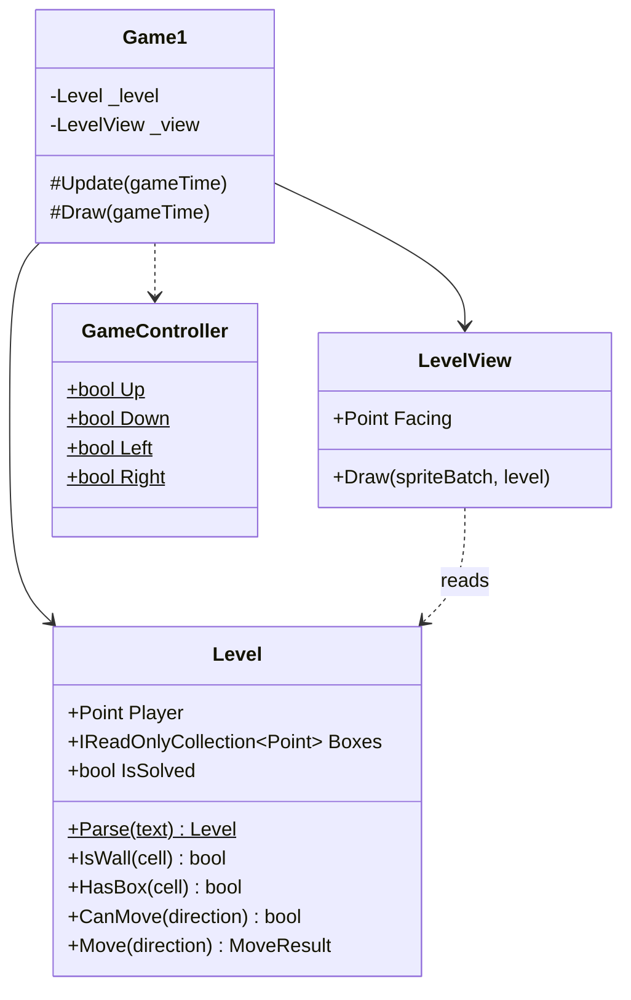
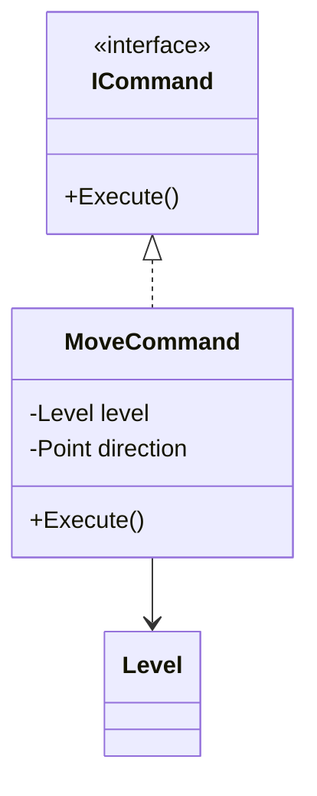

## Today's Goal

Make a **Sokoban** game: push every box onto a goal. You can only push, never pull, and
only one box at a time.

Snake's grid was a picture with a snake on top. In Sokoban, the grid _is_ the game: the
walls, the boxes and the player are the whole state. The main topic is the **Command**
pattern, which turns every move into an object, and gives us **undo and redo**. Along
the way:

- Levels as data: plain text files
- Rules separated from drawing
- Unit tests: checking the rules automatically, without starting the game

**Source code:** [gar-games/04-sokoban](https://github.com/Metamate/gar-games/tree/main/04-sokoban)

| Step | Topic |
| --- | --- |
| `Sokoban0` | Levels as data: a text file drawn character by character |
| `Sokoban1` | Rules apart from drawing: `Level` and `LevelView` |
| `Sokoban2` | Command: every move is an object |
| `Sokoban3` | Undo and redo |
| `Sokoban4` | The whole game: seven levels, restart, move counter (the finished game) |
| `Sokoban.Tests` | Unit tests for the finished game's rules, and for undo and redo |

## Prepare

- [Command](https://gameprogrammingpatterns.com/command.html) (the whole chapter, including
  undo and redo)
- No reading on testing: this session introduces it from the start.

## Levels as Data

_Step `Sokoban0`_

Sokoban levels have been written as text for decades, one character per cell:

```text title="level1.txt"
#######
#     #
# @$ .#
#     #
#######
```

| Character | Meaning |
| --- | --- |
| `#` | Wall |
| `$` | Box |
| `.` | Goal |
| `*` | Box on a goal |
| `@` | Player |
| `+` | Player on a goal |

The format is small, readable, and easy to edit in any text editor. As in
[Snake](../03-snake/#assets-as-data), the builder copies the files as they are, and our own
code reads them:

```csharp title="Builder.cs"
content.IncludeCopy<WildcardRule>("*.txt");
```

```csharp
using Stream stream = TitleContainer.OpenStream(Path.Combine(Content.RootDirectory, "levels/level1.txt"));
```

`Sokoban0` draws the level straight from the text: for each character, pick a tile. It
works, but the text is the only state. To move the player, we would have to edit
characters in strings, and every question ("is there a wall here?", "is the level
solved?") would be a question about characters.

## Rules Apart From Drawing

_Step `Sokoban1`_

`Sokoban1` reads the text once, into a `Level`: walls, goals, boxes and the player. `Level`
holds the state and the rules. It knows nothing about textures, keys or the screen.



The rules of a move fit in one method:

```csharp title="Level.cs"
public bool CanMove(Point direction)
{
    Point next = Player + direction;
    if (IsWall(next))
    {
        return false;
    }

    // A box can be pushed if the cell behind it is free.
    if (HasBox(next))
    {
        Point behind = next + direction;
        return !IsWall(behind) && !HasBox(behind);
    }

    return true;
}

public MoveResult Move(Point direction)
{
    if (!CanMove(direction))
    {
        return MoveResult.Blocked;
    }

    Player += direction;

    if (HasBox(Player))
    {
        _boxes.Remove(Player);
        _boxes.Add(Player + direction);
        return MoveResult.Pushed;
    }

    return MoveResult.Walked;
}

public bool IsSolved => _boxes.All(_goals.Contains);
```

`LevelView` draws a level, but never changes it. Which way the player faces is only about
drawing, so it lives in `LevelView`, not in `Level`. The `GameController` is the one from
[Snake](../03-snake/#input-as-actions).

Why split them? Each part can now change on its own: new art only touches `LevelView`, a
new rule only touches `Level`. And the rules can be tested.

## Unit Tests

_Project `Sokoban.Tests`_

How do you know the rules work? So far, by playing: start the game, walk into a box, and
look. That's slow, it's easy to skip a case (a box against another box?), and every
change to the code means playing it all again.

A **unit test** is a small piece of code that checks one thing about your code
automatically: it sets up a situation, does one thing, and checks the result. A test
passes or fails, and hundreds of them run in about a second. Whenever you change the code,
you run the tests again, and they tell you at once if something that used to work is now
broken.

### A Test Needs Code That Can Be Tested

Try to test a rule written inside `Game1.Update`. To call it, you would need a window, a
graphics device, the content, and a real key press. That's why the split in `Sokoban1`
matters: `Level` needs none of those. A test can create a level from a string and move the
player with a method call.

### The Test Project

Tests live in their own project, `Sokoban.Tests`, next to the game. It's a class library
that references the game project, plus three packages:

```xml title="Sokoban.Tests.csproj"
<ItemGroup>
  <!-- The test framework (xunit), and what lets dotnet test and editors find and run the tests. -->
  <PackageReference Include="Microsoft.NET.Test.Sdk" Version="17.*" />
  <PackageReference Include="xunit" Version="2.*" />
  <PackageReference Include="xunit.runner.visualstudio" Version="3.*" />
</ItemGroup>
<ItemGroup>
  <!-- The code under test: the finished game. -->
  <ProjectReference Include="..\Sokoban4\Sokoban4.csproj" />
</ItemGroup>
```

[xUnit](https://xunit.net/) is a **test framework**: it finds your tests, runs them, and
reports the results. The game itself knows nothing about the tests; they are never part of
the game you ship.

### Anatomy of a Test

```csharp title="LevelTests.cs"
public class LevelTests
{
    private const string Corridor = """
        #######
        # @$ .#
        #######
        """;

    [Fact]
    public void Walking_into_a_box_pushes_it()
    {
        // Arrange: set up the situation
        Level level = Level.Parse(Corridor);

        // Act: do one thing
        MoveResult result = level.Move(Direction.Right);

        // Assert: check the result
        Assert.Equal(MoveResult.Pushed, result);
        Assert.Equal(new Point(3, 1), level.Player);
        Assert.Equal([new Point(4, 1)], level.Boxes);
    }
}
```

- **`[Fact]`** marks a method as a test. xUnit runs every method marked with it.
- **The name** says what the test checks, in plain words. When a test fails, its name is
  the first thing you see.
- **Arrange, act, assert:** most tests have these three parts. Keep them short: one
  situation, one action.
- **`Assert.Equal(expected, actual)`** fails the test when the two values differ. There
  are others, like `Assert.True` and `Assert.False`.

The corridor level is written right in the test, in the same text format as the level
files. Each test builds exactly the small level it needs, so it's clear what is being
tested.

### Running the Tests

In the `04-sokoban` folder, run `dotnet test`:

```text
Passed!  - Failed:     0, Passed:    12, Skipped:     0, Total:    12, Duration: 56 ms - Sokoban.Tests.dll (net10.0)
```

Your editor can run them too, and shows each test with a green or red mark: the **Test
Explorer** in Visual Studio, the **Unit Tests** window in Rider, or the **Testing** view in
VS Code (with the C# Dev Kit).

Now break a rule on purpose. Say a change in `Level.Move` puts the pushed box in the wrong
cell:

```text
Failed Sokoban.Tests.LevelTests.Walking_into_a_box_pushes_it [6 ms]
  Error Message:
   Assert.Equal() Failure: Collections differ
Expected: [{X:4 Y:1}]
Actual:   [{X:5 Y:1}]
  Stack Trace:
     at Sokoban.Tests.LevelTests.Walking_into_a_box_pushes_it() in ...\LevelTests.cs:line 70

Failed!  - Failed:     1, Passed:    11, Skipped:     0, Total:    12
```

The test names the rule that broke, what it expected, what it got, and the line. You
didn't have to play the game to find it.

### What to Test

Test the **rules**: the code that decides what happens. In Sokoban, that's moving,
pushing, being blocked, solving a level, and (later) undo and redo. Don't unit-test
drawing: whether a level _looks_ right is easier to check by looking at it.

`Sokoban.Tests` tests the finished game, `Sokoban4`. The tests for `Level` would work on
`Sokoban1` just as well, since the rules haven't changed since then. When undo arrives in
`Sokoban3`, the old tests keep checking that moving still works while we change the code
around it.

## The Command Pattern

_Step `Sokoban2`_

In `Sokoban1`, a key press calls `_level.Move(direction)` directly, and the move is gone
the moment it's done. The **Command** pattern turns a request into an **object**:

> Encapsulate a request as an object, thereby letting users parameterize clients with
> different requests, queue or log requests, and support undoable operations.
> _(Design Patterns, Gamma et al.)_



```csharp title="MoveCommand.cs"
public class MoveCommand(Level level, Point direction) : ICommand
{
    public void Execute() => level.Move(direction);
}
```

```csharp title="Game1.cs"
private void Move(Point direction)
{
    _view.Facing = direction;
    if (!_level.CanMove(direction))
    {
        return;
    }

    ICommand command = new MoveCommand(_level, direction);
    command.Execute();
    _moves.Add(command);
}
```

Only moves that change something become commands. Walking into a wall is not a move.

A move that is an object can be kept. `Sokoban2` only keeps a list, to count the moves
(shown in the window title), but once moves are objects they can also be:

- **Queued:** executed later, for example one per tick or after an animation.
- **Logged and replayed:** a list of commands _is_ a replay, or a solution to show.
- **Sent:** over the network, in a multiplayer game.
- **Undone:** if a command knows how to reverse itself.

Note the difference from [Snake](../03-snake/#input-as-actions): the `GameController` maps
keys to _actions_ ("the player wants to go up"). A command is what the game _does_ with an
action ("move the player up in this level"), and it's that object we keep.

## Undo and Redo

_Step `Sokoban3`_

To be undone, a command must remember enough to reverse exactly what it did. Moving the
player back is not enough: if the move pushed a box, the box must be pulled back too. So
`MoveCommand` remembers the `MoveResult`:

```csharp title="MoveCommand.cs"
public class MoveCommand(Level level, Point direction) : ICommand
{
    private MoveResult _result;

    public void Execute() => _result = level.Move(direction);

    public void Undo() => level.UndoMove(direction, _result);
}
```

```csharp title="Level.cs"
public void UndoMove(Point direction, MoveResult result)
{
    if (result == MoveResult.Pushed)
    {
        _boxes.Remove(Player + direction);
        _boxes.Add(Player);
    }

    if (result != MoveResult.Blocked)
    {
        Player -= direction;
    }
}
```

A `CommandHistory` executes commands and keeps two stacks: what was done, and what was
undone.

```csharp title="CommandHistory.cs"
public void Execute(ICommand command)
{
    command.Execute();
    _done.Push(command);

    // A new command starts a new future: what was undone can no longer be redone.
    _undone.Clear();
}

public void Undo()
{
    if (_done.TryPop(out ICommand command))
    {
        command.Undo();
        _undone.Push(command);
    }
}

public void Redo()
{
    if (_undone.TryPop(out ICommand command))
    {
        command.Execute();
        _done.Push(command);
    }
}
```

`Z` undoes and `Y` redoes. The move counter is now simply the number of commands on the
undo stack. `UndoTests.cs` in `Sokoban.Tests` checks that undo and redo restore the
level exactly.

There are two ways to undo:

- **Reverse the command** (as here): each command knows its own opposite. It's cheap, but
  every command must get its undo exactly right.
- **Save snapshots**: store a copy of the state before each command, and restore it. It's
  simple and always correct, but costs memory for large states.

Sokoban's state is small, so snapshots would work too. In a game with a large world, only
the commands' changes are worth storing.

## The Whole Game

_Step `Sokoban4`_

`Sokoban4` adds seven levels (`level1.txt` … `level7.txt`), `R` to restart a level, a move
counter, and a message when the level is solved. Loading a level parses a new `Level` and
clears the history. Nothing in the rules or the commands changed.

## Exercises

Start from `Sokoban4`.

1. **A new level:** design your own level in `level8.txt`. Is it solvable? How do you know?
2. **Your first tests:** add tests to `LevelTests.cs` for two cases that aren't tested yet:
   pushing a box off a goal makes the level unsolved again, and the player can walk onto a
   goal. Run them. Then break `Level.Move` on purpose and watch them fail.
3. **Test first:** add ice (`~`): boxes can't be pushed onto it, but the player can walk on
   it. Write the tests before the code, see them fail, then make them pass.
4. **Replay:** when a level is solved, replay the solution from the start, one command
   every 200 ms.
5. **Restart as a command:** make `R` a command too, so a restart can be undone. What must
   it remember?
6. **Snapshot undo (stretch):** replace `CommandHistory` with a history of `Level`
   snapshots. Compare the two: code, memory, and how easy each is to get wrong.

## Apply It to Your Project

- Which of your game's rules could be separated from drawing and input? Write one unit test
  for one of them.
- Would undo, replays or queued actions be useful in your game? Which actions would become
  commands, and what would each need to remember?
- Could your levels, or part of them, be data files?

## Check Yourself

<details>
<summary>What does it mean to turn a request into an object, and what does it make possible?</summary>

Instead of calling a method directly, you create an object that represents the call. It
can then be stored, queued, logged, replayed, sent over the network, or undone, because it
still exists after it has run.

</details>

<details>
<summary>Why does a move command have to remember whether it pushed a box?</summary>

Undoing a walk only moves the player back. Undoing a push must also move the box back. The
level after the move doesn't tell which one happened, so the command must remember it.

</details>

<details>
<summary>Why is the redo stack cleared when a new command is executed?</summary>

The undone commands belong to a different future. After a new move, the state they were
made for no longer exists, so redoing them could leave the level in an impossible state.

</details>

<details>
<summary>What is a unit test, and what are its three parts?</summary>

A small piece of code that checks one thing about your code automatically. It arranges a
situation, acts (does one thing), and asserts that the result is what it should be.

</details>

<details>
<summary>Why can Level be unit-tested, but not code in Game1.Update?</summary>

`Level` only depends on its own data, so a test can create one from a string. `Game1`
needs a window, a graphics device, content and real key presses.

</details>

Related exam questions: [4](../../exam/#4-command-pattern--input-handling),
[7](../../exam/#7-tilemaps-collision-detection--procedural-generation),
[8](../../exam/#8-data-driven-design--serialization).
