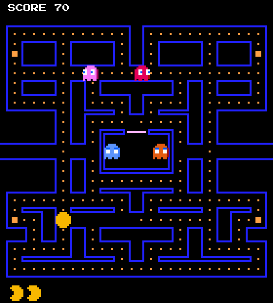
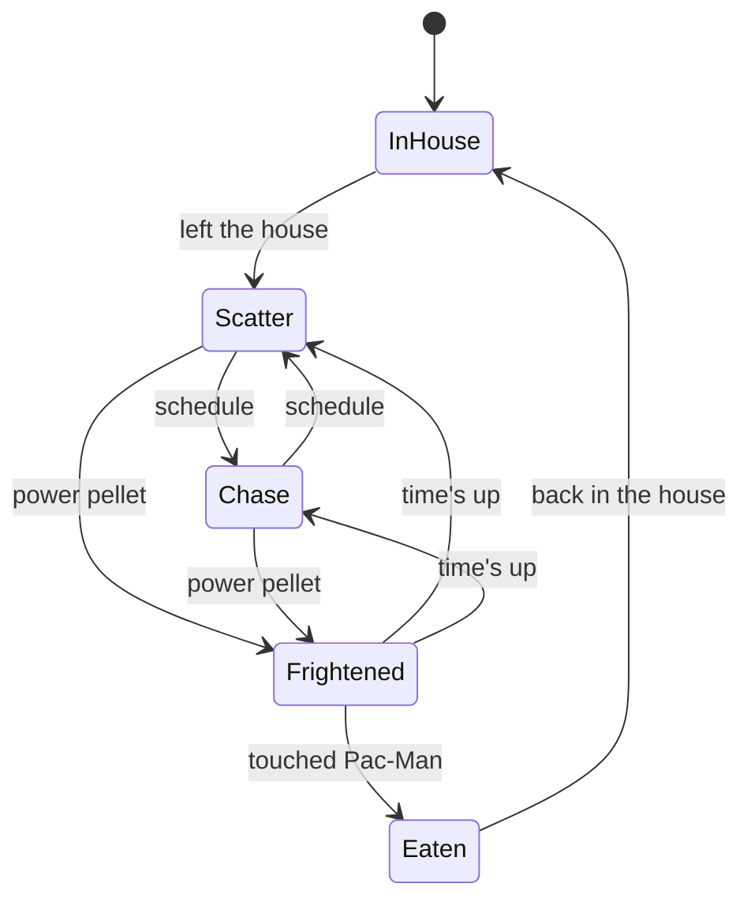
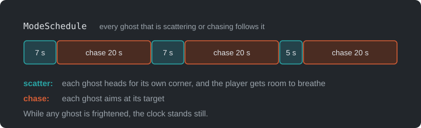
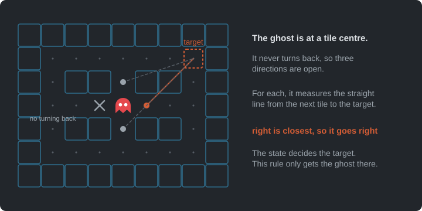
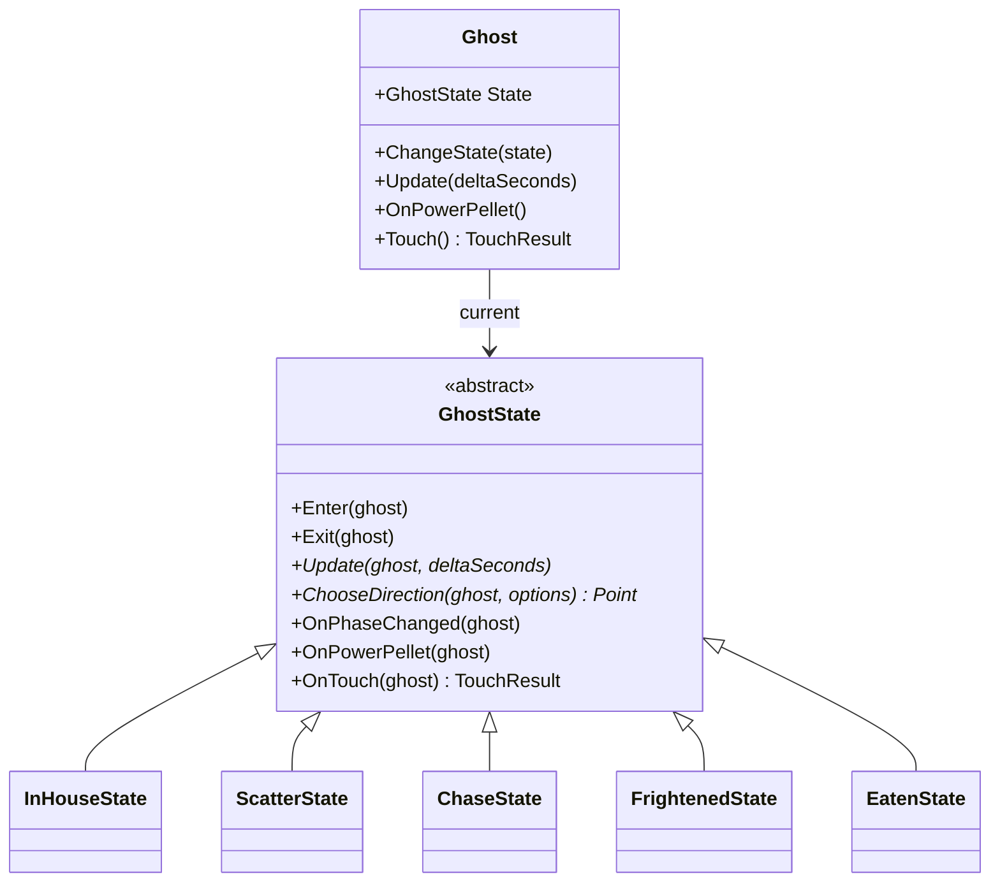
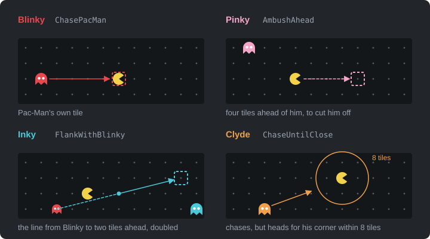
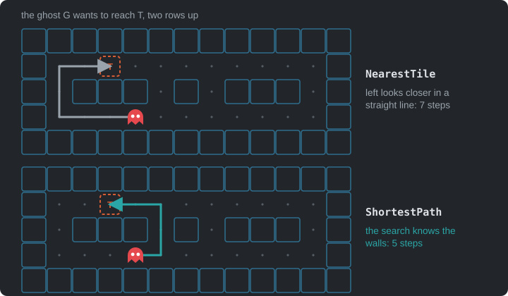
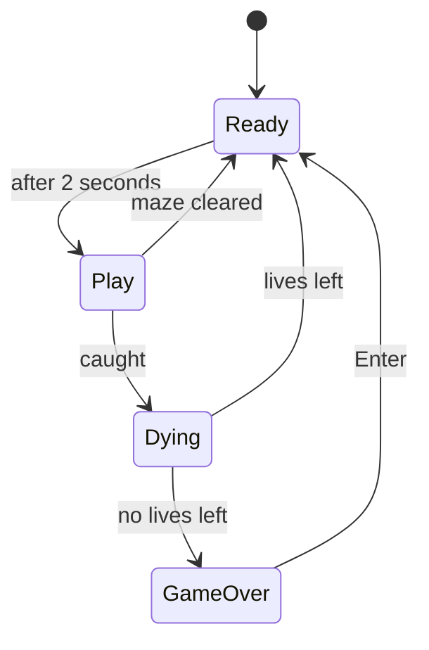
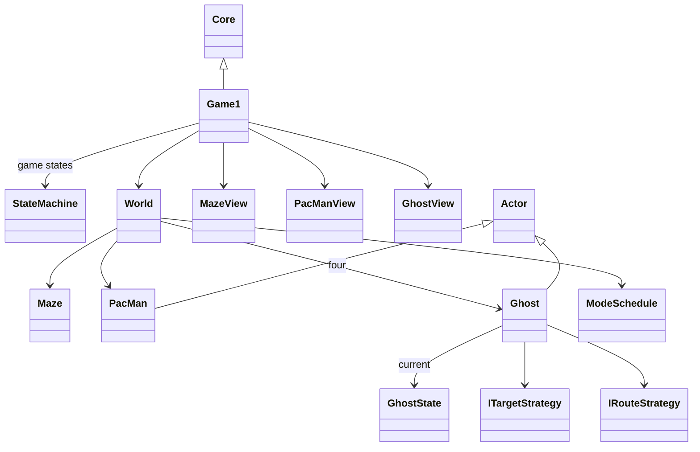

## Today's Goal

Make a **maze chase game**, like Pac-Man: eat every dot in the maze while four ghosts hunt
you. After a power pellet, the ghosts run from you for a few seconds.

<figure class="original">

<figcaption>The original: <em>Pac-Man</em> (Namco, 1980). Image: Bandai Namco Entertainment America, <a href="https://commons.wikimedia.org/wiki/File:Pac-Man_gameplay_(1x_pixel-perfect_recreation).png">CC BY 3.0</a>, via Wikimedia Commons.</figcaption>
</figure>

The ghosts are what make Pac-Man interesting to build. Each ghost switches between modes
(waiting in the house, scattering, chasing, frightened, eaten), and each mode changes how it
moves and what happens when it touches Pac-Man. We write each mode as its own class, with
the **State** pattern.

Each ghost also chases Pac-Man in its own way, and for that we use the **Strategy** pattern.
The two patterns have the same shape, so we look at why they are still used differently.
Strategy comes back a second time, for how a ghost finds its way to the target. Each
ghost's targeting gets its own unit tests.

**Source code:** [gar-games/05-pac-man](https://github.com/Metamate/gar-games/tree/main/05-pac-man)

## Prepare

- [State](https://gameprogrammingpatterns.com/state.html) (up to and including "The State
  Pattern")
- [Strategy](https://refactoring.guru/design-patterns/strategy)
- Optional: [The Pac-Man Dossier](https://pacman.holenet.info/), chapter 3 ("Maze Logic
  101") and 4 ("Meet the Ghosts"): how the original ghosts really work
- Optional: [Introduction to A\*](https://www.redblobgames.com/pathfinding/a-star/introduction.html)
  (Red Blob Games): how the search behind the `Pacman4` step works

## The Maze

_Step `Pacman0`_

The maze is a text file, like [Sokoban's levels](../04-sokoban/#levels-as-data):

```text title="maze.txt (the top)"
####################################
#..................................#
#.###.#######.########.#######.###.#
#.###.........########.........###.#
```

`#` is a wall, `.` a dot and `o` a power pellet. `-` is the door of the ghost house and `H`
its inside; `P` marks where Pac-Man starts, and `b`, `p`, `i` and `c` the four ghosts. A row
that is open at both ends is a tunnel, and leaving on one side enters on the other.

As in Sokoban, the rules are separate from the drawing. `Maze`, `PacMan` and `World` hold the
game; `MazeView` and `PacManView` draw it. The walls aren't even images. `MazeView` draws a
line along every side of a wall tile that faces an open tile.

### Moving through the maze

Pac-Man doesn't move freely like Pong's ball. He moves from the centre of one tile to the
centre of the next, and only at a tile centre can he turn. The ghosts move the same way, so
this lives in a shared base class, `Actor`:

```csharp title="Actor.cs"
public void Move(float distance)
{
    while (true)
    {
        Vector2 goal = Maze.Center(_target);
        float left = Vector2.Distance(Position, goal);
        if (left > distance)
        {
            Position += (goal - Position) / left * distance;
            return;
        }

        // Arrived at a tile centre: wrap through the tunnel, and choose the next direction.
        distance -= left;
        _target = maze.Wrap(_target);
        Position = Maze.Center(_target);
        Heading = ChooseDirection(_target);
        if (Heading == Direction.None)
            return;
        _target += Heading;
    }
}

protected abstract Point ChooseDirection(Point tile);
```

Pac-Man and the ghosts only differ in how they choose. Pac-Man turns where the player asked,
if he can:

```csharp title="PacMan.cs"
protected override Point ChooseDirection(Point tile)
{
    if (Wanted != Direction.None && !Maze.BlocksPacMan(tile + Wanted))
        return Wanted;
    if (!Maze.BlocksPacMan(tile + Heading))
        return Heading;
    return Direction.None;
}
```

`Wanted` is kept until Pac-Man can turn that way. Press up a little before a corner, and he
turns up when he gets there. That's [input buffering](../03-snake/#input-buffering), as in
Snake, but here it's what makes the controls feel good.

**Try it** (`Pacman0`): open a new tunnel in `maze.txt`, or move Pac-Man's start. Then
press a direction just before a corner, and watch when he turns.

## Ghosts, With an Enum

_Step `Pacman1`_

Each ghost is always in one of five **modes**:

| Mode | What the ghost does | Touching Pac-Man |
| --- | --- | --- |
| In the house | Waits, then leaves through the door | — |
| Scatter | Heads for its own corner of the maze | Pac-Man is caught |
| Chase | Hunts Pac-Man | Pac-Man is caught |
| Frightened | Turns blue, slows down and wanders at random | The ghost is eaten |
| Eaten | Only the eyes, racing back to the house | — |


```mermaid
stateDiagram-v2
    [*] --> InHouse
    InHouse --> Scatter : left the house
    Scatter --> Chase : schedule
    Chase --> Scatter : schedule
    Scatter --> Frightened : power pellet
    Chase --> Frightened : power pellet
    Frightened --> Scatter : time's up
    Frightened --> Chase : time's up
    Frightened --> Eaten : touched Pac-Man
    Eaten --> InHouse : back in the house
```

Scatter and chase take turns on a fixed **schedule** (`ModeSchedule`): 7 seconds of scatter,
20 of chase, and so on. This is why the ghosts sometimes seem to give up the hunt. Without the
scatter phases, the game would be too hard.



However a ghost moves, it decides at each tile centre the same way. It never turns back, and
of the directions left, it takes the one whose next tile is closest to a **target tile**
(in a straight line). The mode decides the target. It is the ghost's corner in scatter, Pac-Man in chase, and
the house when eaten. Frightened ghosts have no target, and pick at random.



The simplest way to build the modes is an enum, and that's what `Pacman1` does:

```csharp title="Ghost.cs (Pacman1)"
public enum GhostMode { InHouse, Scatter, Chase, Frightened, Eaten }

public void Update(float deltaSeconds)
{
    switch (Mode)
    {
        case GhostMode.InHouse:
            _houseTimer += deltaSeconds;
            if (_houseTimer < _releaseDelay)
                return;
            Move(HouseSpeed * deltaSeconds);
            if (!Maze.IsInHouse(Tile))
                SetMode(ScheduledMode());
            break;
        case GhostMode.Scatter:
        case GhostMode.Chase:
            Move(Speed * deltaSeconds);
            break;
        case GhostMode.Frightened:
            // ...
    }
}
```

It works, but the class as a whole has problems:

- **Every method switches over the mode:** `Update`, `ChooseDirection`, `OnPowerPellet`,
  `Touch`, `Look`, and `SetMode` for what happens when a mode starts. To understand
  frightened ghosts, you read a piece of seven methods.
- **Fields that belong to one mode:** `_houseTimer` only matters in the house,
  `_frightenedTimer` only when frightened, `_enteringHouse` only when eaten. They're all
  there all the time, and nothing stops a mode from using another mode's field.
- **A new mode touches everything:** add a mode where ghosts are frozen for a moment, and
  every `switch` needs a new case. Miss one, and the compiler won't tell you.

This is the same problem as Pong's string-based game state, and it gets worse with every
mode.

**Try it** (`Pacman1`): add `Frozen` to `GhostMode`, for a ghost that stands still for a
second after being eaten. Don't finish it, just count the `switch`es you would have to change.

## The State Pattern

_Step `Pacman2`_

> Allow an object to alter its behavior when its internal state changes. The object will
> appear to change its class.
> _(Design Patterns, Gamma et al.)_

In [Flappy Bird](../02-flappy-bird/#state-machines) we made each state of the _game_ an
object. The State pattern does the same for an _object_ in the game. Each of a ghost's modes
becomes a class, and the ghost forwards everything that depends on the mode to its current
state.


```mermaid
classDiagram
    class Ghost {
        +GhostState State
        +ChangeState(state)
        +Update(deltaSeconds)
        +OnPowerPellet()
        +Touch() TouchResult
    }
    class GhostState {
        <<abstract>>
        +Enter(ghost)
        +Exit(ghost)
        +Update(ghost, deltaSeconds)*
        +ChooseDirection(ghost, options)* Point
        +OnPhaseChanged(ghost)
        +OnPowerPellet(ghost)
        +OnTouch(ghost) TouchResult
    }
    Ghost --> GhostState : current
    GhostState <|-- InHouseState
    GhostState <|-- ScatterState
    GhostState <|-- ChaseState
    GhostState <|-- FrightenedState
    GhostState <|-- EatenState
```

```csharp title="Ghost.cs"
public void ChangeState(GhostState state)
{
    State?.Exit(this);
    State = state;
    State.Enter(this);
}

public void Update(float deltaSeconds) => State.Update(this, deltaSeconds);
public void OnPowerPellet() => State.OnPowerPellet(this);
public TouchResult Touch() => State.OnTouch(this);
```

Everything about being frightened now lives in one class, including its own timer:

```csharp title="FrightenedState.cs"
public class FrightenedState : GhostState
{
    public const float Seconds = 6;
    private float _elapsed;

    // Every ghost turns around when it becomes frightened: a sign for the player.
    public override void Enter(Ghost ghost) => ghost.Reverse();

    public override void Update(Ghost ghost, float deltaSeconds)
    {
        _elapsed += deltaSeconds;
        ghost.Move(Speed * deltaSeconds);
        if (_elapsed >= Seconds)
            ghost.ChangeState(ghost.ScheduledState());
    }

    public override Point ChooseDirection(Ghost ghost, IReadOnlyList<Point> options)
        => options[ghost.World.Random.Next(options.Count)];

    public override TouchResult OnTouch(Ghost ghost)
    {
        ghost.ChangeState(new EatenState());
        return TouchResult.GhostEaten;
    }
}
```

Things to notice:

- **The states decide the transitions.** `FrightenedState` knows it ends after six seconds,
  and that being touched makes the ghost `EatenState`. `Ghost` doesn't know which states
  exist.
- **The same event, handled differently.** `World` tells every ghost about a power pellet,
  and doesn't care what each one does with it. Scatter and chase become frightened; a
  frightened ghost starts its time over; eaten ghosts and ghosts in the house ignore it (the
  base class does nothing by default).
- **`Enter` and `Exit`** give each state a place to start and clean up. Turning around when
  frightened is part of becoming frightened, so it's in `Enter`.
- **Each state is small.** The five state classes are together about as long as the enum
  version of `Ghost`, but each one can be read on its own.

Compare the diff between `Pacman1` and `Pacman2`: `World` didn't change at all. Only the
inside of `Ghost` did.

**Try it** (`Pacman2`): make frightened ghosts last 3 seconds instead of 6. How many files did
it take? Where would a `FrozenState` go?

## The Strategy Pattern

_Step `Pacman3`_

Until now, all four ghosts chase the same way, straight at Pac-Man. They end up in a line
behind him, which is easy to escape. In the original game, each ghost has its own
personality, and that's all in how it picks its target while chasing:

| Ghost | Strategy | Target while chasing |
| --- | --- | --- |
| Blinky (red) | `ChasePacMan` | Pac-Man's tile |
| Pinky (pink) | `AmbushAhead` | Four tiles ahead of Pac-Man |
| Inky (cyan) | `FlankWithBlinky` | Take the tile two ahead of Pac-Man, and double the line from Blinky to it |
| Clyde (orange) | `ChaseUntilClose` | Pac-Man, until within eight tiles; then his own corner |

Together, they trap Pac-Man: Blinky follows him, Pinky cuts him off, and Inky closes in
from the other side of Blinky.



> Define a family of algorithms, encapsulate each one, and make them interchangeable.
> _(Design Patterns, Gamma et al.)_

```csharp title="ITargetStrategy.cs"
public interface ITargetStrategy
{
    Point ChooseTarget(Ghost ghost, World world);
}
```

```csharp title="AmbushAhead.cs"
// Pinky: four tiles ahead of Pac-Man, to cut him off.
public class AmbushAhead : ITargetStrategy
{
    public const int TilesAhead = 4;

    public Point ChooseTarget(Ghost ghost, World world)
    {
        Point facing = world.PacMan.Facing;
        return world.PacMan.Tile + new Point(facing.X * TilesAhead, facing.Y * TilesAhead);
    }
}
```

Each ghost gets its strategy when `World` creates it, and `ChaseState` asks the ghost's
strategy for the target:

```csharp title="World.cs"
Pinky = new Ghost(this, "pinky", Maze.StartOf('p'), new Point(2, -3), 0, new AmbushAhead());
```

```csharp title="ChaseState.cs"
public override Point ChooseDirection(Ghost ghost, IReadOnlyList<Point> options)
    => ghost.Closest(ghost.Targeting.ChooseTarget(ghost, ghost.World), options);
```

`ChaseState` works for every ghost, and doesn't know which strategies exist. A fifth ghost
with a new personality is one new class and one line in `World`. You'll meet the pattern
again in [Super Mario Bros](../06-super-mario-bros/#strategy-pattern-level-makers), where
interchangeable level makers build different kinds of levels.

**Try it** (`Pacman3`): give Clyde Blinky's strategy in `World`, and play. How does the
chase change?

## State vs. Strategy

Draw the class diagrams of the two patterns, and they look the same. An object holds a
reference to an interface, and forwards work to it. The difference is in **why** and
**when** the object behind the interface changes.

| | State | Strategy |
| --- | --- | --- |
| In Pac-Man | The ghost's mode | The ghost's targeting |
| Who picks it | The states themselves, as the game goes on | Whoever creates the ghost (`World`) |
| How often it changes | All the time | Never, once chosen |
| Knows the others? | Yes: a state creates the next state | No: strategies don't know each other |
| The question it answers | "What am I doing right now?" | "How do I do this?" |

The two work together here. The **state** decides _whether_ the ghost is chasing, and the
**strategy** decides _how_ it chases.

## A Second Strategy: Routing

_Step `Pacman4`_

The ghosts decide one tile at a time. At a tile centre, a ghost takes the open direction
whose next tile is closest to the target in a straight line. That rule is cheap, and it's
what the arcade game does, but it knows nothing about walls. Here the ghost `G` wants to
reach `T`, two rows up:



The tile to the left is closer to `T`, so the ghost goes left. That way is seven steps long.
Going right is five.

Finding the way is a second thing that could be done in more than one way, so it gets the
same treatment as targeting. `ITargetStrategy` says _where_ a ghost wants to go, and
`IRouteStrategy` says _which way it turns_ to get there:

```csharp title="IRouteStrategy.cs"
public interface IRouteStrategy
{
    Point ChooseDirection(Ghost ghost, Point target, IReadOnlyList<Point> options);
}
```

| Strategy | How it chooses |
| --- | --- |
| `NearestTile` | The arcade rule. The open tile closest to the target, in a straight line |
| `ShortestPath` | The first step of the shortest path through the maze |

`ShortestPath` asks `Pathfinder.FindPath` for the path. It searches the maze with **A\***
(say "A star"), the usual algorithm for finding a way on a grid. How the search works is in
`Pathfinder.cs` and in the optional reading. For the ghost, it is one method that takes a
start and a target and gives back the tiles between them.

All four ghosts keep `NearestTile` while they scatter and chase. Their wrong turns are part
of the game, and they give the player room to escape. The eaten ghost is different. Its eyes
should get home as fast as they can, so `EatenState` always uses `ShortestPath`:

```csharp title="EatenState.cs"
private readonly ShortestPath _route = new();

public override Point ChooseDirection(Ghost ghost, IReadOnlyList<Point> options)
    => _route.ChooseDirection(ghost, ghost.Maze.HouseCenter, options);
```

Before this step, the state needed a flag, `_enteringHouse`. The eyes first aimed for the
tile outside the door and then for the middle of the house, because the straight-line rule
couldn't find the door from every side. The search finds the door as part of the path, and
the flag is gone.

**Try it** (`Pacman4`): give Blinky `new ShortestPath()` in `World`, and play. Then give it
to all four. What happens to the game?

## Testing the Ghosts

_Project `Pacman.Tests`_

A targeting strategy is a small class with one method. To test it, put Pac-Man somewhere
and check which tile the ghost aims for. Each strategy can be tested on its own, as in
[Sokoban](../04-sokoban/#unit-tests):

```csharp title="TargetingTests.cs"
[Fact]
public void Inky_doubles_the_line_from_Blinky_to_two_tiles_ahead_of_Pac_Man()
{
    _world.PacMan.Place(new Point(5, 1), Direction.Right);
    _world.Blinky.Place(new Point(3, 3), Direction.Left);

    // Two tiles ahead of Pac-Man is (7, 1). From Blinky that's (+4, -2), doubled: (11, -1).
    Assert.Equal(new Point(11, -1), TargetOf(_world.Inky));
}
```

Inky's rule is the hardest to get right by playing, because you can't see his target. The test
checks it with numbers you can work out on paper.

The states are tested the same way. Put a ghost in a state, make something happen, and check
the state it ends up in (`GhostStateTests`). The tests use a small maze of their own
(`TestMaze`) and a seeded `Random`, so frightened ghosts wander the same way every run.

`PathfinderTests` puts the two routing strategies on the same tile with the same target, and
checks that they turn different ways:

```csharp title="PathfinderTests.cs"
// Left looks closer in a straight line, but the way up is to the right.
Assert.Equal(Direction.Left, new NearestTile().ChooseDirection(blinky, target, options));
Assert.Equal(Direction.Right, new ShortestPath().ChooseDirection(blinky, target, options));
```

## The Whole Game

_Step `Pacman5`_

`Pacman5` adds three lives, Pac-Man's death, and a new level when the dots are gone. The flow
of the game uses the State pattern too, as a state machine like
[Flappy Bird's](../02-flappy-bird/#state-machines):


```mermaid
stateDiagram-v2
    [*] --> Ready
    Ready --> Play : after 2 seconds
    Play --> Dying : caught
    Play --> Ready : maze cleared
    Dying --> Ready : lives left
    Dying --> GameOver : no lives left
    GameOver --> Ready : Enter
```

There are now two levels of state machine in one game, the game's states (title, ready,
play, dying, game over) and each ghost's states. The ghosts only get updated in `PlayState`, so while
Pac-Man is dying, the ghosts' states are paused.


```mermaid
classDiagram
    Core <|-- Game1
    Game1 --> StateMachine : game states
    Game1 --> World
    Game1 --> MazeView
    Game1 --> PacManView
    Game1 --> GhostView
    World --> Maze
    World --> PacMan
    World --> Ghost : four
    World --> ModeSchedule
    Actor <|-- PacMan
    Actor <|-- Ghost
    Ghost --> GhostState : current
    Ghost --> ITargetStrategy
    Ghost --> IRouteStrategy
```

`World` and everything it holds are the rules, and the three views draw them. A ghost
holds one state at a time, and its two strategies for as long as it lives.

## Summary

| Concern | Answer |
| --- | --- |
| What a ghost is doing now | State, with a class for each mode |
| How each ghost hunts | Strategy (`ITargetStrategy`) |
| How a ghost finds its way | A second strategy (`IRouteStrategy`) |
| Who picks the object behind the interface | The states pick the next state. `World` picks each strategy once |
| Checking a ghost's rule | A unit test for each strategy and state |
| The flow of the whole game | A state machine, one level above the ghosts |

## Exercises

Start from `Pacman5`.

1. **A new mode:** when Pac-Man eats a ghost, the game freezes for half a second in the
   original, and shows the points. Here it is enough that the eaten ghost stands still for
   half a second before its eyes head home. Build the frozen mode you counted the `switch`es
   for, as a `FrozenState` that comes before `EatenState`. Which classes did you change, compared
   with the seven places in `Pacman1`'s enum? One test in `GhostStateTests.cs` now fails. Is
   the test wrong, or the code?
2. **A new personality:** add a fifth ghost with its own `ITargetStrategy`, e.g. one that
   aims at the tile opposite Pac-Man, mirrored through the middle of the maze. Write a test
   for it first, next to the others in `TargetingTests.cs`. The ghost needs a start: a
   letter of its own in `maze.txt`, in the test maze and in `Maze.Parse`. Its two frames are
   already in `sprites.png` (row 1, at x = 256 and 288); add the regions and an animation
   in `atlas-definition.xml`.
3. **Frightened in the house:** in the original, ghosts waiting in the house also turn blue
   after a power pellet (but stay in the house). Change `InHouseState` to do that. What does
   the state need to remember?
4. **Fruit:** after 70 dots, a fruit appears below the house for ten seconds, and is worth
   points if Pac-Man reaches it in time. Where does
   that rule belong: in `World`, in `Maze`, or in a class of its own? A cherry is in
   `sprites.png` (row 0, at x = 96), ready for a region.
5. **Tunnel (stretch):** in the original, ghosts slow down in the tunnel. Which class should
   know that the ghost is in the tunnel, and which should know how fast to go there?

## Apply It to Your Project

- Which objects in your game have modes? Are they flags, an enum, or state objects?
- Where do you have a `switch` (or an `if` chain) over a mode in more than one method?
- Is there a behaviour that differs per object, but never changes for one object? That's a
  strategy.

## Check Yourself

<details>
<summary>What problems does the enum version of the ghost have?</summary>

Every method switches over the mode, so one mode's behaviour is spread over many methods.
Fields that belong to one mode exist in all of them, and adding a mode means finding and
changing every `switch`.

</details>

<details>
<summary>In the State pattern, who decides when to change state?</summary>

Usually the states themselves. A state knows which events end it, and which state comes
next. The object that holds the state only forwards to it, and doesn't need to know which
states exist.

</details>

<details>
<summary>What are Enter and Exit for?</summary>

Setting up and cleaning up a state, in one place, whichever state came before or comes
after. Here, `FrightenedState.Enter` turns the ghost around.

</details>

<details>
<summary>State and Strategy have the same structure. How do they differ?</summary>

A state changes during the object's life, often chosen by the states themselves. A strategy
is chosen from outside, usually once, and strategies don't know about each other.

</details>

<details>
<summary>Why do the chasing ghosts keep the arcade rule, when the shortest path is better?</summary>

Better pathfinding would make the game harder without making it more fun. The ghosts'
wrong turns give the player room to escape, and with the shortest path all four would end up
in the same corridors. Because routing is a strategy, the choice is one argument in `World`.

</details>

Related exam questions: [2](../../exam/#2-state-pattern--state-stack).
