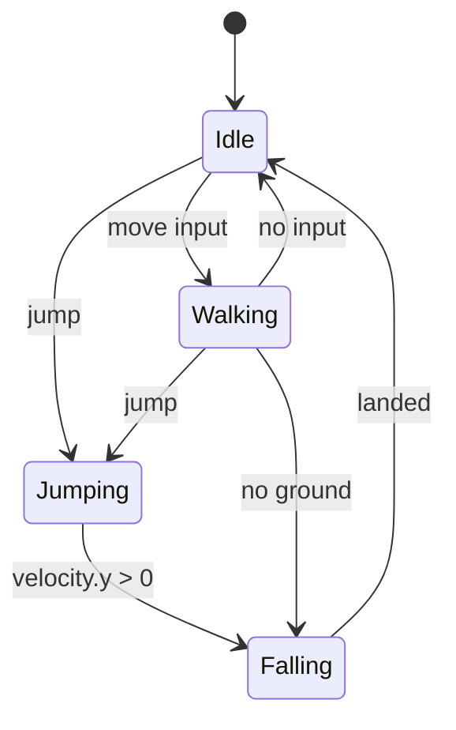

## Today's Goal

Make a **2D platformer**.

We go through the fundamental steps of a basic Super Mario Bros. clone, focusing on:

- Procedural level generation
- The State pattern for characters
- Camera
- Platformer physics
- Basic AI

**Source code:** [Metamate/gmd2-platformer](https://github.com/Metamate/gmd2-platformer)

## Prepare

- [14: Sound Effects and Music](https://docs.monogame.net/articles/tutorials/building_2d_games/14_soundeffects_and_music)
- [15: Audio Controller](https://docs.monogame.net/articles/tutorials/building_2d_games/15_audio_controller)
- [16: Working with SpriteFonts](https://docs.monogame.net/articles/tutorials/building_2d_games/16_working_with_spritefonts)
- [17: Scenes](https://docs.monogame.net/articles/tutorials/building_2d_games/17_scenes)
- [18: Texture Sampling](https://docs.monogame.net/articles/tutorials/building_2d_games/18_texture_sampling)
- [State](https://gameprogrammingpatterns.com/state.html)

## Levels: From Data and From Code

In Snake, the tilemap was loaded from an XML file. Levels can also be **generated**:

```csharp
public Tilemap Generate(int columns, int rows)
{
    var tilemap = new Tilemap(Tileset, columns, rows);
    int groundHeight = 2;

    for (int x = 0; x < columns; x++)
        for (int y = rows - groundHeight; y < rows; y++)
            tilemap.SetTile(x, y, new Tile(graphicId: 1, isSolid: true));

    return tilemap;
}
```

Our tilemap is getting smarter. Instead of plain integer ids, it now stores `Tile` values
that know more than their graphic:

```csharp
public readonly struct Tile(int graphicId = -1, int topperId = -1, bool isSolid = false)
{
    public static readonly Tile Empty = new();

    public int GraphicId { get; init; } = graphicId;
    public int TopperId { get; init; } = topperId;
    public bool IsSolid { get; init; } = isSolid;
    public bool HasTopper => TopperId >= 0;
}
```

### Strategy pattern: level makers

Different kinds of levels are produced by interchangeable **level makers** sharing one
base: `FlatLevelMaker`, `PillarLevelMaker`, `PitLevelMaker`, `ComplexLevelMaker`… The
game asks _a_ level maker for a level without knowing which algorithm it uses. This is the
**Strategy pattern**: a family of interchangeable algorithms behind a common interface.

## Character State

Consider this (from _Game Programming Patterns_):

```cpp
void Heroine::handleInput(Input input)
{
    if (input == PRESS_B)
    {
        if (!isJumping_ && !isDucking_) { /* Jump... */ }
    }
    else if (input == PRESS_DOWN)
    {
        if (!isJumping_) { isDucking_ = true; setGraphics(IMAGE_DUCK); }
        else { isJumping_ = false; setGraphics(IMAGE_DIVE); }
    }
    else if (input == RELEASE_DOWN)
    {
        if (isDucking_) { /* Stand... */ }
    }
}
```

With one boolean per condition, you can end up in **illegal states**. Can you spot the bug?
(We prevent air-jumping while jumping, but not while diving, so we need yet another flag.)

An **enum** makes illegal combinations impossible: the heroine is in exactly one state.
But it still doesn't scale. Every method switches over every state, and what if a state
needs its own data (e.g. charge time while ducking)?

### The State pattern

> Allow an object to alter its behaviour when its internal state changes.

- Each state is a class with its own behaviour and its own data.
- The entity delegates to its current state object.
- Adding a state doesn't touch existing states.

In the platformer, both the **game** (title, play, game over) and the **player** (idle,
walking, jumping, falling) use state machines, using the same `IState` idea as in Flappy
Bird.



## Basic AI: Snail States

Enemy AI can be built from states too:

- **Base:** shared collision resolution, gravity, ground detection
- **Idle:** plays an idle animation for a random duration
- **Move:** walks, turns around at edges or when blocked
- **Chase:** moves towards the player when close

## Entities

An **entity** is any "thing" in the game that isn't part of the tilemap: the player,
snails, blocks, powerups. Entities don't align to the grid, they move, and they can have
their own states.

```csharp
public interface IEntity
{
    Vector2 Position { get; set; }
    Rectangle Bounds { get; }
    bool Collidable { get; set; }
    bool IsSolid { get; }
    bool Active { get; set; }

    void Update(GameTime gameTime);
    void Draw(SpriteBatch spriteBatch);
    bool Collides(IEntity other);
}
```

The level updates all entities through the Update Method pattern, and each entity decides
how to respond to collisions.

## Camera

Our previous games fit on one screen. A level wider than the screen needs a **camera**: a
transform that shifts the world so the target (the player) is centred. It is passed to
`SpriteBatch.Begin()` together with the screen scale matrix. Here we only follow the
x-axis, and clamp the camera to the level's edges.

## Platformer Physics

- **Hitbox inset:** the player is as wide as a tile, which makes pits impossible to fall
  into. We shrink the hitbox by 2 px on each side.
- **Tile collision:** check the tiles at the hitbox corners in the direction of movement,
  then **snap** the player to the tile edge and zero the velocity on that axis.
- **Ground check:** probe one pixel below the hitbox for solid tiles or solid entities.
- **Coyote time:** allow a jump for a few frames after walking off a ledge. It feels
  fairer.

### Performance

Do we need to test the player against every tile? No. The grid is static, so we can look
up the tile at a position directly (`IsSolidAt(x, y)`). That costs the same for a level of
10 or 10,000 tiles: **O(1)** instead of **O(n)**. Moving entities can't be looked up this
way. Testing all pairs of entities is **O(n²)**.

## Input: GameController

The platformer maps keys to actions through a `GameController` class (`controller.Jump`
instead of `Keys.Space`).

**Discuss:** this is _not_ the Command pattern. Why not?

## Exercises

1. **Custom level maker:** create a new level maker with varying ground height and pit
   widths, platforms, several enemy types, and a goal flag. Touching the flag loads a
   longer, harder level.
2. **Keys & locks:** spawn a random coloured key and matching lock in each level. Picking
   up the key and touching the lock spawns the goal flag.
3. **Powerups:** add a star (invincibility with a timer) and a mushroom (the player grows).
   How do you add these without piling flags onto the `Player` class?

## Apply It to Your Project

- Which entities in your game have distinct behaviour modes? Draw a state diagram for one
  of them.
- Is anything in your game currently a set of booleans that should be a state machine?

## Check Yourself

<details>
<summary>Why is a switch on an enum still a problematic way to model character state?</summary>

Every method has to switch over every state, so adding a state means touching many places,
and state-specific data has nowhere natural to live.

</details>

<details>
<summary>Why can tile collision be O(1) while entity collision can't?</summary>

Tiles never move and sit in a grid, so a position maps directly to a tile index. Entities
move freely, so we have to check them against each other.

</details>

Related exam questions: [2](../../exam/#2-state-pattern--state-stack),
[4](../../exam/#4-command-pattern--input-handling),
[7](../../exam/#7-tilemaps-collision-detection--procedural-generation).
