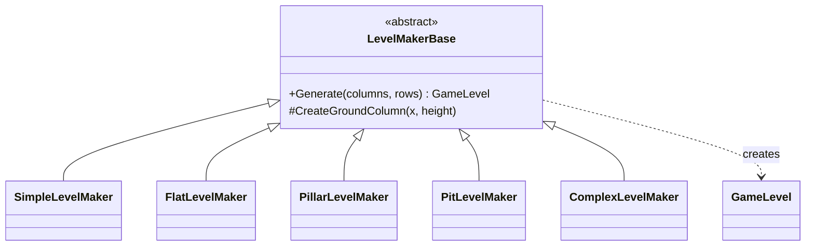
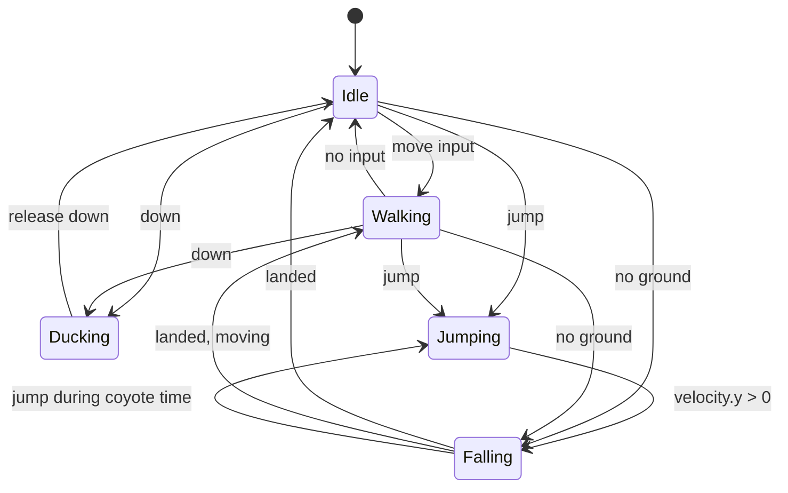

## Today's Goal

Make a **2D platformer**.

We go through the fundamental steps of a basic Super Mario Bros. clone. The main topic is
**platformer physics and tile collision**: making a character run, jump and land on a tile
world, and seeing what the collision code actually does. Along the way:

- Debug drawing
- A camera for levels wider than the screen
- Level makers: the Strategy pattern again
- The State pattern again, now for the player

**Source code:** [Metamate/gmd2-platformer](https://github.com/Metamate/gmd2-platformer)

The code is split into steps, one project per concept. Each section below names the step
that introduces it. Compare neighbouring steps to see exactly what changed.

| Step | Topic |
| --- | --- |
| `Platformer0` | A tilemap generated in code |
| `Platformer1` | Level makers (Strategy pattern) |
| `Platformer2` | Player and platformer physics, debug drawing, with state as an enum |
| `Platformer3` | The State pattern |
| `Platformer4` | Camera |
| `Platformer5` | Game states |
| `Platformer6` | Entities |
| `Platformer7` | Basic AI |
| `Platformer8` | Audio (the finished game) |

## Prepare

- [14: Sound Effects and Music](https://docs.monogame.net/articles/tutorials/building_2d_games/14_soundeffects_and_music)
- [15: Audio Controller](https://docs.monogame.net/articles/tutorials/building_2d_games/15_audio_controller)
- [16: Working with SpriteFonts](https://docs.monogame.net/articles/tutorials/building_2d_games/16_working_with_spritefonts)
- [17: Scenes](https://docs.monogame.net/articles/tutorials/building_2d_games/17_scenes)
- [18: Texture Sampling](https://docs.monogame.net/articles/tutorials/building_2d_games/18_texture_sampling)
- [State](https://gameprogrammingpatterns.com/state.html)

## Levels From Code

_Step `Platformer0`_

In Snake, the tilemap was loaded from an XML file. Levels can also be **generated** in code:

```csharp
private void GenerateLevel()
{
    Tileset tileset = _tilesets[Random.Shared.Next(_tilesets.Count)];
    _tilemap = new Tilemap(tileset, Columns, Rows);

    for (int x = 0; x < Columns; x++)
    {
        for (int y = Rows - GroundHeight; y < Rows; y++)
        {
            // A tile is more than a graphic: it also knows whether it is solid.
            _tilemap.SetTile(x, y, new Tile(GroundTile, isSolid: true));
        }
    }
}
```

Our tilemap is getting smarter. Instead of plain integer ids, it now stores `Tile` values
that know more than their graphic:

```csharp
// One cell of a tilemap: which tileset graphic to draw, and whether it blocks movement.
public readonly struct Tile(int graphicId = -1, bool isSolid = false)
{
    public static readonly Tile Empty = new();

    public int GraphicId { get; init; } = graphicId;
    public bool IsSolid { get; init; } = isSolid;
    public bool IsEmpty => GraphicId < 0;
}
```

`Tile` and `Tilemap` live in GMDCore, so they only hold what any tile-based game needs.
Because the graphics are separate from the level's structure, the same level can be drawn
with any of the 60 tilesets in `tiles.png` (press `R`).

### Strategy pattern: level makers

_Step `Platformer1`_

Different kinds of levels are produced by interchangeable **level makers** sharing one
base: `SimpleLevelMaker`, `FlatLevelMaker`, `PillarLevelMaker`, `PitLevelMaker`,
`ComplexLevelMaker` (keys `1`–`5` in this step). The game asks _a_ level maker for a level
without knowing which algorithm it uses. This is the **Strategy pattern** from
[Pac-Man](../05-pac-man/): a family of interchangeable algorithms behind a common interface.

The grass or snow on top of the ground (the _toppers_) is a detail of this game, not of
tilemaps in general, so it isn't part of `Tile`. Instead, a `GameLevel` has two tilemaps
of the same size: `Tilemap` for the ground and `Toppers`, drawn on top with its own
tileset. Layering tilemaps like this is how most tile editors (e.g. Tiled) work, and
[Pokemon](../10-pokemon/) uses it for its tall grass.



Each ground column also gets a **topper** (a grass or snow edge on the top tile) from a
separate topperset, and each level a random background.

## Platformer Physics

_Step `Platformer2`_

- **Gravity and jumping:** gravity adds to the vertical velocity every frame; a jump sets it
  to a negative impulse.
- **Hitbox inset:** the player is as wide as a tile, which makes pits impossible to fall
  into. We shrink the hitbox by 2 px on each side.
- **Tile collision:** move one axis at a time. After moving, check the tiles at the hitbox
  corners in the direction of movement, then **snap** the player to the tile edge and zero
  the velocity on that axis.
- **Ground check:** probe one pixel below the hitbox for solid tiles.
- **Coyote time:** allow a jump for a moment after walking off a ledge. It feels fairer.

### Performance

Do we need to test the player against every tile? No. The grid is static, so we can look
up the tile at a position directly (`IsSolidAt(x, y)`). That costs the same for a level of
10 or 10,000 tiles: **O(1)** instead of **O(n)**. Moving entities can't be looked up this
way. Testing all pairs of entities is **O(n²)**; in
[Vampire Survivors](../12-vampire-survivors/) we make that fast too.

### Debug drawing

Collision bugs are hard to see: the hitbox is invisible, and a player that stops a few
pixels early looks just like one that works. So we **draw what the game can't show**. Press
`F1` to outline the solid tiles in red and the player's hitbox in green (from `Platformer6`,
the entities in yellow too). You can see the hitbox inset, and exactly where the player
collides.

GMDCore gets a small `DebugDraw` class. Its drawing calls do nothing unless
`DebugDraw.Enabled` is true, so they can stay in the code:

```csharp title="GameLevel.cs"
if (Tilemap.GetTile(column, row).IsSolid)
{
    Vector2 position = Tilemap.TileToPoint(column, row);
    DebugDraw.Rectangle(spriteBatch, new Rectangle((int)position.X, (int)position.Y,
        (int)Tilemap.TileWidth, (int)Tilemap.TileHeight), Color.Red);
}
```

Debug drawing and the debugger complement each other. The debugger shows the exact values
at one moment (set a breakpoint in the collision code and inspect the hitbox); debug drawing
shows what happens over time, while the game runs.

### Input: GameController

As in [Snake](../03-snake/), the platformer maps keys to actions through a `GameController`
class (`GameController.Jump` instead of `Keys.Space`).

**Discuss:** this is _not_ the Command pattern from [Sokoban](../04-sokoban/). Why not?

## Character State

_Steps `Platformer2` → `Platformer3`_

In [Pac-Man](../05-pac-man/), each ghost's mode was a state object. The player of a
platformer needs the same pattern, and it shows well why the simpler options break down.
Consider this (from _Game Programming Patterns_):

```cpp
void Heroine::handleInput(Input input)
{
    if (input == PRESS_B)
    {
        if (!isJumping_ && !isDucking_) { /* Jump... */ }
    }
    else if (input == PRESS_DOWN)
    {
        if (!isJumping_) { isDucking_ = true; setGraphics(IMAGE_DUCK); }
        else { isJumping_ = false; setGraphics(IMAGE_DIVE); }
    }
    else if (input == RELEASE_DOWN)
    {
        if (isDucking_) { /* Stand... */ }
    }
}
```

With one boolean per condition, you can end up in **illegal states**. Can you spot the bug?
(We prevent air-jumping while jumping, but not while diving, so we need yet another flag.)

An **enum** makes illegal combinations impossible: the player is in exactly one state. In
`Platformer2`, the player's state is an enum, and its behaviour lives in `switch`
statements:

```csharp
switch (State)
{
    case PlayerState.Idle:
        if (Velocity.X != 0) ChangeState(PlayerState.Walking);
        if (GameController.Down) ChangeState(PlayerState.Ducking);
        if (GameController.Jump) ChangeState(PlayerState.Jumping);
        if (!IsOnGround()) ChangeState(PlayerState.Falling);
        break;

    case PlayerState.Jumping:
        if (Velocity.Y > 0) ChangeState(PlayerState.Falling);
        break;

    // ...
}
```

It works, but it doesn't scale. Every method switches over every state (`ChangeState`
has its own switch, and `HandleHorizontalMovement` a special case for ducking), and what if a
state needs its own data, e.g. charge time while ducking?

### The State pattern

> Allow an object to alter its behaviour when its internal state changes.

- Each state is a class with its own behaviour and its own data.
- The entity delegates to its current state object.
- Adding a state doesn't touch existing states.

In `Platformer3`, each case becomes a class: `PlayerIdleState`, `PlayerWalkState`,
`PlayerJumpState`, `PlayerFallState` and `PlayerDuckState`. The shared physics moves to
`PlayerStateBase`, and `Player` just forwards `Update` and `Draw` to its current state.



## Camera

_Step `Platformer4`_

Our previous games fit on one screen. A level wider than the screen needs a **camera**: a
transform that shifts the world so the target (the player) is centred. It is passed to
`SpriteBatch.Begin()` together with the screen scale matrix. Here we only follow the
x-axis, and clamp the camera to the level's edges. The background scrolls at half the
camera's speed, for a parallax effect.

## Game States

_Step `Platformer5`_

The game itself also uses the State pattern, like Flappy Bird: a `StartState` with the
title screen, and a `PlayState` that creates the level and the player. Falling into a pit
sends you back to the title screen.

## Entities

_Step `Platformer6`_

An **entity** is any "thing" in the game that isn't part of the tilemap: the player,
snails, bushes, mystery boxes, gems. Entities don't align to the grid, they move, and they
can have their own states.

```csharp
public interface IEntity
{
    Vector2 Position { get; set; }
    Rectangle Bounds { get; }
    bool Collidable { get; set; }
    bool IsSolid { get; }
    bool Active { get; set; }

    void Update(GameTime gameTime);
    void Draw(SpriteBatch spriteBatch);
    bool Collides(IEntity other);
}
```

The level updates all entities through the Update Method pattern, and each entity decides
how to respond to collisions. Solid entities (mystery boxes) block the player just like
tiles. Hitting a box from below pops out a gem, and collecting gems raises the score.

## Basic AI: Snail States

_Step `Platformer7`_

Enemy AI can be built from states too:

- **Base:** shared collision resolution, gravity, ground detection
- **Idle:** plays an idle animation for a while
- **Walk:** walks, turns around at edges or when blocked
- **Chase:** moves towards the player when close

Landing on a snail from above stomps it. Touching it any other way ends the game.

`Platformer8` adds music and sound effects: the finished game.

## Exercises

Start from `Platformer8`.

1. **Custom level maker:** create a new level maker with varying ground height and pit
   widths, platforms, several enemy types, and a goal flag. Touching the flag loads a
   longer, harder level.
2. **Keys & locks:** spawn a random coloured key and matching lock in each level. Picking
   up the key and touching the lock spawns the goal flag.
3. **Powerups:** add a star (invincibility with a timer) and a mushroom (the player grows).
   How do you add these without piling flags onto the `Player` class?
4. **Debug drawing:** also draw the probe below the player that checks for ground, and show
   the player's current state and velocity on screen. Use it to find where coyote time
   starts and ends.

## Apply It to Your Project

- What would you want to see while debugging your game? Add debug drawing for your
  hitboxes, triggers or AI targets, behind a key.
- Which entities in your game have distinct behaviour modes? Draw a state diagram for one
  of them.
- Is anything in your game currently a set of booleans that should be a state machine?

## Check Yourself

<details>
<summary>Why is a switch on an enum still a problematic way to model character state?</summary>

Every method has to switch over every state, so adding a state means touching many places,
and state-specific data has nowhere natural to live.

</details>

<details>
<summary>Why can tile collision be O(1) while entity collision can't?</summary>

Tiles never move and sit in a grid, so a position maps directly to a tile index. Entities
move freely, so we have to check them against each other.

</details>

<details>
<summary>Why keep debug drawing in the code, behind a switch, instead of deleting it once a bug is fixed?</summary>

The next bug needs it too. Behind a switch it costs nothing when it is off, and anyone
working on the game can turn it on to see what the collision code is doing.

</details>

Related exam questions: [2](../../exam/#2-state-pattern--state-stack),
[4](../../exam/#4-command-pattern--input-handling),
[7](../../exam/#7-tilemaps-collision-detection--procedural-generation).
