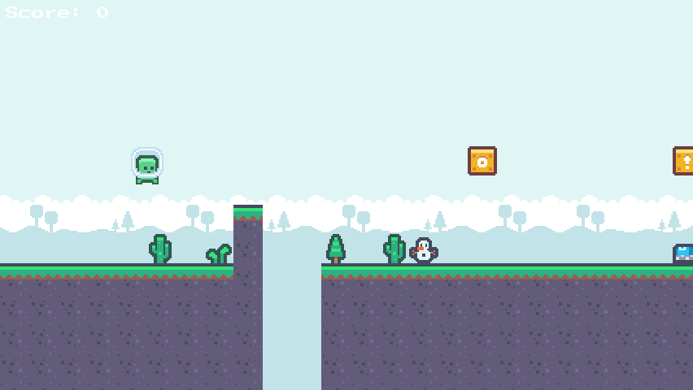
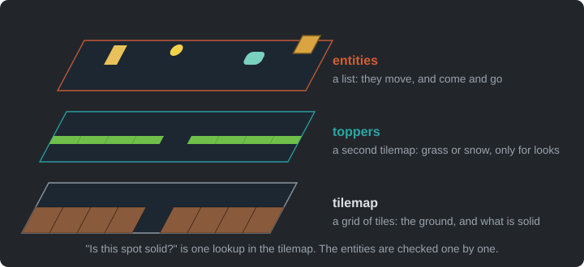
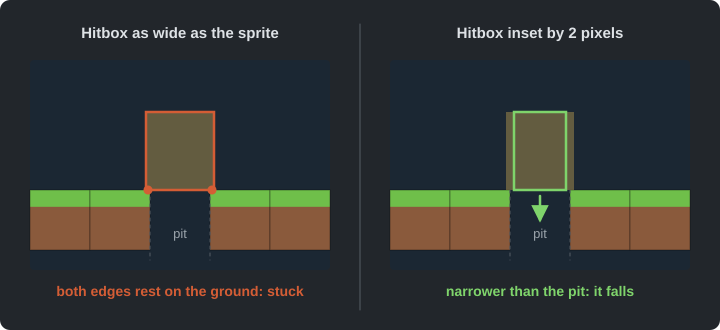
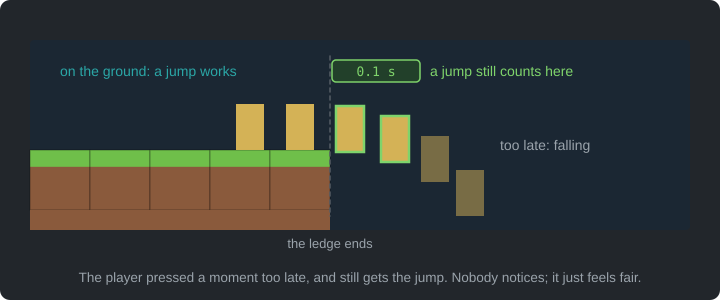
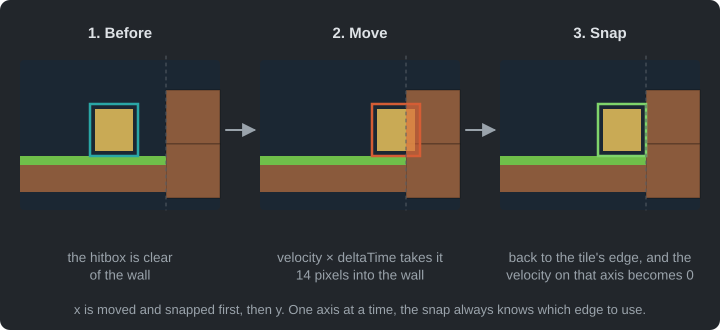
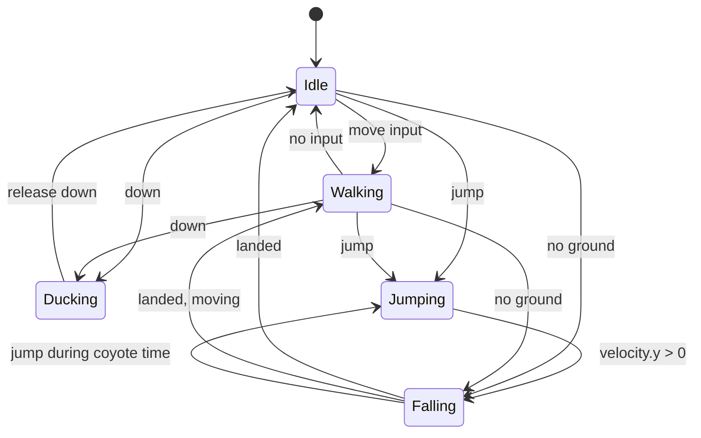
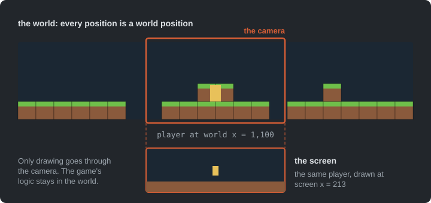
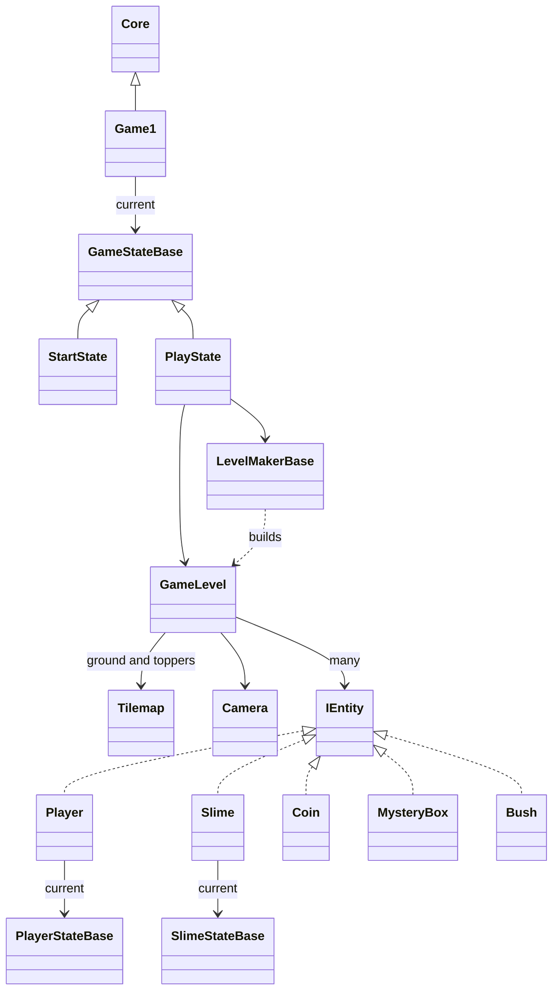

## Today's Goal

Make a **platform game**, like Super Mario Bros: run and jump through a level that scrolls
sideways, collect coins, and stomp on the creatures in your way.

<figure class="original">

<figcaption>The original: <em>Super Mario Bros.</em> (Nintendo, 1985). Screenshot © Nintendo.</figcaption>
</figure>

This session's topic is the game world. The level is a tilemap, the player and the
creatures are entities that move through it, and a camera shows the part of the level you
can see.

To get the player around the world, we need platformer physics and collision with tiles.
The levels come from level makers, which is the Strategy pattern again. We add debug
drawing to see the collision boxes. The player gets states, as the ghosts did in Pac-Man,
but these share their physics and react to the world.

**Source code:** [gar-games/06-super-mario-bros](https://github.com/Metamate/gar-games/tree/main/06-super-mario-bros)

## Prepare

- [State](https://gameprogrammingpatterns.com/state.html), the rest of the chapter. You read
  the first half for [Pac-Man](../05-pac-man/); "Hierarchical State Machines" is close to what
  the player's states do here.
- Optional: [The guide to implementing 2D platformers](http://higherorderfun.com/blog/2012/05/20/the-guide-to-implementing-2d-platformers/)
  (Rodrigo Monteiro), on how tile-based platformers handle collision, slopes and moving
  platforms

## Levels From Code

_Step `Mario0`_

In Snake, the tilemap was loaded from an XML file. Levels can also be **generated** in code:

```csharp
private void GenerateLevel()
{
    Tileset tileset = _tilesets[Random.Shared.Next(_tilesets.Count)];
    _tilemap = new Tilemap(tileset, Columns, Rows);

    for (int x = 0; x < Columns; x++)
    {
        for (int y = Rows - GroundHeight; y < Rows; y++)
        {
            // A tile is more than a graphic: it also knows whether it is solid.
            _tilemap.SetTile(x, y, new Tile(GroundTile, isSolid: true));
        }
    }
}
```

The tilemap now stores `Tile` values instead of plain integer ids. A tile knows more than
its graphic:

```csharp
// One cell of a tilemap: which tileset graphic to draw, and whether it blocks movement.
public readonly struct Tile(int graphicId = -1, bool isSolid = false)
{
    public static readonly Tile Empty = new();

    public int GraphicId { get; init; } = graphicId;
    public bool IsSolid { get; init; } = isSolid;
    public bool IsEmpty => GraphicId < 0;
}
```

`Tile` and `Tilemap` live in GARCore, so they only hold what any tile-based game needs.
Because the graphics are separate from the level's structure, the same level can be drawn
with any of the four tilesets in `tiles.png` (press `R`).

**Try it** (`Mario0`): in `GenerateLevel`, leave a gap two tiles wide in the ground, and
raise the ground by two tiles in the middle. Press R: what changes, and what doesn't?

### Strategy pattern: level makers

_Step `Mario1`_

Different kinds of levels are produced by interchangeable **level makers** sharing one
base: `SimpleLevelMaker`, `FlatLevelMaker`, `PillarLevelMaker`, `PitLevelMaker`,
`ComplexLevelMaker` (keys `1`–`5` in this step). The game asks _a_ level maker for a level
without knowing which algorithm it uses. This is the **Strategy pattern** from
[Pac-Man](../05-pac-man/): a family of interchangeable algorithms behind a common interface.

The grass or snow on top of the ground (the _toppers_) is a detail of this game, so it
isn't part of `Tile`. Instead, a `GameLevel` has two tilemaps
of the same size: `Tilemap` for the ground and `Toppers`, drawn on top with its own
tileset. Layering tilemaps like this is how most tile editors (e.g. Tiled) work, and
[Pokemon](../10-pokemon/) uses it for its tall grass.



Each level also gets a random background.

**Try it** (`Mario1`): make pits twice as common in `PitLevelMaker`, then press 4 to
see it.

## Platformer Physics

_Step `Mario2`_

- **Gravity and jumping:** gravity adds to the vertical velocity every frame; a jump sets it
  to a negative impulse.
- **Hitbox inset:** the player is a little wider than a tile, which makes pits impossible
  to fall into. We shrink the hitbox by 2 px on each side.
- **Ground check:** probe one pixel below the hitbox for solid tiles.
- **Coyote time:** allow a jump for a moment after walking off a ledge. It feels fairer.





### Tile collision

The player moves first and is corrected afterwards. After a move, the hitbox may overlap a
solid tile. Then the player is **snapped** back to that tile's edge, and the velocity on that
axis is set to zero:



Only the tiles at the hitbox's leading edge are checked, which is two lookups in the tilemap.
The two axes are done one after the other:

```csharp title="PlayerStateBase.cs"
// Resolve X (Move then Snap)
Player.Position = new Vector2(Player.Position.X + Player.Velocity.X * dt, Player.Position.Y);
ResolveXCollisions();

// Resolve Y (Move then Snap)
Player.Position = new Vector2(Player.Position.X, Player.Position.Y + Player.Velocity.Y * dt);
ResolveYCollisions();
```

Moving both axes at once would leave a question with no good answer. A hitbox that ends up
inside a corner could have come from the side or from above. With one axis at a time, the snap
always knows which way the player was moving, so it knows which edge to snap to.

**Try it** (on paper): with 18-pixel tiles, a hitbox spans x 34 to 50 and moves 8 pixels right,
and a wall starts at x 54. Where is the hitbox after the move, and after the snap? What happens
to its velocity?

**Try it** (`Mario2`): press F1, and set `HitboxInset` to 0. Can you still fall into a
one-tile pit? Then set `CoyoteTime` to 0.5: how does jumping off a ledge feel?

### Performance

The player doesn't need to be tested against every tile. The grid is static, so we can
look up the tile at a position directly (`IsSolidAt(x, y)`). That costs the same for a level of
10 or 10,000 tiles: **O(1)** instead of **O(n)**. Moving entities can't be looked up this
way. Testing all pairs of entities is **O(n²)**; in
[Vampire Survivors](../12-vampire-survivors/) we make that fast too.

### Debug drawing

Collision bugs are hard to see. The hitbox is invisible, and a player that stops a few
pixels early looks just like one that works. **Debug drawing** makes them visible. Press
`F1` to outline the solid tiles in red and the player's hitbox in green (from `Mario6`,
the entities in yellow too). You can see the hitbox inset, and where the player
collides.

GARCore gets a small `DebugDraw` class. Its drawing calls do nothing unless
`DebugDraw.Enabled` is true, so they can stay in the code:

```csharp title="GameLevel.cs"
if (Tilemap.GetTile(column, row).IsSolid)
{
    Vector2 position = Tilemap.TileToPoint(column, row);
    DebugDraw.Rectangle(spriteBatch, new Rectangle((int)position.X, (int)position.Y,
        (int)Tilemap.TileWidth, (int)Tilemap.TileHeight), Color.Red);
}
```

Debug drawing and the debugger complement each other. The debugger shows the exact values
at one moment (set a breakpoint in the collision code and inspect the hitbox); debug drawing
shows what happens over time, while the game runs.

### Input: GameController

As in [Snake](../03-snake/), the platformer maps keys to actions through a `GameController`
class (`GameController.Jump` instead of `Keys.Space`).

**Discuss:** this is _not_ the Command pattern from [Sokoban](../04-sokoban/). Why not?

## Player States

_Steps `Mario2` → `Mario3`_

In `Mario2`, the player's state is an enum, and its behaviour lives in `switch` statements,
like [Pac-Man](../05-pac-man/#ghosts-with-an-enum)'s ghosts before the State pattern. `Mario3`
makes the same move. Each case becomes a class (`PlayerIdleState`, `PlayerWalkState`,
`PlayerJumpState`, `PlayerFallState`, `PlayerDuckState`), and `Player` forwards `Update` and
`Draw` to its current state. Two things are new compared with the ghosts:

- **Shared behaviour in a base state.** Every player state falls, collides with tiles and
  moves sideways. That physics is written once, in `PlayerStateBase`, and each state adds only
  what is different. The jump state sets the upward velocity, and the duck state ignores
  sideways input. The ghosts' states shared almost nothing.
- **The world triggers transitions too.** A ghost changes mode on a
  timer or when Pac-Man eats a pellet. The player also changes state because of the level:
  walking off a ledge starts a fall, a jump turns into a fall at the top of its arc, and
  landing ends a fall. Coyote time is a transition too. For a few frames after leaving the
  ground, the fall state still lets a jump through.


```mermaid
stateDiagram-v2
    [*] --> Idle
    Idle --> Walking : move input
    Walking --> Idle : no input
    Idle --> Ducking : down
    Walking --> Ducking : down
    Ducking --> Idle : release down
    Idle --> Jumping : jump
    Walking --> Jumping : jump
    Jumping --> Falling : velocity.y > 0
    Idle --> Falling : no ground
    Walking --> Falling : no ground
    Falling --> Idle : landed
    Falling --> Walking : landed, moving
    Falling --> Jumping : jump during coyote time
```

**Try it** (`Mario3`): make the player jump higher and walk faster. Which class holds
each value?

## Camera

_Step `Mario4`_

Our previous games fit on one screen. A level wider than the screen needs a **camera**: a
transform that shifts the world so the target (the player) is centred:

```csharp title="Camera.cs"
Transform = Matrix.CreateTranslation(new Vector3(-Position, 0)) * // Shifts the world based on target position
            Matrix.CreateTranslation(new Vector3(center, 0)); // Centers the target in the viewport
```

```csharp title="GameLevel.cs"
spriteBatch.Begin(transformMatrix: Camera.Transform * screenScale, samplerState: SamplerState.PointClamp);
```

There are now two coordinate spaces. The player, the tiles and the entities keep their
positions in the **world**, and nothing in the game's logic knows where the camera is. Only
drawing goes through the camera, which turns world positions into **screen** positions. The
score is drawn in a second `Begin`, without the camera, so it stays where it is.



Here we only follow the x-axis, and clamp the camera to the level's edges. The background
scrolls at half the camera's speed, for a parallax effect.

**Try it** (`Mario4`): make the background scroll at a quarter of the camera's speed
(in `GameLevel`). What do the factors 0 and 1 look like?

## Game States

_Step `Mario5`_

The game itself has states too, as in Flappy Bird. A `StartState` shows the title screen,
and a `PlayState` creates the level and the player. Falling into a pit
sends you back to the title screen.

## Entities

_Step `Mario6`_

An **entity** is any "thing" in the game that isn't part of the tilemap: the player,
slimes, bushes, mystery boxes (the "?" blocks), coins. Entities don't align to the grid, they move, and they
can have their own states.

```csharp
public interface IEntity
{
    Vector2 Position { get; set; }
    Rectangle Bounds { get; }
    bool Collidable { get; set; }
    bool IsSolid { get; }
    bool Active { get; set; }

    void Update(GameTime gameTime);
    void Draw(SpriteBatch spriteBatch);
    bool Collides(IEntity other);
}
```

The level updates all entities through the Update Method pattern, and each entity decides
how to respond to collisions. Solid entities (mystery boxes) block the player just like
tiles. Hitting a box from below pops out a coin, and collecting coins raises the score.

The world now has two parts, and each suits what it holds. The tilemap is a grid that never
changes, so "is this spot solid?" is one lookup. Entities are few, they move, and they come
and go, so they are a list that is checked one by one. A box that pops out a coin adds an
entity while the level is looping over its entities. The level collects such additions and
removals, and applies them after the loop.

## Basic AI: Slime States

_Step `Mario7`_

Enemy AI can be built from states too:

- **Base:** shared collision resolution, gravity, ground detection
- **Idle:** plays an idle animation for a while
- **Walk:** walks, turns around at edges or when blocked
- **Chase:** moves towards the player when close

Landing on a slime from above stomps it. Touching it any other way ends the game.

## The Whole Game

_Step `Mario8`_

`Mario8` adds music and sound effects, and is the finished game. The play state asks a level
maker for a `GameLevel`, which holds the two tilemaps, the entities and the camera. The
player and each slime hold their current state.


```mermaid
classDiagram
    Core <|-- Game1
    Game1 --> GameStateBase : current
    GameStateBase <|-- StartState
    GameStateBase <|-- PlayState
    PlayState --> LevelMakerBase
    PlayState --> GameLevel
    LevelMakerBase ..> GameLevel : builds
    GameLevel --> Tilemap : ground and toppers
    GameLevel --> Camera
    GameLevel --> IEntity : many
    IEntity <|.. Player
    IEntity <|.. Slime
    IEntity <|.. Coin
    IEntity <|.. MysteryBox
    IEntity <|.. Bush
    Player --> PlayerStateBase : current
    Slime --> SlimeStateBase : current
```

There are three kinds of state in one game. The game has states, the player has states, and
every slime has states, each kind with a base class of its own.

## Summary

| Concern | Answer |
| --- | --- |
| What the level is made of | Tilemaps of `Tile` values, built by level makers (Strategy) |
| Things that move | Entities, in a list |
| Whether a spot is solid | One lookup in the grid, O(1) |
| Stopping at a wall | Move, then snap, one axis at a time |
| What the player is doing | States that share their physics in a base state |
| A level wider than the screen | A camera transform |
| Seeing what the collision code does | Debug drawing |

## Exercises

Start from `Mario8`.

1. **A chunk level maker:** design a handful of short level chunks by hand (a pit with a
   platform over it, a staircase, a slime on a ledge), each a small grid of tiles in a data
   file in `Content/Assets`. The builder copies `.xml` files as they are; for another
   format, such as `.txt`, add an `IncludeCopy` rule in `Builder.cs`. Write a level maker
   that strings random chunks together. Which chunks may follow which, so that every level
   can be finished?
2. **Moving platforms:** a platform that glides back and forth and carries the player
   standing on it. Where does "carried along" belong: in the platform, in the player, or
   in the collision code?
3. **Powerups:** add a diamond (for a few seconds, slimes can't hurt the player) and a
   mushroom (the player grows).
   Both are drawn in `images/extras.png`. How do you add these without piling flags onto
   the `Player` class? Is "big" a player state, like jumping? The player can be big and
   jumping at once, so what does that say about putting both in one state machine?
4. **Debug drawing:** also draw the probe below the player that checks for ground
   (`IsOnGround` in `PlayerStateBase`), and show the player's current state and velocity
   on screen. Use it to find where coyote time starts and ends.
5. **Auto-tiling (stretch):** each topper set in `tile_tops.png` has a middle piece (tile 0),
   a left end (1), a right end (2) and a single piece (3), but the level makers always use
   the middle. Look at each topper's neighbours and pick the matching piece, so the grass
   rounds off at every ledge. Where does that belong: in the level maker, or in the tilemap?
6. **A scene graph (stretch):** in the moving-platform exercise, the player rides along.
   Engines solve this with a hierarchy of transforms. A child's position is relative to its
   parent's, so while the player stands on the platform, it becomes the platform's child.
   Sketch a `Transform` with a parent. What does the player's position in the world become
   when the platform moves? _Game Programming Patterns_ uses the same example in
   [Dirty Flag](https://gameprogrammingpatterns.com/dirty-flag.html).

## Apply It to Your Project

- What would you want to see while debugging your game? Add debug drawing for your
  hitboxes, triggers or AI targets, behind a key.
- Which entities in your game have distinct behaviour modes? Draw a state diagram for one
  of them.
- Is anything in your game currently a set of booleans that should be a state machine?

## Check Yourself

<details>
<summary>What do the player’s states share, and where does that code live?</summary>

Every state needs gravity, tile collision and moving sideways, so they live once in
`PlayerStateBase`. Each state overrides only what is different about it. Without the base
class, every state would carry its own copy of the physics, and a fix to one would miss
the others.

</details>

<details>
<summary>Why can tile collision be O(1) while entity collision can't?</summary>

Tiles never move and sit in a grid, so a position maps directly to a tile index. Entities
move freely, so we have to check them against each other.

</details>

<details>
<summary>Why keep debug drawing in the code, behind a switch, instead of deleting it once a bug is fixed?</summary>

The next bug needs it too. Behind a switch it costs nothing when it is off, and anyone
working on the game can turn it on to see what the collision code is doing.

</details>

<details>
<summary>Why does tile collision move and snap one axis at a time?</summary>

A hitbox that ends up inside a corner after moving on both axes could have come from the
side or from above. With one axis at a time, the snap knows which way the player was
moving, so it knows which edge to snap to.

</details>

<details>
<summary>Why are the level makers an example of the Strategy pattern?</summary>

Each one is a different algorithm for the same job, building a level, behind a common
base. The game asks a level maker for a level without knowing which one it has, so a new
kind of level is a new class.

</details>

Related exam questions: [2](../../exam/#2-state-pattern--state-stack),
[4](../../exam/#4-command-pattern--input-handling),
[7](../../exam/#7-tilemaps-collision-detection--procedural-generation).
