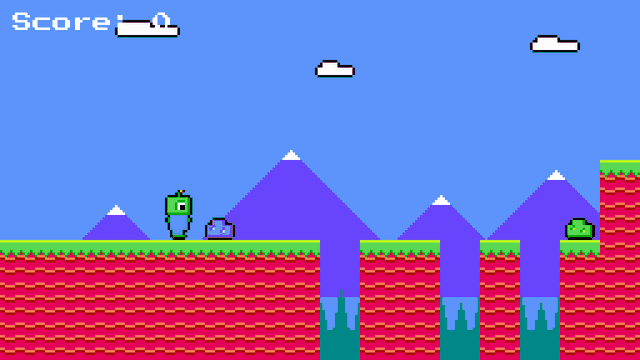
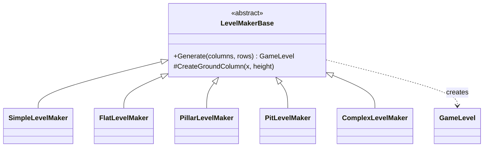
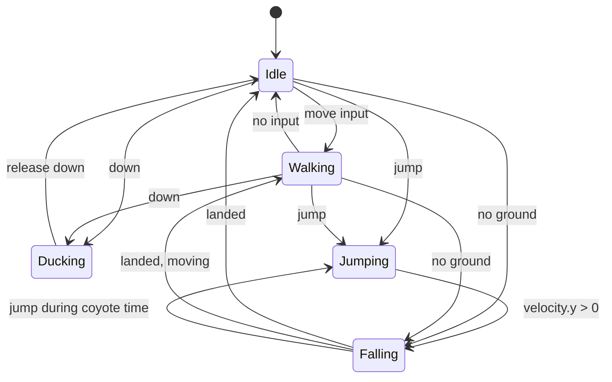

## Today's Goal

Make a **2D platformer**.

<figure class="original">

<figcaption>The original: <em>Super Mario Bros.</em> (Nintendo, 1985). Screenshot © Nintendo.</figcaption>
</figure>

We go through the fundamental steps of a basic Super Mario Bros. clone. The main topic is
**platformer physics and tile collision**: making a character run, jump and land on a tile
world, and seeing what the collision code actually does. Along the way:

- Debug drawing
- A camera for levels wider than the screen
- Level makers: the Strategy pattern again
- The State pattern again, now for the player

**Source code:**
[gar-games/06-super-mario-bros](https://github.com/Metamate/gar-games/tree/main/06-super-mario-bros).
Its README lists the steps (`Mario0` to `Mario8`, one project per concept), maps
the code, and says how to run it. Each section below names the steps that introduce it;
compare neighbouring steps to see exactly what changed.

## Prepare

- [14: Sound Effects and Music](https://docs.monogame.net/articles/tutorials/building_2d_games/14_soundeffects_and_music)
- [15: Audio Controller](https://docs.monogame.net/articles/tutorials/building_2d_games/15_audio_controller)
- [16: Working with SpriteFonts](https://docs.monogame.net/articles/tutorials/building_2d_games/16_working_with_spritefonts)
- [17: Scenes](https://docs.monogame.net/articles/tutorials/building_2d_games/17_scenes)
- [18: Texture Sampling](https://docs.monogame.net/articles/tutorials/building_2d_games/18_texture_sampling)
- [State](https://gameprogrammingpatterns.com/state.html)

## Levels From Code

_Step `Mario0`_

In Snake, the tilemap was loaded from an XML file. Levels can also be **generated** in code:

```csharp
private void GenerateLevel()
{
    Tileset tileset = _tilesets[Random.Shared.Next(_tilesets.Count)];
    _tilemap = new Tilemap(tileset, Columns, Rows);

    for (int x = 0; x < Columns; x++)
    {
        for (int y = Rows - GroundHeight; y < Rows; y++)
        {
            // A tile is more than a graphic: it also knows whether it is solid.
            _tilemap.SetTile(x, y, new Tile(GroundTile, isSolid: true));
        }
    }
}
```

The tilemap now stores `Tile` values instead of plain integer ids. A tile knows more than
its graphic:

```csharp
// One cell of a tilemap: which tileset graphic to draw, and whether it blocks movement.
public readonly struct Tile(int graphicId = -1, bool isSolid = false)
{
    public static readonly Tile Empty = new();

    public int GraphicId { get; init; } = graphicId;
    public bool IsSolid { get; init; } = isSolid;
    public bool IsEmpty => GraphicId < 0;
}
```

`Tile` and `Tilemap` live in GMDCore, so they only hold what any tile-based game needs.
Because the graphics are separate from the level's structure, the same level can be drawn
with any of the 60 tilesets in `tiles.png` (press `R`).

**Try it** (`Mario0`): in `GenerateLevel`, leave a gap two tiles wide in the ground, and
raise the ground by two tiles in the middle. Press R: what changes, and what doesn't?

### Strategy pattern: level makers

_Step `Mario1`_

Different kinds of levels are produced by interchangeable **level makers** sharing one
base: `SimpleLevelMaker`, `FlatLevelMaker`, `PillarLevelMaker`, `PitLevelMaker`,
`ComplexLevelMaker` (keys `1`–`5` in this step). The game asks _a_ level maker for a level
without knowing which algorithm it uses. This is the **Strategy pattern** from
[Pac-Man](../05-pac-man/): a family of interchangeable algorithms behind a common interface.

The grass or snow on top of the ground (the _toppers_) is a detail of this game, not of
tilemaps in general, so it isn't part of `Tile`. Instead, a `GameLevel` has two tilemaps
of the same size: `Tilemap` for the ground and `Toppers`, drawn on top with its own
tileset. Layering tilemaps like this is how most tile editors (e.g. Tiled) work, and
[Pokemon](../10-pokemon/) uses it for its tall grass.


```mermaid
classDiagram
    class LevelMakerBase {
        <<abstract>>
        +Generate(columns, rows) GameLevel
        #CreateGroundColumn(x, height)
    }
    LevelMakerBase <|-- SimpleLevelMaker
    LevelMakerBase <|-- FlatLevelMaker
    LevelMakerBase <|-- PillarLevelMaker
    LevelMakerBase <|-- PitLevelMaker
    LevelMakerBase <|-- ComplexLevelMaker
    LevelMakerBase ..> GameLevel : creates
```

Each ground column also gets a **topper** (a grass or snow edge on the top tile) from a
separate topperset, and each level a random background.

**Try it** (`Mario1`): make pits twice as common in `PitLevelMaker`, then press 4 to
see it.

## Platformer Physics

_Step `Mario2`_

- **Gravity and jumping:** gravity adds to the vertical velocity every frame; a jump sets it
  to a negative impulse.
- **Hitbox inset:** the player is as wide as a tile, which makes pits impossible to fall
  into. We shrink the hitbox by 2 px on each side.
- **Tile collision:** move one axis at a time. After moving, check the tiles at the hitbox
  corners in the direction of movement, then **snap** the player to the tile edge and zero
  the velocity on that axis.
- **Ground check:** probe one pixel below the hitbox for solid tiles.
- **Coyote time:** allow a jump for a moment after walking off a ledge. It feels fairer.

**Try it:** on paper, with 16-pixel tiles: a hitbox spans x 30 to 42 and moves 8 pixels right,
and a wall starts at x 48. Where is the hitbox after the move, and after the snap? What happens
to its velocity?

**Try it** (`Mario2`): press F1, and set `HitboxInset` to 0. Can you still fall into a
one-tile pit? Then set `CoyoteTime` to 0.5: how does jumping off a ledge feel?

### Performance

The player doesn't need to be tested against every tile. The grid is static, so we can
look up the tile at a position directly (`IsSolidAt(x, y)`). That costs the same for a level of
10 or 10,000 tiles: **O(1)** instead of **O(n)**. Moving entities can't be looked up this
way. Testing all pairs of entities is **O(n²)**; in
[Vampire Survivors](../12-vampire-survivors/) we make that fast too.

### Debug drawing

Collision bugs are hard to see: the hitbox is invisible, and a player that stops a few
pixels early looks just like one that works. **Debug drawing** makes them visible. Press
`F1` to outline the solid tiles in red and the player's hitbox in green (from `Mario6`,
the entities in yellow too). You can see the hitbox inset, and exactly where the player
collides.

GMDCore gets a small `DebugDraw` class. Its drawing calls do nothing unless
`DebugDraw.Enabled` is true, so they can stay in the code:

```csharp title="GameLevel.cs"
if (Tilemap.GetTile(column, row).IsSolid)
{
    Vector2 position = Tilemap.TileToPoint(column, row);
    DebugDraw.Rectangle(spriteBatch, new Rectangle((int)position.X, (int)position.Y,
        (int)Tilemap.TileWidth, (int)Tilemap.TileHeight), Color.Red);
}
```

Debug drawing and the debugger complement each other. The debugger shows the exact values
at one moment (set a breakpoint in the collision code and inspect the hitbox); debug drawing
shows what happens over time, while the game runs.

### Input: GameController

As in [Snake](../03-snake/), the platformer maps keys to actions through a `GameController`
class (`GameController.Jump` instead of `Keys.Space`).

**Discuss:** this is _not_ the Command pattern from [Sokoban](../04-sokoban/). Why not?

## Character State

_Steps `Mario2` → `Mario3`_

In [Pac-Man](../05-pac-man/), each ghost's mode was a state object. The player of a
platformer needs the same pattern, and it shows well why the simpler options break down.
Consider this (from _Game Programming Patterns_):

```cpp
void Heroine::handleInput(Input input)
{
    if (input == PRESS_B)
    {
        if (!isJumping_ && !isDucking_) { /* Jump... */ }
    }
    else if (input == PRESS_DOWN)
    {
        if (!isJumping_) { isDucking_ = true; setGraphics(IMAGE_DUCK); }
        else { isJumping_ = false; setGraphics(IMAGE_DIVE); }
    }
    else if (input == RELEASE_DOWN)
    {
        if (isDucking_) { /* Stand... */ }
    }
}
```

With one boolean per condition, you can end up in **illegal states**. Can you spot the bug?
(We prevent air-jumping while jumping, but not while diving, so we need yet another flag.)

An **enum** makes illegal combinations impossible: the player is in exactly one state. In
`Mario2`, the player's state is an enum, and its behaviour lives in `switch`
statements:

```csharp
switch (State)
{
    case PlayerState.Idle:
        if (Velocity.X != 0) ChangeState(PlayerState.Walking);
        if (GameController.Down) ChangeState(PlayerState.Ducking);
        if (GameController.Jump) ChangeState(PlayerState.Jumping);
        if (!IsOnGround()) ChangeState(PlayerState.Falling);
        break;

    case PlayerState.Jumping:
        if (Velocity.Y > 0) ChangeState(PlayerState.Falling);
        break;

    // ...
}
```

It works, but every method switches over every state (`ChangeState` has its own switch,
and `HandleHorizontalMovement` a special case for ducking), and there is no good place for
data that only one state needs, such as a charge time while ducking.

**Try it** (`Mario3`): make the player jump higher and walk faster. Which class holds
each value?

### The State pattern

> Allow an object to alter its behaviour when its internal state changes.

- Each state is a class with its own behaviour and its own data.
- The entity delegates to its current state object.
- Adding a state doesn't touch existing states.

In `Mario3`, each case becomes a class: `PlayerIdleState`, `PlayerWalkState`,
`PlayerJumpState`, `PlayerFallState` and `PlayerDuckState`. The shared physics moves to
`PlayerStateBase`, and `Player` just forwards `Update` and `Draw` to its current state.


```mermaid
stateDiagram-v2
    [*] --> Idle
    Idle --> Walking : move input
    Walking --> Idle : no input
    Idle --> Ducking : down
    Walking --> Ducking : down
    Ducking --> Idle : release down
    Idle --> Jumping : jump
    Walking --> Jumping : jump
    Jumping --> Falling : velocity.y > 0
    Idle --> Falling : no ground
    Walking --> Falling : no ground
    Falling --> Idle : landed
    Falling --> Walking : landed, moving
    Falling --> Jumping : jump during coyote time
```

## Camera

_Step `Mario4`_

Our previous games fit on one screen. A level wider than the screen needs a **camera**: a
transform that shifts the world so the target (the player) is centred. It is passed to
`SpriteBatch.Begin()` together with the screen scale matrix. Here we only follow the
x-axis, and clamp the camera to the level's edges. The background scrolls at half the
camera's speed, for a parallax effect.

**Try it** (`Mario4`): make the background scroll at a quarter of the camera's speed
(in `GameLevel`). What do 0 and 1 look like?

## Game States

_Step `Mario5`_

The game itself also uses the State pattern, like Flappy Bird: a `StartState` with the
title screen, and a `PlayState` that creates the level and the player. Falling into a pit
sends you back to the title screen.

## Entities

_Step `Mario6`_

An **entity** is any "thing" in the game that isn't part of the tilemap: the player,
snails, bushes, mystery boxes, gems. Entities don't align to the grid, they move, and they
can have their own states.

```csharp
public interface IEntity
{
    Vector2 Position { get; set; }
    Rectangle Bounds { get; }
    bool Collidable { get; set; }
    bool IsSolid { get; }
    bool Active { get; set; }

    void Update(GameTime gameTime);
    void Draw(SpriteBatch spriteBatch);
    bool Collides(IEntity other);
}
```

The level updates all entities through the Update Method pattern, and each entity decides
how to respond to collisions. Solid entities (mystery boxes) block the player just like
tiles. Hitting a box from below pops out a gem, and collecting gems raises the score.

## Basic AI: Snail States

_Step `Mario7`_

Enemy AI can be built from states too:

- **Base:** shared collision resolution, gravity, ground detection
- **Idle:** plays an idle animation for a while
- **Walk:** walks, turns around at edges or when blocked
- **Chase:** moves towards the player when close

Landing on a snail from above stomps it. Touching it any other way ends the game.

`Mario8` adds music and sound effects: the finished game.

## Exercises

Start from `Mario8`.

1. **A chunk level maker:** design a handful of short level chunks by hand (a pit with a
   platform over it, a staircase, a snail on a ledge), each a small grid of tiles in a data
   file in `Content/Assets`. The builder copies `.xml` files as they are; for another
   format, such as `.txt`, add an `IncludeCopy` rule in `Builder.cs`. Write a level maker
   that strings random chunks together, and make each level a few chunks longer than the
   last when the player reaches its right edge.
2. **Moving platforms:** a platform that glides back and forth and carries the player
   standing on it. Where does "carried along" belong: in the platform, in the player, or
   in the collision code?
3. **Powerups:** add a star (invincibility with a timer) and a mushroom (the player grows).
   Both are drawn in `images/extras.png`. How do you add these without piling flags onto
   the `Player` class?
4. **Debug drawing:** also draw the probe below the player that checks for ground
   (`IsOnGround` in `PlayerStateBase`), and show the player's current state and velocity
   on screen. Use it to find where coyote time starts and ends.

**Going further (optional):** auto-tiling. Instead of the level maker choosing each tile's graphic, look at a solid tile's neighbours (which of up, down, left and right are solid) and pick the matching edge or corner graphic. Where does that belong: in the level maker, or in the tilemap?

## Apply It to Your Project

- What would you want to see while debugging your game? Add debug drawing for your
  hitboxes, triggers or AI targets, behind a key.
- Which entities in your game have distinct behaviour modes? Draw a state diagram for one
  of them.
- Is anything in your game currently a set of booleans that should be a state machine?

## Check Yourself

<details>
<summary>Why is a switch on an enum still a problematic way to model character state?</summary>

Every method has to switch over every state, so adding a state means touching many places,
and state-specific data has nowhere natural to live.

</details>

<details>
<summary>Why can tile collision be O(1) while entity collision can't?</summary>

Tiles never move and sit in a grid, so a position maps directly to a tile index. Entities
move freely, so we have to check them against each other.

</details>

<details>
<summary>Why keep debug drawing in the code, behind a switch, instead of deleting it once a bug is fixed?</summary>

The next bug needs it too. Behind a switch it costs nothing when it is off, and anyone
working on the game can turn it on to see what the collision code is doing.

</details>

Related exam questions: [2](../../exam/#2-state-pattern--state-stack),
[4](../../exam/#4-command-pattern--input-handling),
[7](../../exam/#7-tilemaps-collision-detection--procedural-generation).
