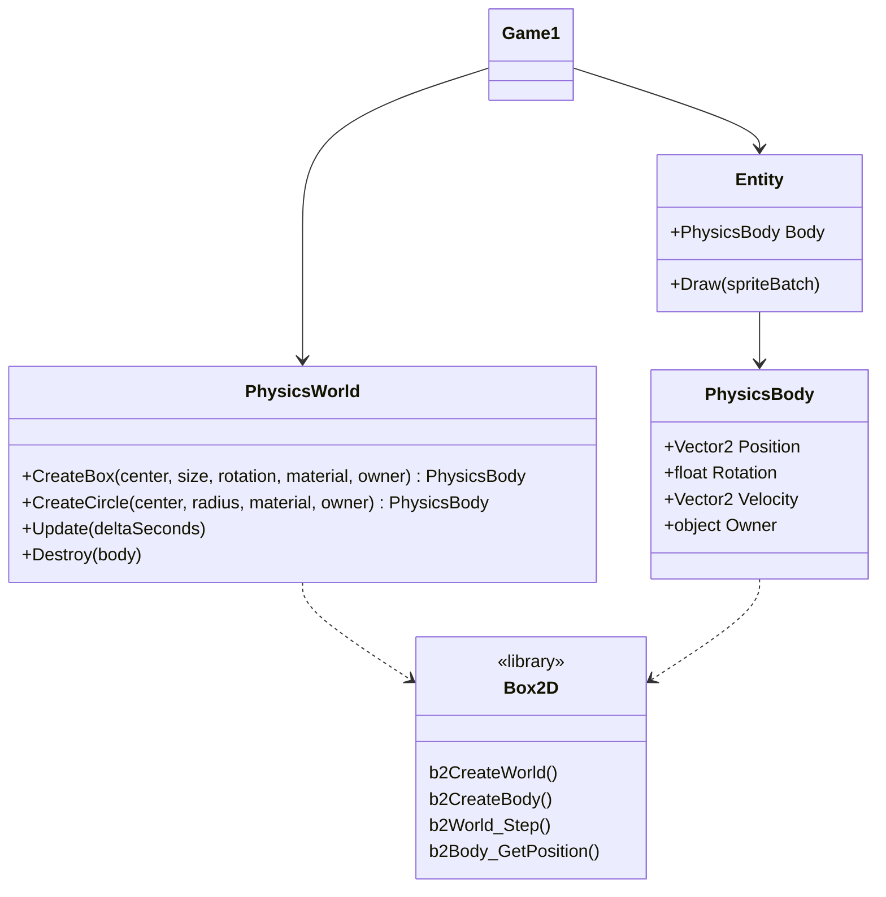
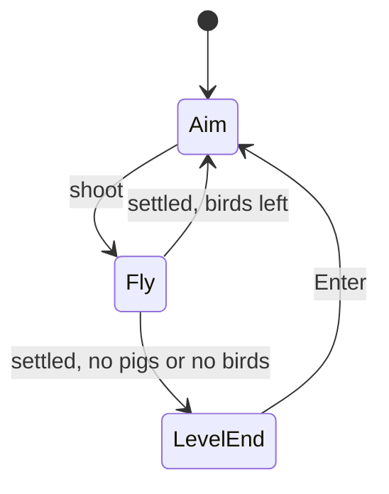

## Today's Goal

Make **Angry Birds**: pull back the slingshot, let go, and knock down the pigs' huts.

In [Super Mario Bros](../06-super-mario-bros/) we wrote our own physics: gravity, velocity,
and collisions with tiles. For stacks of blocks that tip over, bounce and break, that isn't
enough. Real games use a **physics library** for that, and here we use **Box2D**. The main
topic isn't physics, though. It's how you bring someone else's library into your
architecture, so that the rest of your game doesn't have to know about it. Along the way:

- The **Adapter** and **Facade** patterns
- Two worlds: the physics world (metres, y up) and the game world (pixels, y down)
- Contact events, and destroying bodies safely
- The **Prototype** pattern: building levels from prefabs

**Source code:** [gar-games/07-angry-birds](https://github.com/Metamate/gar-games/tree/main/07-angry-birds)

| Step | Topic |
| --- | --- |
| `Birds0` | Box2D, used directly in `Game1` |
| `Birds1` | Adapter & Facade: `PhysicsWorld` and `PhysicsBody` |
| `Birds2` | Contact events: hits that damage, removed safely after the step |
| `Birds3` | Prototype: prefabs, and levels as text files |
| `Birds4` | The whole game: three levels, a few birds each, an aiming curve (the finished game) |

## Prepare

- [Box2D: Hello Box2D](https://box2d.org/documentation/hello.html) (skim: the world, bodies,
  shapes and stepping)
- [Adapter](https://refactoring.guru/design-patterns/adapter) and
  [Facade](https://refactoring.guru/design-patterns/facade)
- [Prototype](https://gameprogrammingpatterns.com/prototype.html) (up to "What about
  data?")

## A Physics Library

_Step `Birds0`_

[Box2D](https://box2d.org/) is a 2D physics engine, used in many games (Angry Birds among
them). We use [Box2D.NET](https://github.com/ikpil/Box2D.NET), a C# port, added as a NuGet
package:

```xml title="Birds0.csproj"
<PackageReference Include="Box2D.NET" Version="3.1.*" />
```

Box2D simulates a **world** of **bodies**. Each body has one or more **shapes** (boxes,
circles, polygons), with a density, friction and bounciness. Static bodies (the ground)
never move; dynamic bodies are moved by gravity and collisions. You **step** the world
forward in time, and read where the bodies ended up.

`Birds0` uses Box2D directly, in `Game1`:

```csharp title="Game1.cs (Birds0)"
private void AddBox(float x, float y, float width, float height, string sprite)
{
    B2BodyDef bodyDef = b2DefaultBodyDef();
    bodyDef.type = B2BodyType.b2_dynamicBody;
    bodyDef.position = new B2Vec2(x / PixelsPerMeter, -y / PixelsPerMeter);
    B2BodyId body = b2CreateBody(_world, in bodyDef);

    B2Polygon box = b2MakeBox(width / 2 / PixelsPerMeter, height / 2 / PixelsPerMeter);
    B2ShapeDef shapeDef = b2DefaultShapeDef();
    shapeDef.material.friction = 0.6f;
    b2CreatePolygonShape(body, in shapeDef, in box);

    _bodies.Add((body, _atlas.GetRegion(sprite)));
}
```

It works: the hut stands, the bird flies, the blocks tumble. But look at what `Game1` now
has to know:

- **A foreign API.** Box2D is written in C, and the port keeps its style: functions like
  `b2CreateBody` instead of methods, structs passed with `in`, and IDs (`B2BodyId`)
  instead of objects.
- **Another world's units.** Box2D works in **metres**, with **y pointing up**. Our game
  works in **pixels**, with y pointing down. So every position that crosses between the
  two is divided or multiplied by `PixelsPerMeter`, and its y is flipped: when creating a
  body, when launching the bird, and every frame when drawing. Box2D also turns
  counter-clockwise, and SpriteBatch clockwise. Forget one conversion, and a body appears
  in the wrong place, or falls up.
- **Everywhere.** Box2D's types and conversions are spread all through the game. Moving
  to another physics library, or to a new version of this one, would mean changing all of
  it.

Box2D is made for scale: 1 unit should be about 1 metre, and objects should be roughly 0.1
to 10 units in size. In pixels, a 50-pixel block would be a 50-metre block, and it would
fall as slowly as a building. That's why the conversion is needed at all.

## Adapter & Facade

_Step `Birds1`_

`Birds1` puts Box2D behind two classes of our own, in the `Physics` folder. The rest of the
game never sees a Box2D type again.



Two patterns are at work here:

- An **Adapter** converts the interface of a class into the interface its users expect.
  `PhysicsBody` wraps a `B2BodyId`, and gives the game what it wants: a position in pixels,
  a rotation that turns the same way as SpriteBatch, a velocity it can set.
- A **Facade** puts one simple interface in front of a complicated subsystem. Box2D has
  hundreds of functions; the game needs a handful. `PhysicsWorld` offers exactly those:
  create a box, create a circle, step, destroy.

```csharp title="PhysicsBody.cs"
public sealed class PhysicsBody
{
    internal B2BodyId Id { get; }
    public object Owner { get; }

    public Vector2 Position => Units.ToPixels(b2Body_GetPosition(Id));

    // Box2D turns counter-clockwise, SpriteBatch clockwise.
    public float Rotation
    {
        get
        {
            B2Rot rotation = b2Body_GetRotation(Id);
            return -b2Rot_GetAngle(in rotation);
        }
    }
}
```

And every conversion between the two worlds is in one place:

```csharp title="Units.cs"
internal static class Units
{
    public const float PixelsPerMeter = 50;

    public static B2Vec2 ToMeters(Vector2 pixels) => new(pixels.X / PixelsPerMeter, -pixels.Y / PixelsPerMeter);
    public static Vector2 ToPixels(B2Vec2 meters) => new(meters.X * PixelsPerMeter, -meters.Y * PixelsPerMeter);
}
```

Now the game reads like our game again:

```csharp title="Block.cs"
public Block(PhysicsWorld world, Vector2 center, Vector2 size, float rotation, PhysicsMaterial material, TextureRegion sprite) : base(sprite)
{
    Body = world.CreateBox(center, size, rotation, material, this);
}
```

What did we gain?

- **One place to change.** A new version of Box2D, or another physics library, means
  changing the `Physics` folder only.
- **Our language.** The adapter speaks pixels, clockwise rotations and our own types.
  Nothing outside it has to think in metres.
- **A smaller surface.** The facade only offers what the game needs, so the game can't
  come to depend on the rest of Box2D.

And what does it cost? Every Box2D feature the game needs later (joints, raycasts,
sensors) has to be added to the facade first. That's the point, but it is work. Wrap a
library when it's foreign to your code, when you might swap it, or when you use a small
part of it. A library that already fits your code, like MonoGame itself, doesn't need it.

`Units` is `internal`, and so are the IDs. In a bigger project, the `Physics` folder would
be its own class library project, and `internal` would then really hide Box2D from the game.

### Who owns the position?

A block now exists twice: as an `Entity` in our game, and as a body in the physics world.
Two copies of the same position would drift apart, so one of them must own it. Here, the
**physics world owns it**: an entity has no position of its own, and reads its body's
position every time it's drawn.

```csharp title="Entity.cs"
public void Draw(SpriteBatch spriteBatch)
{
    var origin = new Vector2(Sprite.Width / 2f, Sprite.Height / 2f);
    Sprite.Draw(spriteBatch, Body.Position, Color.White, Body.Rotation, origin, 1, SpriteEffects.None, 0);
}
```

The link goes both ways. Every body knows its owner (`PhysicsBody.Owner`), so when the
physics world reports something about a body, the game can find the entity it belongs to.

### Debug drawing

`F1` draws what the physics world sees: every body's shape, in green while it's awake and
in blue when it's asleep (Box2D stops simulating bodies that have come to rest). It uses
GMDCore's `DebugDraw.Enabled` from [Super Mario Bros](../06-super-mario-bros/). When a
sprite and its body don't line up, this is where you see it.

### A fixed time step

Box2D wants the same time step every time. `PhysicsWorld.Update` collects the frame time
and steps the world in fixed steps of 1/60 second: the accumulator from
[Snake](../03-snake/#fixed-tick-movement), again.

## Contact Events

_Step `Birds2`_

Blocks should break, and pigs should pop. Box2D can report **hit events**: two shapes
touched at more than a certain speed. They're collected during the step, and read after it.
`PhysicsWorld` turns them into a C# event, in our own terms:

```csharp title="PhysicsWorld.cs"
public event Action<PhysicsBody, PhysicsBody, float> Hit;

private void RaiseHitEvents()
{
    B2ContactEvents events = b2World_GetContactEvents(_world);
    for (int i = 0; i < events.hitCount; i++)
    {
        B2ContactHitEvent hit = events.hitEvents[i];

        // A body destroyed since the step no longer has valid shapes.
        if (!b2Shape_IsValid(hit.shapeIdA) || !b2Shape_IsValid(hit.shapeIdB))
            continue;

        Hit?.Invoke(BodyOf(hit.shapeIdA), BodyOf(hit.shapeIdB), Units.ToPixels(hit.approachSpeed));
    }
}
```

The game listens, and damages both entities: the faster the hit, the more damage. Glass
breaks easily, stone hardly at all.

(A C# `event` lets other code subscribe to something that happens, without the publisher
knowing who listens. In [Zelda](../08-the-legend-of-zelda/), this becomes the Observer
pattern.)

### Destroying safely

When an entity's health runs out, it must go: its body leaves the physics world, and the
entity leaves the game's list. The obvious place to do that is in the hit handler. Don't:

```csharp
private void OnHit(PhysicsBody a, PhysicsBody b, float speed)
{
    float damage = speed / 100;
    (a.Owner as Entity)?.TakeDamage(damage);
    (b.Owner as Entity)?.TakeDamage(damage);
    // Not here: _physics.Destroy(...) or _entities.Remove(...)
}
```

- **The physics world is still reporting.** More hits from the same step may follow, and
  one may be about the body you just destroyed. In many physics libraries (including older
  versions of Box2D), destroying a body during a callback crashes the game.
- **You may be in the middle of a loop.** Removing an entity from a list while something is
  looping over that list throws an exception, or skips an item.

So the handler only **marks** entities as destroyed, and they're removed later, when the
step and all its hits are done:

```csharp title="Game1.cs"
_physics.Update(deltaSeconds);
RemoveDestroyed();

private void RemoveDestroyed()
{
    for (int i = _entities.Count - 1; i >= 0; i--)
    {
        Entity entity = _entities[i];
        if (!entity.IsDestroyed)
            continue;

        _score += entity.Points;
        _physics.Destroy(entity.Body);
        _entities.RemoveAt(i);
    }
}
```

The loop runs backwards, so removing an item doesn't skip the next one. This pattern (mark
now, remove at a safe point) comes back whenever objects are destroyed while the game is
busy with them.

## Prototype

_Step `Birds3`_

So far, the level is built in code, with every block's material, size, health, points and
sprite repeated:

```csharp
_entities.Add(new Block(_physics, new Vector2(880, 590), new Vector2(20, 100), 0, Materials.Wood, 8, 500, _atlas.GetRegion("wood-post")));
```

A level designer thinks in _kinds_ of things: a wood post, a glass box, a big pig. And they
shouldn't need to write C# to build a level.

> The Prototype pattern: specify the kinds of objects to create using a prototypical
> instance, and create new objects by copying this prototype.
> _(Design Patterns, Gamma et al.)_

A **prototype** is a fully configured entity that isn't in the world. To place one, copy
it, and give the copy a body:

```csharp title="Entity.cs"
public Entity Clone()
{
    var copy = (Entity)MemberwiseClone();
    copy.Body = null;
    return copy;
}

public void Spawn(PhysicsWorld world, Vector2 position, float rotation) => Body = CreateBody(world, position, rotation);
```

`Prefabs` keeps one prototype per kind of thing, by name:

```csharp title="Prefabs.cs"
Add("wood-post", new Block(Materials.Wood, post, 8, 500, atlas.GetRegion("wood-post")));
Add("glass-box", new Block(Materials.Glass, box, 4, 500, atlas.GetRegion("glass-box")));
Add("big-pig", new Pig(30, 6, 5000, atlas.GetRegion("big-pig")));

public Entity Spawn(string name, PhysicsWorld world, Vector2 position, float rotation = 0)
{
    Entity entity = _prototypes[name].Clone();
    entity.Spawn(world, position, rotation);
    return entity;
}
```

And a level is a text file of prefab names and positions, like
[Sokoban's levels](../04-sokoban/#levels-as-data):

```text title="level1.txt"
wood-post    880 590 0
wood-post   1040 590 0
wood-plank   960 530 0
pig          960 618 0
glass-box    960 495 0
pig          960 448 0
```

Things to notice:

- **`MemberwiseClone` makes a shallow copy.** Every field is copied, but a field that refers
  to an object copies the reference, not the object. The copy shares the prototype's
  sprite, which is fine, because nobody changes a sprite. It must never share a _body_:
  two blocks with one body would move as one. That's why `Clone` clears the body, and
  `Spawn` creates a new one.
- **Prototypes are instances, not classes.** A "big pig" isn't a subclass of `Pig`, but a
  `Pig` configured with a bigger radius and more health. A new kind of block is one line
  in `Prefabs`, not a new class.
- **Anything can be a prototype.** You could clone a block that's already damaged, or a
  pig with a helmet you configured in code. The copy starts out exactly like the original.
- **The bird is a prefab too.** When you shoot, the game spawns `"bird"`. A different kind
  of bird would be another prototype.

Prototype and Type Object (in [Plants vs. Zombies](../09-plants-vs-zombies/)) solve a
similar problem: many kinds of things, without a class for each. Prototype copies a
configured object; Type Object shares one object that describes a kind. We'll compare
them there.

## The Whole Game

_Step `Birds4`_

`Birds4` adds three levels, a few birds per level (`birds 3` at the top of a level file),
a curve that shows where the bird will fly while you aim, and game states like
[Pac-Man's](../05-pac-man/#the-whole-game):



`FlyState` waits until the physics world has **settled**: every body has gone to sleep.
The facade answers that question in one line (`IsSettled`), using Box2D's count of awake
bodies.

The aiming curve doesn't use the physics world at all. The bird flies in a parabola until
it hits something, so its position at time _t_ is `start + velocity * t + gravity * t² / 2`.

## Exercises

Start from `Birds4`.

1. **A new level:** design `level4.txt` from the prefabs. Add a new prefab too, e.g. a long
   stone plank. How much code did you change?
2. **A new bird:** a heavy bird that's twice the size. Make it a prefab, and give each
   level a list of birds instead of a count (e.g. `birds red red heavy`).
3. **Explosive:** a TNT box that, when destroyed, pushes everything nearby away. What does
   the facade need to offer (e.g. `ApplyImpulse`)? Add it without letting Box2D types out.
4. **Unit test the conversion:** `Units` is small, but easy to get wrong. Write tests that
   convert a point to metres and back, and check that y flips.
5. **Swap the library (stretch):** which files would change if you replaced Box2D with
   another physics library? Try it with
   [Aether.Physics2D](https://github.com/nkast/Aether.Physics2D).

## Apply It to Your Project

- Which libraries does your game use (besides MonoGame)? Would the rest of your code notice
  if you replaced one?
- Does anything in your game exist twice (e.g. a position in two places)? Which copy owns
  it?
- Do you ever remove objects while looping over them, or while something is reporting
  about them?
- Which kinds of things in your game could be prototypes, and which could come from data
  files?

## Check Yourself

<details>
<summary>What is the difference between an Adapter and a Facade?</summary>

An Adapter converts one interface into another that its users expect (here, a Box2D body
into a body in pixels). A Facade puts one simple interface in front of a whole subsystem
(here, a few methods in front of Box2D's many). `PhysicsWorld` and `PhysicsBody` together
do both.

</details>

<details>
<summary>Why convert between metres and pixels at all?</summary>

Box2D is tuned for objects of about 0.1 to 10 metres. In pixels, objects would be tens or
hundreds of units big, and would behave like huge, slow objects. The game simulates in
metres, and draws in pixels.

</details>

<details>
<summary>Why not destroy a body inside the hit handler?</summary>

The physics world is still reporting hits, and a later one may be about the destroyed
body; some libraries crash if the world changes during a callback. The game may also be
looping over the list you remove from. Mark it, and remove it after the step.

</details>

<details>
<summary>What does a shallow copy share with the original, and why does that matter here?</summary>

Every field that refers to an object: the copy points to the same object. Sharing an
unchanging sprite is fine, but sharing a physics body would make two entities one. So the
clone gets its own body.

</details>

Related exam questions: [5](../../exam/#5-observer-pattern-events--ui),
[7](../../exam/#7-tilemaps-collision-detection--procedural-generation),
[8](../../exam/#8-data-driven-design--serialization).
