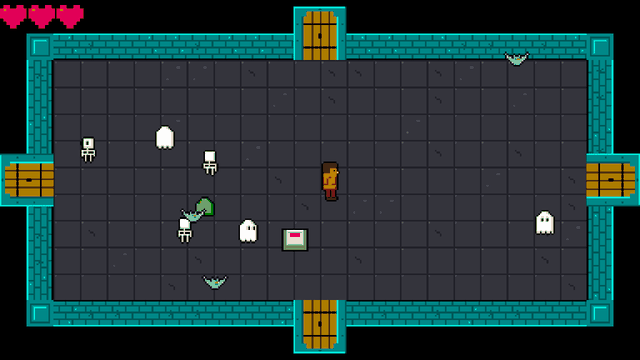
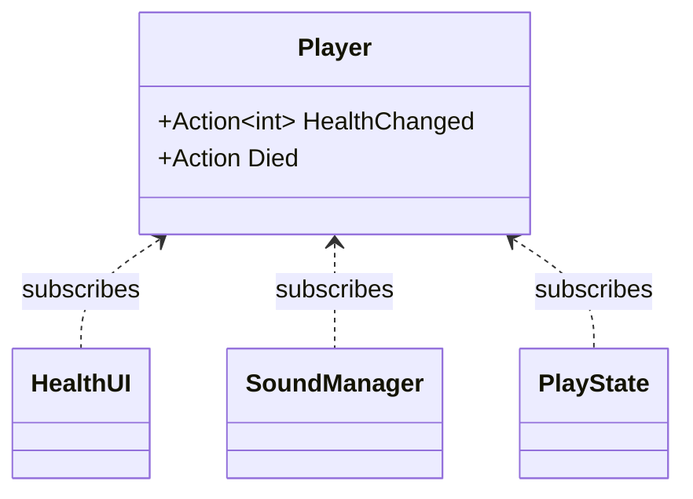
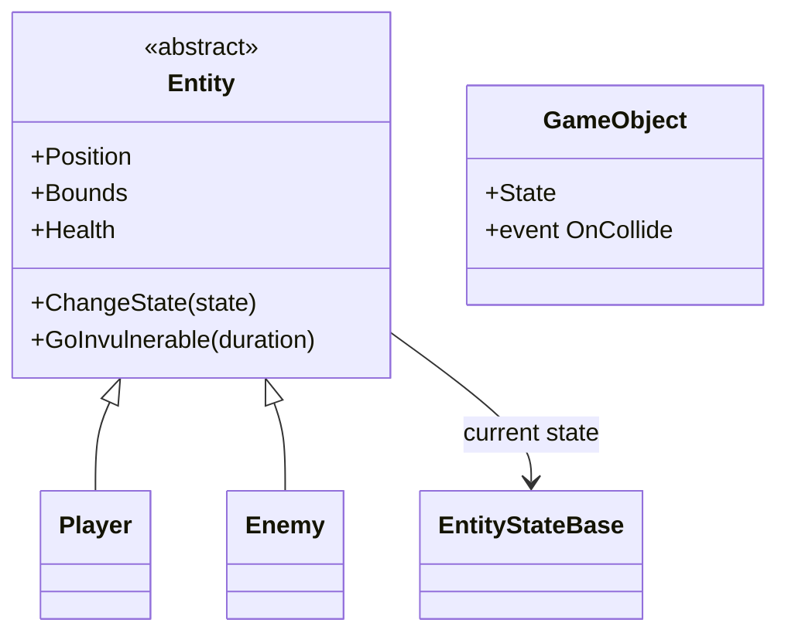

## Today's Goal

Make a **top-down dungeon crawler**.

<figure class="original">

<figcaption>The original: <em>The Legend of Zelda</em> (Nintendo, 1986). Screenshot © Nintendo.</figcaption>
</figure>

We go through the fundamental steps of a primitive _The Legend of Zelda_ clone. The main
topic is **composition vs. inheritance**: the game has many kinds of things (a player,
several enemies, switches, doorways), and how we build them decides how easy it is to add
the next one. Along the way:

- The Observer pattern (delegates and events)
- Hitboxes and hurtboxes
- A tweening system for screen scrolling

**Source code:** [gar-games/07-zelda](https://github.com/Metamate/gar-games/tree/main/07-zelda).
Its README lists the steps (`Zelda0` to `Zelda7`, one project per concept), maps the code,
and says how to run it. Each section below names the steps that introduce it; compare
neighbouring steps to see exactly what changed.

## Prepare

- [Observer](https://gameprogrammingpatterns.com/observer.html)
- [Event Queue](https://gameprogrammingpatterns.com/event-queue.html) (skim)
- [C# Delegates](https://learn.microsoft.com/en-us/dotnet/csharp/programming-guide/delegates/)
- [C# Action Delegate](https://learn.microsoft.com/en-us/dotnet/api/system.action)

## Explore the Codebase

Take about 15 minutes to browse the finished game, `Zelda7`, using the README as a guide:

- Find where the game transitions between the title screen, gameplay and game over.
- How does the player move?
- Find where a new room is generated, and what it contains when created.
- The player and enemies share a lot of code. Find the common base and explain what it
  provides.
- Trace what happens from the moment the player presses Space to an enemy taking damage.

## Top-Down Perspective & Dungeon Generation

_Steps `Zelda0` → `Zelda2`_

The dungeon is an endless series of rooms. Each room is a tilemap generated when entered:
solid walls and corners around the edge, and a floor of random floor tiles (`Zelda0`). Then
come the player (`Zelda1`), enemies (`Zelda2`), and doorways and objects such as the switch
that opens the doors (`Zelda4`).

In a top-down game, the player's sprite is taller than the part that collides: the sprite is
drawn a few pixels above its collision box, so the character looks like it stands _on_ the
floor.

The rooms' tiles and the XML files refer to tiles by their number in the sprite sheet
(`frames="9,10,11,10"`). Nobody can read those numbers off an image, so the repo has a small
tool, `LabelTiles`, that writes each tile's number onto a copy of a sheet. Small throwaway
tools like this, which the game never uses, are common in game projects: they make working
with data practical.

## Hitboxes & Hurtboxes

_Step `Zelda3`_

- **Hitbox:** the area that _deals_ damage (e.g. the sword swing).
- **Hurtbox:** the area that _receives_ damage (e.g. the enemy's body).

Keeping them separate means the sword's reach and the enemy's body don't have to match
the sprite. The player's hurtbox is only the lower half of its sprite, its feet, which suits
the top-down look. The sword's hitbox is a rectangle in front of the player, built when the
swing starts. The swing is a state: it checks the hitbox against the enemies every frame,
and ends when its one-shot animation has played once.

**Where does collision live?** There is no central collision system. Each kind of
collision is checked where the knowledge it needs already is:

| Collision | Checked in | Because |
| --- | --- | --- |
| Player and enemy | The room | The consequence (damage, maybe death) needs the room |
| Player and switch | The room | Opening the doors needs the room's doorways |
| Sword and enemy | The sword-swing state | It belongs to the swing and its timing |
| Entity and wall | The walk state | Stopping at walls is part of moving |

That trades a single overview for locality: reading a state or a room method shows exactly
what that interaction does. Compare it with the dedicated collision system in
[Geometry Wars](../11-geometry-wars/), which has far more things colliding.

**Try it** (`Zelda7`): make the sword reach twice as far in `GameSettings`, and play. Does it
still feel fair?

## Events & the Observer Pattern

_Steps `Zelda3` → `Zelda4`_

In `Zelda3`, the play state checks every frame whether the player has died:

```csharp
if (_player.Health <= 0)
    Game.SetState(new GameOverState(Game));
```

In `Zelda4`, the room announces it instead, and the play state reacts:

```csharp
_room.OnPlayerDied += OnPlayerDied;
```

Once there is a dungeon of rooms (`Zelda5`), the event is passed up one layer at a time:
the room announces it, the dungeon forwards it, and the play state reacts. The room knows
nothing about the dungeon, and the dungeon nothing about the play state; each class only
knows the one below it.

```csharp title="Dungeon.cs"
room.OnPlayerDied += () => OnPlayerDied?.Invoke();
```

Games are full of moments where something happens and other things need to react. The
thing that happened shouldn't need to know what those other things are.

**Observer** flips the dependency around: the _subject_ (publisher) just announces that
something happened, and any number of _observers_ (subscribers) react.



In C#, we don't need to implement the pattern ourselves. Delegates and events are built
into the language.

### Delegates

A delegate is a variable that holds a reference to a method.

```csharp
Action       // no arguments, returns void
Action<T>    // takes a T, returns void
Func<T>      // no arguments, returns T

obj.OnCollide = () => Console.WriteLine("hit");  // assign one handler
obj.OnCollide += () => PlaySound("hit");         // add more handlers
obj.OnCollide?.Invoke();                         // call all of them
```

### Events

An `event` is a delegate with guardrails: outside code can only `+=` and `-=`. Only the
owning class can invoke it or replace its subscribers.

```csharp
public class Player
{
    public event Action Died;

    private void TakeDamage(int amount)
    {
        _health -= amount;
        if (_health <= 0)
            Died?.Invoke();
    }
}
```

### Lambdas and closures

A lambda is an inline, anonymous function: `(int n) => n % 2 == 0`. When a lambda uses
variables from its surrounding scope, it _captures_ them (a closure):

```csharp
switchObj.OnCollide += () =>
{
    if (switchObj.State == "unpressed")
    {
        switchObj.State = "pressed";
        foreach (var door in Doorways)
            door.IsOpen = true;
    }
};
```

**Try it** (`Zelda7`): in `PlayState`, add a second subscriber to `_dungeon.OnPlayerDied`
that plays a sound: `_dungeon.OnPlayerDied += () => SoundManager.PlaySound("hit-player");`.
Which classes did you change, and which didn't need to know?

### Pitfalls

- **Forgotten unsubscribes:** a subscriber stays alive (and keeps reacting) as long as the
  publisher holds a reference to it. Unsubscribe in `Exit()`/`Dispose()`. You can't `-=` a
  lambda unless you stored it in a variable.
- **Hidden control flow:** "who reacts to this?" is no longer visible at the call site.
- **Ordering:** don't rely on the order in which subscribers are called.
- **Re-entrancy:** a handler that changes state (e.g. removes entities from a list) while
  the publisher is still iterating over it.

### Event Queue

Events are handled immediately, inside the publisher's call. An **event queue** stores
messages and processes them later (e.g. once per frame). This decouples the sender from
the receiver _in time_ as well. The classic example is audio: many systems ask for sounds,
and the audio system plays them in one place, merging duplicates.

## Screen Scrolling & Tweening

_Step `Zelda5`_

**Tweening** ("in-betweening") animates a value from A to B over time, instead of
snapping it. The simplest curve is linear interpolation:

```text
lerp(a, b, t) = a + (b - a) * t        where t goes from 0 to 1
```

Non-linear curves (ease-in, ease-out, see [easings.net](https://easings.net)) often feel
more natural.

When the player walks through a door, the camera and the player move at the same time. The
next room is placed one screen away, and the camera travelling towards it creates the
scroll. We could keep a progress value, advance it every frame and lerp by hand, but games
tween _all the time_: fades, flashes, menus sliding in, damage numbers floating up. So
GMDCore gets a small, reusable **tween system**, a `TweenManager`:

- **Tween:** change one or more values from A to B over a set time.
- **After:** wait N seconds, then run a method.
- **Every:** repeat a method at a fixed interval (`.Limit` to stop after N times).
- **Chaining:** `.Add()` animates several values at once, and `.Finish()` runs code when
  done.

```csharp title="Dungeon.cs"
_tweens.Tween(GameSettings.RoomShiftDuration)
    .Add(t => _camera.Position = Vector2.Lerp(Vector2.Zero, _shiftTarget, t), 0f, 1f)
    .Add(t => _player.Position = Vector2.Lerp(playerStart, playerEnd, t), 0f, 1f)
    .Finish(FinishShift);
```

The dungeon only has to call `_tweens.Update(gameTime)` while shifting. When the tween
ends, `FinishShift` makes the new room the current room and resets the camera. The dungeon
doesn't keep a progress variable or check whether the scroll is done; the tween system
keeps the timing.

## Stenciling

_Step `Zelda6`_

While walking through a door in `Zelda5`, the player is drawn on top of the door arch. `Zelda6`
fixes this with the **stencil buffer**: an extra per-pixel mask, next to the colour of each
pixel. The dungeon draws in three passes:

1. The rooms and everything in them, as usual.
2. A rectangle over each door arch, with colour writes switched off: it draws nothing you
   can see, but writes 1 into the stencil buffer there.
3. The player again, only where the stencil is still 0.

The player seems to walk _under_ the arch. All three passes use the same camera transform,
so the mask follows the camera while the rooms scroll.

```csharp title="Dungeon.cs"
// Pass 2: mark the arches in the stencil buffer, without drawing any colour
spriteBatch.Begin(transformMatrix: worldTransform, blendState: StencilOnlyBlend, depthStencilState: WriteStencilState);
DrawArchMasks(spriteBatch, pixel);
spriteBatch.End();

// Pass 3: the player, only where the stencil is 0
spriteBatch.Begin(transformMatrix: worldTransform, depthStencilState: ReadStencilState);
_player.Draw(spriteBatch);
spriteBatch.End();
```

## Data-Driven Design

_Steps `Zelda1`, `Zelda2` and `Zelda4`_

Enemies and game objects are defined in XML, not in C#:

```xml
<Enemy type="skeleton" width="16" height="16" walkSpeed="20" health="1">
  <Animation name="walk-down" frames="9,10,11,10" interval="0.2" />
  <Animation name="idle-down" frames="10" interval="0.2" />
</Enemy>
```

Adding a new enemy type means one `<Enemy>` block plus a spritesheet row: no new class.
The C# code only knows animation _names_ like `walk-down`, never frame numbers. Objects work
the same way: a switch's states (`unpressed`, `pressed`) and their frames come from
`object_definitions.xml`, and each doorway's tiles from `door_layouts.xml`. Content lives in
data and behaviour in C#. [Angry Birds](../08-angry-birds/) builds its levels from data in
the same way, and [Plants vs. Zombies](../09-plants-vs-zombies/) a whole game, with the Type
Object pattern.

## Composition vs. Inheritance

_Steps `Zelda1` → `Zelda4`_

The player and the enemies share an abstract `Entity` base class. It provides what every
creature needs: a position and a collision box, a sprite offset for the top-down look,
animations, health, invulnerability after a hit, and a current state. `Player` and `Enemy`
inherit it and add their own parts.



**Inheritance works well while there is one axis of variation.** It gets harder with an
enemy that shoots _and_ flies _and_ explodes, or a pot that the player can carry _and_
throw. Deep hierarchies (`Entity → Movable → Enemy → ShootingEnemy → HomingShootingEnemy…`) lead
to one of two problems:

- **Duplicated code:** two branches of the tree need the same behaviour, so it is copied.
- **A bloated base class:** the shared behaviour moves up into `Entity`, until every entity
  carries every feature, used or not.

**Composition** is the alternative: an object _has_ behaviours instead of _being_ a kind of
something. Zelda already composes in three places we have seen:

- **Behaviour in state objects:** an enemy's AI lives in the state object it currently
  holds (`EntityWalkState`, `EntityIdleState`). To behave differently, the enemy swaps that
  object; its class stays the same.
- **Behaviour wired from outside:** a floor switch is a plain `GameObject`. The room
  attaches a handler to its `OnCollide` event, and that handler decides what happens when
  the player steps on it. There is no `SwitchObject` subclass.
- **Data instead of subclasses:** enemy types (their size, speed, health and animations)
  come from a data file, so there is no class per enemy type.

> "Favor object composition over class inheritance." — Gang of Four, _Design Patterns_

Inheritance isn't wrong: `Entity` is a sensible base here. But every time you add a
subclass, ask whether you're describing _what something is_ or _what it can do_. The second
is usually better as a part the object has. In [Plants vs. Zombies](../09-plants-vs-zombies/),
we take this all the way with the **Component pattern**.

## Exercises

Start from `Zelda7`.

**Make Zelda (more) event-driven.** Pick one and refactor it. The class firing the event
must have no reference to the class reacting to it.

- `OnPlayerDied` is detected in one place, but causes a game over screen to appear
  somewhere completely different. Trace the full chain through the code.
- Enemy death is handled differently from player death. What happens now when an enemy
  dies? What could happen if there were an event for it?
- `SoundManager.PlaySound(...)` is called directly from several unrelated classes. Find
  all the call sites. Why is this a problem, and how would events fix it?

**Composition:** sketch the class hierarchy you would need for enemies that can walk, fly,
shoot or explode, in any combination. Then sketch the same with composition: which parts
would an enemy _have_? Implement one of them (e.g. a shooting behaviour that any enemy can
be given).

**Keys and locked doors:**

- Some enemies drop a key when they die. Use an event for it, as above. The key is drawn
  in `hearts.png` (its last frame, `frame_6`).
- Some doorways are locked. Add `locked` layouts to `door_layouts.xml`, so the look stays in
  data: a closed door's four tiles, plus a padlock on top. The padlock is drawn over four
  tiles of the tilesheet: 243 (top left), 244 (top right), 245 (bottom left) and 246
  (bottom right).
- Walking into a locked door with a key uses up the key and opens the door for good. Show
  the keys the player carries next to the hearts.

**Going further (optional):** a dungeon map. Keep track of the rooms the player has visited, and show them as a small map on a key press, with the current room highlighted. Which state shows it, and what does it need to know?

## Apply It to Your Project

- What are the meaningful moments in your game that other systems might care about? Map
  out at least two: what fires the event, and what should react?
- Is there anywhere a class knows too much about another class? Could an event fix that?
- Where does your game use inheritance? For each subclass, is it _what something is_ or
  _what it can do_?

## Check Yourself

<details>
<summary>When does inheritance fit, and when is composition better?</summary>

Inheritance fits when there is one clear "is a" axis and the shared behaviour is needed by
every subclass. Composition fits when behaviours combine freely: instead of one subclass
per combination, an object has the parts it needs, and they can even change at runtime.

</details>

<details>
<summary>Why does Observer suit UI code particularly well?</summary>

The UI depends on the game data, but the game shouldn't depend on the UI. With events, the
health bar subscribes to `HealthChanged` and gameplay code never needs to know a health
bar exists. The UI also only updates when something actually changes.

</details>

<details>
<summary>What is the difference between a delegate and an event in C#?</summary>

An event is a delegate that outside code can only subscribe to and unsubscribe from. Only
the declaring class can invoke it or overwrite its subscriber list.

</details>

<details>
<summary>What is the cost of data-driven design?</summary>

Errors move from compile time to runtime, you need loading and validation code, and
behaviour is split between code and data files.

</details>

Related exam questions: [5](../../exam/#5-observer-pattern-events--ui),
[7](../../exam/#7-tilemaps-collision-detection--procedural-generation),
[8](../../exam/#8-data-driven-design--serialization),
[9](../../exam/#9-components--systems).
