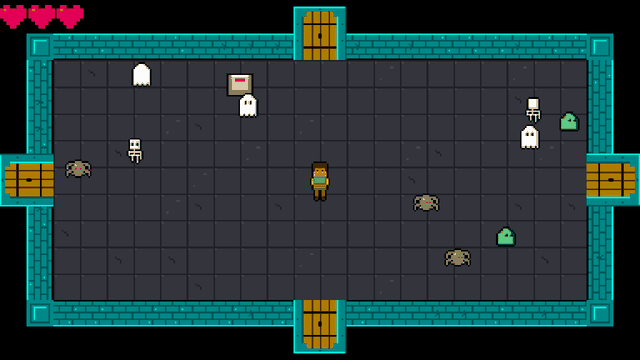

## Today's Goal

Make a **dungeon adventure game**, like The Legend of Zelda: fight through rooms of monsters
with a sword, and open the doors to the next room.

<figure class="original">

<figcaption>The original: <em>The Legend of Zelda</em> (Nintendo, 1986). Screenshot © Nintendo.</figcaption>
</figure>

We build the basics of a dungeon adventure game. In a game like this, things happen all the
time. The player dies, a switch is pressed, a room is left. Other parts of the game have to
react, and the part where it happened shouldn't need to know who they are. That is what
events are for. We use the **Observer** pattern, which C# has built in as events.

The session also covers hitboxes and hurtboxes, and a tweening system for scrolling between
rooms. It ends with composition vs. inheritance. The game has many kinds of things, and
how we build them decides how easy the next one is to add.

**Source code:** [gar-games/07-the-legend-of-zelda](https://github.com/Metamate/gar-games/tree/main/07-the-legend-of-zelda)

## Prepare

- [Observer](https://gameprogrammingpatterns.com/observer.html)
- [Event Queue](https://gameprogrammingpatterns.com/event-queue.html) (skim)
- [C# Delegates](https://learn.microsoft.com/en-us/dotnet/csharp/programming-guide/delegates/)
- Optional: [C# Action Delegate](https://learn.microsoft.com/en-us/dotnet/api/system.action), the reference

## Explore the Codebase

Take about 15 minutes to browse the finished game, `Zelda7`, using the README as a guide:

- Find where the game transitions between the title screen, gameplay and game over.
- How does the player move?
- Find where a new room is generated, and what it contains when created.
- The player and enemies share a lot of code. Find the common base and explain what it
  provides.
- Trace what happens from the moment the player presses Space to an enemy taking damage.

## Top-Down Perspective & Dungeon Generation

_Steps `Zelda0` → `Zelda2`_

The dungeon is an endless series of rooms. Each room is a tilemap generated when entered:
solid walls and corners around the edge, and a floor of random floor tiles (`Zelda0`). Then
come the player (`Zelda1`), enemies (`Zelda2`), and doorways and objects such as the switch
that opens the doors (`Zelda4`).

In a top-down game, the player's sprite is taller than the part that collides. The sprite is
drawn a few pixels above its collision box, so the character looks like it stands _on_ the
floor.

The rooms' tiles and the XML files refer to tiles by their number in the sprite sheet
(`frames="9,10,11,10"`). The repo's `LabelTiles` tool writes each tile's number onto a copy of
a sheet, so you can look them up.

## Hitboxes & Hurtboxes

_Step `Zelda3`_

- **Hitbox:** the area that _deals_ damage (e.g. the sword swing).
- **Hurtbox:** the area that _receives_ damage (e.g. the enemy's body).

Keeping them separate means the sword's reach and the enemy's body don't have to match
the sprite. The player's hurtbox is only the lower half of its sprite, its feet, which suits
the top-down look. The sword's hitbox is a rectangle in front of the player, built when the
swing starts. The swing is a state. It checks the hitbox against the enemies every frame,
and ends when its one-shot animation has played once. Press `F1` to see both during a
swing, the hitbox in red and the hurtbox in green, drawn with the `DebugDraw` from
[Super Mario Bros](../06-super-mario-bros/#debug-drawing).

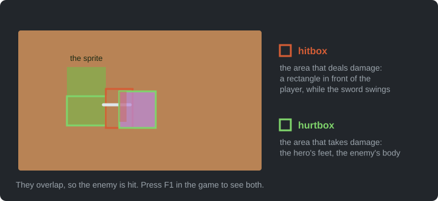

**Where does collision live?** There is no central collision system. Each kind of
collision is checked where the knowledge it needs already is:

| Collision | Checked in | Because |
| --- | --- | --- |
| Player and enemy | The room | The consequence (damage, maybe death) needs the room |
| Player and switch | The room | Opening the doors needs the room's doorways |
| Sword and enemy | The sword-swing state | It belongs to the swing and its timing |
| Entity and wall | The walk state | Stopping at walls is part of moving |

No single place lists every collision, which is the price. In return, reading a state or a
room method shows everything that interaction does. Compare it with the dedicated collision
system in
[Geometry Wars](../11-geometry-wars/), which has far more things colliding.

**Try it** (`Zelda7`): make the sword reach twice as far in `GameSettings`, press `F1` and
play. Does it still feel fair?

## Events & the Observer Pattern

_Steps `Zelda3` → `Zelda4`_

In `Zelda3`, the play state checks every frame whether the player has died:

```csharp
if (_player.Health <= 0)
    Game.SetState(new GameOverState(Game));
```

In `Zelda4`, the room announces it instead, and the play state reacts:

```csharp
_room.OnPlayerDied += OnPlayerDied;
```

Once there is a dungeon of rooms (`Zelda5`), the event is passed up one layer at a time:
the room announces it, the dungeon forwards it, and the play state reacts. The room knows
nothing about the dungeon, and the dungeon nothing about the play state; each class only
knows the one below it.

```csharp title="Dungeon.cs"
room.OnPlayerDied += () => OnPlayerDied?.Invoke();
```

Games are full of moments where something happens and other things need to react. The
thing that happened shouldn't need to know what those other things are.

**Observer** flips the dependency around. The _subject_ (publisher) just announces that
something happened, and any number of _observers_ (subscribers) react.

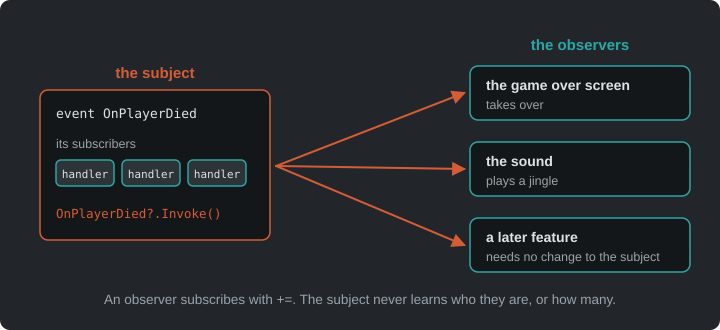

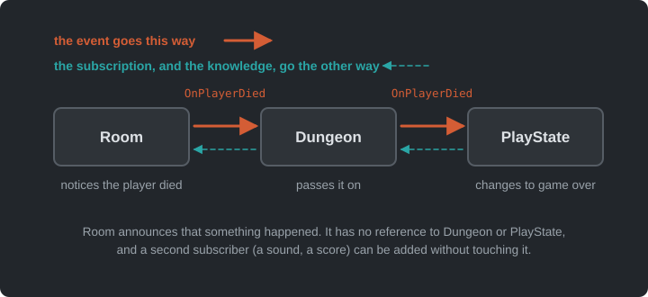

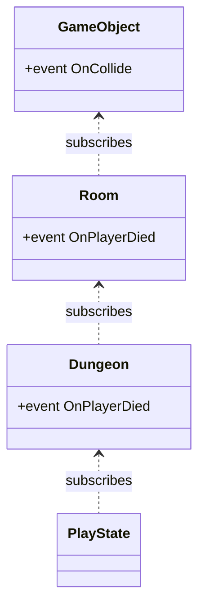

In C#, we don't need to implement the pattern ourselves. Delegates and events are built
into the language.

### Delegates

A delegate is a variable that holds a reference to a method.

```csharp
Action       // no arguments, returns void
Action<T>    // takes a T, returns void
Func<T>      // no arguments, returns T

obj.OnCollide = () => Console.WriteLine("hit");  // assign one handler
obj.OnCollide += () => PlaySound("hit");         // add more handlers
obj.OnCollide?.Invoke();                         // call all of them
```

### Events

An `event` is a delegate with guardrails, and outside code can only `+=` and `-=`. Only the
owning class can invoke it or replace its subscribers.

```csharp title="GameObject.cs"
public event Action OnCollide;

public void Collide() => OnCollide?.Invoke();
```

`?.Invoke()` calls every subscriber, and does nothing when there are none. The floor switch is
a `GameObject`. It announces that something stepped on it, and has no idea what a switch is
for.

### Lambdas and closures

A lambda is an inline, anonymous function: `(int n) => n % 2 == 0`. When a lambda uses
variables from its surrounding scope, it _captures_ them (a closure). The room gives the
switch its meaning with one:

```csharp title="Room.cs"
switchObj.OnCollide += () =>
{
    if (switchObj.State == "unpressed")
    {
        switchObj.State = "pressed";
        foreach (var d in Doorways)
            d.IsOpen = true;
        SoundManager.PlaySound("door");
    }
};
```

The lambda uses `switchObj` and the room's `Doorways`, long after the method that created it
has returned.

**Try it** (`Zelda7`): in `PlayState`, add a second subscriber to `_dungeon.OnPlayerDied`
that plays a sound: `_dungeon.OnPlayerDied += () => SoundManager.PlaySound("hit-player");`.
Which classes did you change, and which didn't need to know?

### Pitfalls

- **Forgotten unsubscribes:** a subscriber stays alive (and keeps reacting) as long as the
  publisher holds a reference to it. Unsubscribe in `Exit()`/`Dispose()`. You can't `-=` a
  lambda unless you stored it in a variable.
- **Hidden control flow:** "who reacts to this?" is no longer visible at the call site.
- **Ordering:** don't rely on the order in which subscribers are called.
- **Re-entrancy:** a handler that changes state (e.g. removes entities from a list) while
  the publisher is still iterating over it.

### Event Queue

Events are handled immediately, inside the publisher's call. An **event queue** stores
them instead, and handles them later, at a safe point, such as once per frame. That
decouples the sender from the receiver _in time_ as well, and avoids the re-entrancy
pitfall above, since nothing is handled while the publisher is still busy. You've built a small
one already: [Snake](../03-snake/#input-buffering) queues the player's turns and handles one
per tick.

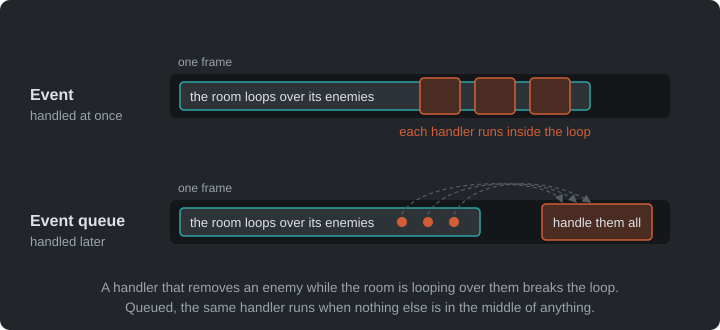

The classic example is audio. Many parts of the game ask for sounds, and the audio system
plays them in one place, once per frame, merging duplicates. That is one of the exercises
below. In [Angry Birds](../08-angry-birds/#contact-events), you'll meet a queue that a library
keeps for you.

## Screen Scrolling & Tweening

_Step `Zelda5`_

**Tweening** ("in-betweening") animates a value from A to B over time, instead of
snapping it. The simplest curve is linear interpolation:

```text
lerp(a, b, t) = a + (b - a) * t        where t goes from 0 to 1
```

Non-linear curves (ease-in, ease-out, see [easings.net](https://easings.net)) often feel
more natural.

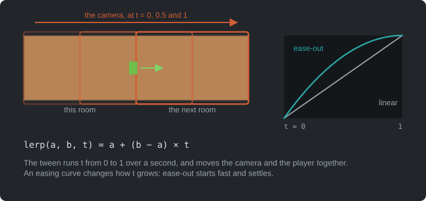

When the player walks through a door, the camera and the player move at the same time. The
next room is placed one screen away, and the camera travelling towards it creates the
scroll. We could keep a progress value, advance it every frame and lerp by hand, but games
tween _all the time_: fades, flashes, menus sliding in, damage numbers floating up. So
GARCore gets a small, reusable **tween system**, a `TweenManager`:

- **Tween:** change one or more values from A to B over a set time.
- **After:** wait N seconds, then run a method.
- **Every:** repeat a method at a fixed interval (`.Limit` to stop after N times).
- **Chaining:** `.Add()` animates several values at once, and `.Finish()` runs code when
  done.

```csharp title="Dungeon.cs"
_tweens.Tween(GameSettings.RoomShiftDuration)
    .Add(t => _camera.Position = Vector2.Lerp(Vector2.Zero, _shiftTarget, t), 0f, 1f)
    .Add(t => _player.Position = Vector2.Lerp(playerStart, playerEnd, t), 0f, 1f)
    .Finish(FinishShift);
```

The dungeon only has to call `_tweens.Update(gameTime)` while shifting. When the tween
ends, `FinishShift` makes the new room the current room and resets the camera. The dungeon
doesn't keep a progress variable or check whether the scroll is done; the tween system
keeps the timing.

**Try it** (`Zelda7`): make the room shift take twice as long. Then give it an ease-out. In
`Dungeon`, pass `1 - (1 - t) * (1 - t)` to `Vector2.Lerp` instead of `t`. How does the
scroll feel now?

## Stenciling

_Step `Zelda6`_

While walking through a door in `Zelda5`, the player is drawn on top of the door arch. `Zelda6`
fixes this with the **stencil buffer**: an extra per-pixel mask, next to the colour of each
pixel. The dungeon draws in three passes:

1. The rooms and everything in them, as usual.
2. A rectangle over each door arch, with colour writes switched off. It draws nothing you
   can see, but writes 1 into the stencil buffer there.
3. The player again, only where the stencil is still 0.

The player seems to walk _under_ the arch. All three passes use the same camera transform,
so the mask follows the camera while the rooms scroll.

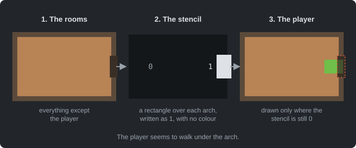

## Data-Driven Design

_Steps `Zelda1`, `Zelda2` and `Zelda4`_

Enemies and game objects are defined in XML:

```xml
<Enemy type="rat" width="16" height="16" walkSpeed="20" health="1">
  <Animation name="walk-down" frames="9,10,11,10" interval="0.2" />
  <Animation name="idle-down" frames="10" interval="0.2" />
</Enemy>
```

Adding a new enemy type means one `<Enemy>` block plus a sprite sheet row, and no new class.
The C# code only knows animation _names_ like `walk-down`, never frame numbers. Objects work
the same way. A switch's states (`unpressed`, `pressed`) and their frames come from
`object_definitions.xml`, and each doorway's tiles from `door_layouts.xml`. Content lives in
data and behaviour in C#. [Angry Birds](../08-angry-birds/) builds its levels from data in
the same way, and [Plants vs. Zombies](../09-plants-vs-zombies/) a whole game, with the Type
Object pattern.

## Composition vs. Inheritance

_Steps `Zelda1` → `Zelda4`_

The player and the enemies share an abstract `Entity` base class. It provides what every
creature needs: a position and a collision box, a sprite offset for the top-down look,
animations, health, invulnerability after a hit, and a current state. `Player` and `Enemy`
inherit it and add their own parts.

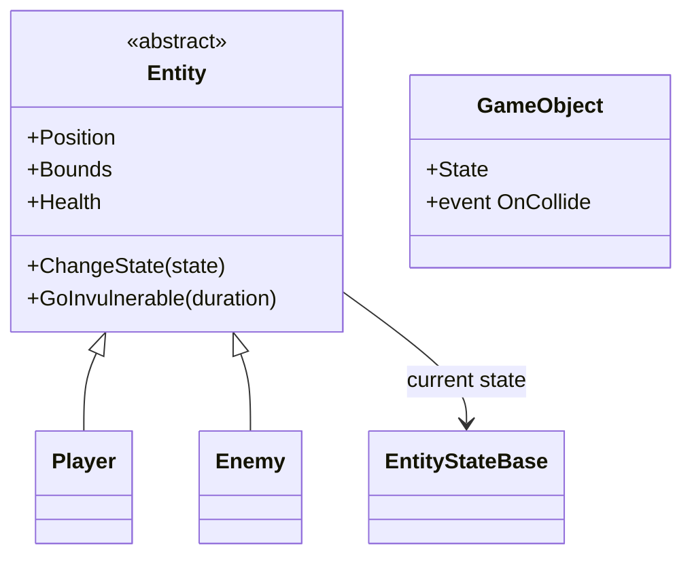

**Inheritance works well while there is one axis of variation.** It gets harder with an
enemy that shoots _and_ flies _and_ explodes, or a pot that the player can carry _and_
throw. Deep hierarchies (`Entity → Movable → Enemy → ShootingEnemy → HomingShootingEnemy…`) lead
to one of two problems:

- **Duplicated code:** two branches of the tree need the same behaviour, so it is copied.
- **A bloated base class:** the shared behaviour moves up into `Entity`, until every entity
  carries every feature, used or not.

**Composition** is the alternative. An object is given the behaviours it _has_. Zelda already composes in three places we have seen:

- **Behaviour in state objects:** an enemy's AI lives in the state object it currently
  holds (`EntityWalkState`, `EntityIdleState`). To behave differently, the enemy swaps that
  object; its class stays the same.
- **Behaviour wired from outside:** a floor switch is a plain `GameObject`. The room
  attaches a handler to its `OnCollide` event, and that handler decides what happens when
  the player steps on it. There is no `SwitchObject` subclass.
- **Enemy types as data:** enemy types (their size, speed, health and animations)
  come from a data file, so there is no class per enemy type.

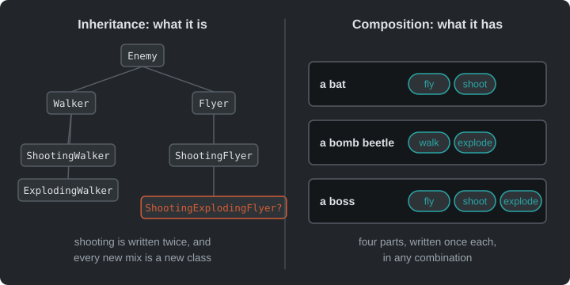

> "Favor object composition over class inheritance." — Gang of Four, _Design Patterns_

Inheritance isn't wrong: `Entity` is a sensible base here. But every time you add a
subclass, ask whether you're describing _what something is_ or _what it can do_. The second
is usually better as a part the object has. In [Plants vs. Zombies](../09-plants-vs-zombies/),
we take this all the way with the **Component pattern**.

## The Whole Game

_Step `Zelda7`_

`Zelda7` adds music and sound effects, and is the finished game. The play state holds the
player and the dungeon. The dungeon holds the current room, and the next one while the
screen scrolls. A room holds its enemies, objects and doorways.

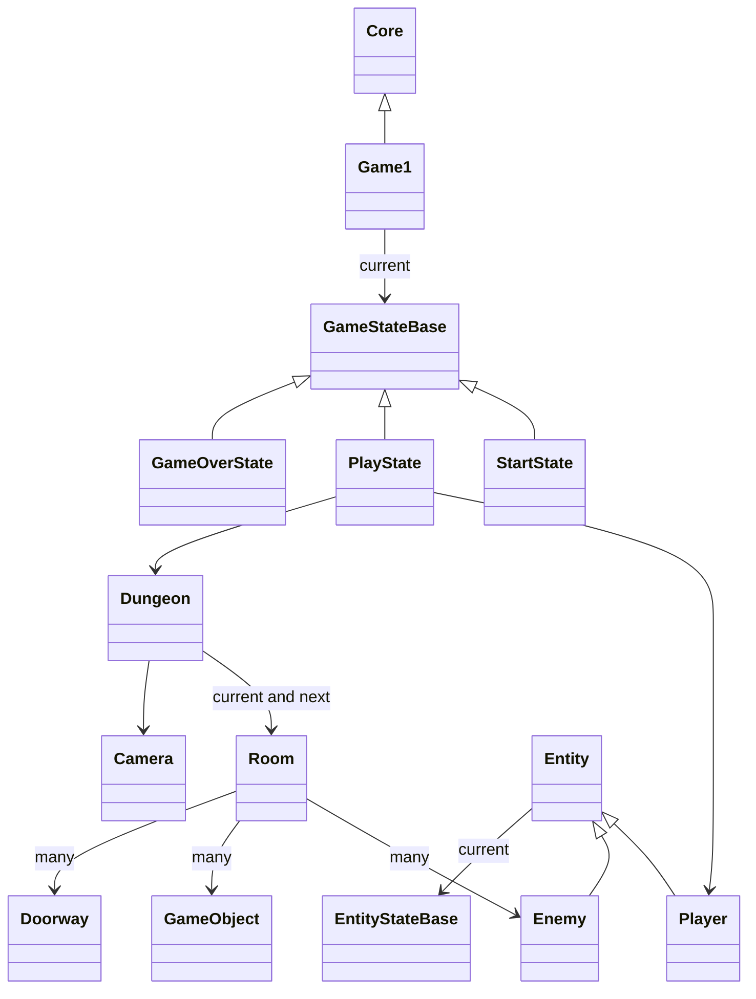

The arrows point down, from the play state to the room. The events travel the other way,
so a room can announce the player's death without an arrow up to the play state.

## Summary

| Concern | Answer |
| --- | --- |
| Reacting to something that happened elsewhere | Observer, as C# events |
| Reacting later, at a safe point | An event queue |
| Dealing and taking damage | A hitbox and a hurtbox |
| A value that changes over time | A tween |
| Many kinds of things | Parts an object has, where inheritance would need a class per combination |
| Enemy and object types | Definitions in XML |

## Exercises

Start from `Zelda7`.

1. **More event-driven:** start with the first, then do one of the other two. The class
   firing an event must have no reference to the class reacting to it.
   - Trace `OnPlayerDied` through the code, from where the player's death is noticed to
     where the game over screen appears. Which classes does it pass through?
   - Enemy death has no event. Find what happens now when an enemy dies. Then add an event
     for it, and let something react, such as a sound or a score.
   - `SoundManager.PlaySound(...)` is called directly from several unrelated classes. Find
     all the call sites. Why is this a problem, and how would events fix it? Then make it an
     [event queue](#event-queue): `PlaySound` only records the sound's name, and once per
     frame every requested sound plays once, so ten hits in the same frame don't play ten
     sounds. Where in the frame do the sounds play, and what do you give up?
2. **Composition:** sketch the class hierarchy you would need for enemies that can walk, fly,
   shoot or explode, in any combination. Then sketch the same with composition. Which parts
   would an enemy _have_? Implement one of them (e.g. a shooting behaviour that any enemy
   can be given).
3. **Keys and locked doors:**
   - Some enemies drop a key when they die. Use an event for it, as above. The key is drawn
     in `hearts.png` (its last frame, `frame_6`).
   - Some doorways are locked. The switch opens the other doors of the room, but a locked
     one stays shut until the player brings a key. Add `locked` layouts to `door_layouts.xml`, so the look stays
     in data, as a closed door's four tiles with a padlock on top. The padlock is drawn over
     four tiles of the tilesheet: 243 (top left), 244 (top right), 245 (bottom left) and 246
     (bottom right).
   - Walking into a locked door with a key uses up the key and opens the door. Show
     the keys the player carries next to the hearts.
4. **A dungeon map (stretch):** keep track of the rooms the player has visited, and show
   them as a small map on a key press, with the current room highlighted. Which state shows
   it, and what does it need to know?

## Apply It to Your Project

- What are the meaningful moments in your game that other systems might care about? Map
  out at least two. What fires the event, and what should react?
- Is there anywhere a class knows too much about another class? Could an event fix that?
- Where does your game use inheritance? For each subclass, is it _what something is_ or
  _what it can do_?

## Check Yourself

<details>
<summary>When does inheritance fit, and when is composition better?</summary>

Inheritance fits when there is one clear "is a" axis and the shared behaviour is needed by
every subclass. Composition fits when behaviours combine freely. Instead of one subclass
per combination, an object has the parts it needs, and they can even change at runtime.

</details>

<details>
<summary>Why does Observer suit UI code particularly well?</summary>

The UI depends on the game data, but the game shouldn't depend on the UI. With events, a
health bar subscribes to an event on the player, and gameplay code never needs to know a
health bar exists. The UI also only updates when something actually changes.

</details>

<details>
<summary>What is the difference between a delegate and an event in C#?</summary>

An event is a delegate that outside code can only subscribe to and unsubscribe from. Only
the declaring class can invoke it or overwrite its subscriber list.

</details>

<details>
<summary>What is the cost of data-driven design?</summary>

Errors move from compile time to runtime, you need loading and validation code, and
behaviour is split between code and data files.

</details>

<details>
<summary>What does an event queue change, compared with a plain event?</summary>

A plain event is handled at once, inside the publisher's call. A queue stores it and
handles it later, at a safe point such as once per frame. Nothing is handled while the
publisher is still busy, and duplicates can be merged.

</details>

Related exam questions: [5](../../exam/#5-observer-pattern-events--ui),
[7](../../exam/#7-tilemaps-collision-detection--procedural-generation),
[8](../../exam/#8-data-driven-design--serialization),
[9](../../exam/#9-components--systems).
