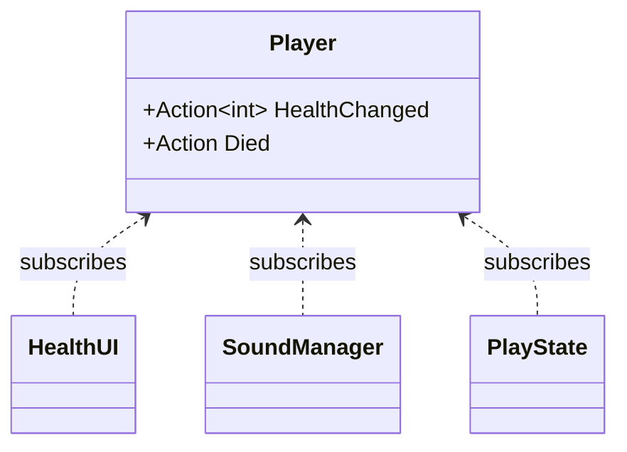

## Today's Goal

Make a **top-down dungeon crawler**.

We go through the fundamental steps of a primitive _The Legend of Zelda_ clone, focusing
on:

- Assets and tooling
- Dungeon generation
- Hitboxes and hurtboxes
- The Observer pattern (delegates and events)
- Screen scrolling and tweening
- Data-driven design

**Source code:** [Metamate/gmd2-zelda](https://github.com/Metamate/gmd2-zelda) (walkthrough
in the README)

The code is split into steps, one project per concept. Each section below names the step
that introduces it. Compare neighbouring steps to see exactly what changed.

| Step | Topic |
| --- | --- |
| `Zelda0` | Rooms generated as tilemaps |
| `Zelda1` | The player: top-down movement |
| `Zelda2` | Enemies and AI |
| `Zelda3` | Combat: hitboxes, hurtboxes and damage |
| `Zelda4` | Events: player death, the floor switch and doorways |
| `Zelda5` | Screen scrolling between rooms |
| `Zelda6` | Stenciling the door arches |
| `Zelda7` | Audio (the finished game) |

## Prepare

- [Observer](https://gameprogrammingpatterns.com/observer.html)
- [Event Queue](https://gameprogrammingpatterns.com/event-queue.html) (skim)
- [C# Delegates](https://learn.microsoft.com/en-us/dotnet/csharp/programming-guide/delegates/)
- [C# Action Delegate](https://learn.microsoft.com/en-us/dotnet/api/system.action)

## Explore the Codebase

Take about 15 minutes to browse the finished game, `Zelda7`, using the README as a guide:

- Find where the game transitions between the title screen, gameplay and game over.
- How does the player move?
- Find where a new room is generated, and what it contains when created.
- The player and enemies share a lot of code. Find the common base and explain what it
  provides.
- Trace what happens from the moment the player presses Space to an enemy taking damage.

## Top-Down Perspective & Dungeon Generation

_Steps `Zelda0` → `Zelda2`_

The dungeon is an endless series of rooms. Each room is a tilemap generated when entered:
solid walls and corners around the edge, and a floor of random floor tiles (`Zelda0`). Then
come the player (`Zelda1`), enemies (`Zelda2`), and doorways and objects such as the switch
that opens the doors (`Zelda4`).

In a top-down game, the player's sprite is taller than the part that collides: the sprite is
drawn a few pixels above its collision box, so the character looks like it stands _on_ the
floor.

## Hitboxes & Hurtboxes

_Step `Zelda3`_

- **Hitbox:** the area that _deals_ damage (e.g. the sword swing).
- **Hurtbox:** the area that _receives_ damage (e.g. the enemy's body).

Keeping them separate means the sword's reach and the enemy's body don't have to match
the sprite.

## Composition vs. Inheritance

_Steps `Zelda1` → `Zelda2`_

The player and enemies share a common base class that provides movement, collision and
animation. Inheritance works well while there is one axis of variation, but what about an
enemy that shoots _and_ flies _and_ explodes? Deep hierarchies (`Entity → Movable → Enemy
→ ShootingEnemy → HomingShootingEnemy…`) quickly lead to duplicated code or bloated base
classes.

The alternative is **composition**: an entity _has_ behaviours rather than _is_ a kind of
something. Keep this in mind for your project. We look at it in depth with the Component
pattern in [Geometry Wars](../11-geometry-wars/).

## Events & the Observer Pattern

_Steps `Zelda3` → `Zelda4`_

In `Zelda3`, the play state checks every frame whether the player has died:

```csharp
if (_player.Health <= 0)
    Game.SetState(new GameOverState(Game));
```

In `Zelda4`, the room announces it instead, and the play state reacts:

```csharp
_room.OnPlayerDied += OnPlayerDied;
```

Games are full of moments where something happens and other things need to react. The
thing that happened shouldn't need to know what those other things are.

**Observer** flips the dependency around: the _subject_ (publisher) just announces that
something happened, and any number of _observers_ (subscribers) react.



In C#, we don't need to implement the pattern ourselves. Delegates and events are built
into the language.

### Delegates

A delegate is a variable that holds a reference to a method.

```csharp
Action       // no arguments, returns void
Action<T>    // takes a T, returns void
Func<T>      // no arguments, returns T

obj.OnCollide = () => Console.WriteLine("hit");  // assign one handler
obj.OnCollide += () => PlaySound("hit");         // add more handlers
obj.OnCollide?.Invoke();                         // call all of them
```

### Events

An `event` is a delegate with guardrails: outside code can only `+=` and `-=`. Only the
owning class can invoke it or replace its subscribers.

```csharp
public class Player
{
    public event Action Died;

    private void TakeDamage(int amount)
    {
        _health -= amount;
        if (_health <= 0)
            Died?.Invoke();
    }
}
```

### Lambdas and closures

A lambda is an inline, anonymous function: `(int n) => n % 2 == 0`. When a lambda uses
variables from its surrounding scope, it _captures_ them (a closure):

```csharp
switchObj.OnCollide += () =>
{
    if (switchObj.State == "unpressed")
    {
        switchObj.State = "pressed";
        foreach (var door in Doorways)
            door.IsOpen = true;
    }
};
```

### Pitfalls

- **Forgotten unsubscribes:** a subscriber stays alive (and keeps reacting) as long as the
  publisher holds a reference to it. Unsubscribe in `Exit()`/`Dispose()`. You can't `-=` a
  lambda unless you stored it in a variable.
- **Hidden control flow:** "who reacts to this?" is no longer visible at the call site.
- **Ordering:** don't rely on the order in which subscribers are called.
- **Re-entrancy:** a handler that changes state (e.g. removes entities from a list) while
  the publisher is still iterating over it.

### Event Queue

Events are handled immediately, inside the publisher's call. An **event queue** stores
messages and processes them later (e.g. once per frame). This decouples the sender from
the receiver _in time_ as well. The classic example is audio: many systems ask for sounds,
and the audio system plays them in one place, merging duplicates.

## Screen Scrolling & Tweening

_Step `Zelda5`_

**Tweening** ("in-betweening") animates a value from A to B over time, instead of
snapping it. The simplest curve is linear interpolation:

```text
lerp(a, b, t) = a + (b - a) * t        where t goes from 0 to 1
```

Non-linear curves (ease-in, ease-out, see [easings.net](https://easings.net)) often feel
more natural.

When the player walks through a door, the camera and the player tween at the same time.
The next room is placed one screen away, and the camera travelling towards it creates the
scroll:

```csharp
_shiftProgress = Math.Min(1f, _shiftProgress + dt / GameSettings.RoomShiftDuration);
_camera.Position = Vector2.Lerp(Vector2.Zero, _shiftTarget, _shiftProgress);
_player.Position = Vector2.Lerp(_shiftPlayerStart, _shiftPlayerEnd, _shiftProgress);
```

When the shift is done, the new room becomes the current room and the camera and player
positions are reset.

## Stenciling

_Step `Zelda6`_

While walking through a door in `Zelda5`, the player is drawn on top of the door arch. `Zelda6`
fixes this with the **stencil buffer**: an extra per-pixel mask. The dungeon draws in three
passes: the rooms, then the arch areas into the stencil buffer only (no colour), and finally
the player, only where the stencil is empty. The player seems to walk _under_ the arch.

## Data-Driven Design

_Steps `Zelda1`, `Zelda2` and `Zelda4`_

**Content lives in data files, behaviour lives in C#.**

```xml
<Enemy type="skeleton" width="16" height="16" walkSpeed="20" health="1">
  <Animation name="walk-down" frames="9,10,11,10" interval="0.2" />
  <Animation name="idle-down" frames="10" interval="0.2" />
</Enemy>
```

- Definition classes parse the XML once at startup into dictionaries. The rest of the
  code never touches XML.
- Adding a new enemy type means one `<Enemy>` block plus a spritesheet row: no C# changes
  and no recompile.
- `GameObject` contains no `if (type == "switch")`. The data defines the valid states.

Each enemy definition is shared by all enemies of that type, while each enemy instance has
its own position and health. This is the
[Type Object](https://gameprogrammingpatterns.com/type-object.html) pattern.

**Trade-off:** a typo in XML (`type="skelton"`) becomes a runtime error instead of a
compile error. Validate data when loading it and fail loudly.

## Exercises

Start from `Zelda7`.

**Make Zelda (more) event-driven.** Pick one and refactor it. The class firing the event
must have no reference to the class reacting to it.

- `OnPlayerDied` is detected in one place, but causes a game over screen to appear
  somewhere completely different. Trace the full chain through the code.
- Enemy death is handled differently from player death. What happens now when an enemy
  dies? What could happen if there were an event for it?
- `SoundManager.PlaySound(...)` is called directly from several unrelated classes. Find
  all the call sites. Why is this a problem, and how would events fix it?

**Extend Zelda:**

- Some enemies randomly drop hearts that heal the player for one whole heart.
- The player can lift pots (animations are in the sprite sheet). Carried pots follow the
  player.
- The player can throw pots to damage enemies. A pot breaks when it hits a wall or an
  enemy, or after travelling four tiles.

## Apply It to Your Project

- What are the meaningful moments in your game that other systems might care about? Map
  out at least two: what fires the event, and what should react?
- Is there anywhere a class knows too much about another class? Could an event fix that?
- Which hardcoded values or entity types in your game could be moved to data files?

## Check Yourself

<details>
<summary>Why does Observer suit UI code particularly well?</summary>

The UI depends on the game data, but the game shouldn't depend on the UI. With events, the
health bar subscribes to `HealthChanged` and gameplay code never needs to know a health
bar exists. The UI also only updates when something actually changes.

</details>

<details>
<summary>What is the difference between a delegate and an event in C#?</summary>

An event is a delegate that outside code can only subscribe to and unsubscribe from. Only
the declaring class can invoke it or overwrite its subscriber list.

</details>

<details>
<summary>What is the cost of data-driven design?</summary>

Errors move from compile time to runtime, you need loading and validation code, and
behaviour is split between code and data files.

</details>

Related exam questions: [5](../../exam/#5-observer-pattern-events--ui),
[8](../../exam/#8-data-driven-design--serialization),
[9](../../exam/#9-components-memory--performance).
