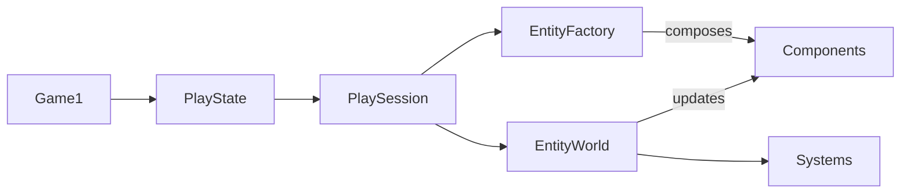

## Today's Goal

Make a **top-down shooter**.

Geometry Wars puts thousands of entities on screen at 60 FPS. Naive OOP breaks down here:
deep inheritance, garbage collector churn and cache misses. Every pattern today solves a
real bottleneck:

- Component pattern
- Data-oriented design
- Object Pool
- Flyweight
- Spatial partitioning
- Profiling

**Source code:** [Metamate/gmd2-geometrywars](https://github.com/Metamate/gmd2-geometrywars)
(walkthrough in the README)

The goal isn't to understand every system in the codebase, but the overall architecture.

The code is split into steps. Each step adds components to the entity recipes in
`EntityFactory`, plus the systems they need. Each section below names the step that
introduces it.

| Step | Topic |
| --- | --- |
| `GeometryWars0` | Entities & components: the player ship |
| `GeometryWars1` | Shooting & Object Pool |
| `GeometryWars2` | Enemies, collisions, score and lives |
| `GeometryWars3` | Particles |
| `GeometryWars4` | The spring grid and black holes |
| `GeometryWars5` | Bloom |
| `GeometryWars6` | Audio (the finished game) |

## Prepare

- [Component](https://gameprogrammingpatterns.com/component.html)
- [Data Locality](https://gameprogrammingpatterns.com/data-locality.html)
- [Object Pool](https://gameprogrammingpatterns.com/object-pool.html)
- [Flyweight](https://gameprogrammingpatterns.com/flyweight.html)
- [Spatial Partition](https://gameprogrammingpatterns.com/spatial-partition.html)
- [Data-Oriented Design](https://www.youtube.com/watch?v=WwkuAqObplU) (video)

## Explore the Codebase

Take about 10 minutes with the finished game, `GeometryWars6`:

- Clone, build and play the game. How high a score can you get?
- How is the codebase split between the core library and the Geometry Wars project?

## High-Level Architecture



- `Game1` owns the application shell.
- `PlayState` owns one active gameplay state.
- `PlaySession` owns one run of the game.
- `EntityWorld` updates entities and collisions.
- `EntityFactory` builds entities by composing components.
- **Components** implement the actual behaviour.
- **Systems** handle concerns that cut across components.

## Component Pattern

_Step `GeometryWars0` onwards_

**The problem.** Inheritance seems natural: `Enemy → ShootingEnemy →
HomingShootingEnemy…`. But each new combination of behaviours grows the hierarchy. Want a
homing enemy that also explodes? Copy-paste the homing code. You end up with fragile base
classes and dead code everywhere.

**The solution.** An entity is just an ID plus a bag of components. Each component holds
data and a small slice of behaviour (`Transform`, `Sprite`, `Collider`, `Health`,
`Weapon`…). A homing, exploding enemy is simply an entity with `Homing` and `Explode`
components.

```csharp
public class Entity
{
    public int Id;
    public List<Component> Components = [];
}

public abstract class Component { public Entity Owner; }

public class Transform : Component { public Vector2 Position; public float Rotation, Scale; }
public class Sprite : Component { public Texture2D Texture; public Color Tint; }
public class Health : Component { public int HP; }

// Spawn a grunt enemy: no new class needed
var grunt = new Entity();
grunt.Components.Add(new Transform { Position = spawnPoint });
grunt.Components.Add(new Sprite { Texture = gruntTexture });
grunt.Components.Add(new Health { HP = 1 });
```

**Favour composition over inheritance**, and keep each component to a single
responsibility so it can be reused.

In the codebase: `Component.cs`, `Entity.cs`, `EntityFactory.cs`.

:::note[ECS]
Taken further, this becomes an **Entity Component System**. Entities are only IDs,
components are pure data, and all behaviour lives in systems that process every entity
with a given set of components. Unity DOTS and Bevy work like this.
:::

## Data-Oriented Design

_Steps `GeometryWars3` (particles) and `GeometryWars4` (grid)_

Think in data, not objects. OOP asks _"what is a bullet?"_; DOD asks _"how does bullet
data flow?"_

- **Array of Structs (AoS):** `Bullet[]`, where each bullet holds all its fields.
- **Struct of Arrays (SoA):** separate arrays for positions, velocities, lifetimes…

### Memory layout matters

- L1 cache hit: about 1 ns. Main memory: about 100 ns, a 100× penalty.
- The CPU fetches 64 bytes (one _cache line_) at a time.
- With AoS, updating positions drags sprites, tags and pointers through the cache too.
- With SoA, the loop only reads the data it needs, packed tightly together.

```csharp
public class BulletSystem
{
    const int Max = 10_000;
    public Vector2[] Position = new Vector2[Max];
    public Vector2[] Velocity = new Vector2[Max];
    public float[] Lifetime = new float[Max];
    public bool[] Active = new bool[Max];
    int _count;

    public void Update(float dt)
    {
        for (int i = 0; i < _count; i++)
        {
            if (!Active[i]) continue;
            Position[i] += Velocity[i] * dt;
            Lifetime[i] -= dt;
            if (Lifetime[i] <= 0) Active[i] = false;
        }
    }
}
```

In the codebase: `Grid.cs`, `ParticleManager.cs`.

## Object Pool

_Step `GeometryWars1`_

**The problem.** 20 bullets per second, 30 particles per hit, 50 debris pieces per enemy:
thousands of short-lived allocations per second. In C#, every `new` object will
eventually be collected by the garbage collector, and GC pauses are unpredictable. A
stutter every few seconds is the telltale sign of allocation in a hot loop.

**The solution.** Allocate everything up front and reuse inactive objects:

```csharp
public class ParticlePool
{
    private readonly Particle[] _items = new Particle[5000];

    public ParticlePool()
    {
        for (int i = 0; i < _items.Length; i++)
            _items[i] = new Particle();
    }

    public Particle Spawn(Vector2 position)
    {
        foreach (var particle in _items)
        {
            if (!particle.Active)
            {
                particle.Reset(position);
                particle.Active = true;
                return particle;
            }
        }
        return null; // Pool exhausted: size it generously
    }
}
```

Pooled objects must be fully **reset** when reused, or old state leaks into the new
"instance".

In the codebase: `ObjectPool.cs`, `BulletSpawner.cs`.

## Flyweight

_Step `GeometryWars0` onwards_

**Share what's shared, store what's unique.** 500 enemies on screen, all using the same
sprite and stats.

- **Intrinsic state** is shared and immutable: the texture and the stats template.
- **Extrinsic state** is per instance: position, velocity, current HP.

```csharp
// Intrinsic (shared): one instance, referenced by every enemy of this type
public class EnemyType
{
    public Texture2D Texture;
    public float MaxSpeed, SpawnHP;
    public int ScoreValue;
}

// Extrinsic (per instance)
public struct EnemyInstance
{
    public EnemyType Type;
    public Vector2 Position, Velocity;
    public int CurrentHP;
}
```

500 enemies hold 500 references to one texture, not 500 copies of it.

In the codebase: `GameAssets.cs`, `GameplayDefinitions.cs`.

## Spatial Partitioning

_Not in the code yet: this is exercise 3._

Collision between all pairs of `n` entities costs `n × (n − 1) / 2` checks: about 4.5
million per frame for 3,000 entities. A **broad phase** reduces this by only testing
entities that are near each other.

A **uniform grid** (spatial hash) is the simplest option: divide the world into cells,
insert each entity into the cell(s) it overlaps each frame, and only test entities that
share a cell. Quadtrees and bounding volume hierarchies adapt better to uneven
distributions, at the cost of more complexity.

## Profiling

_Step `GeometryWars0` onwards: press `F3` in the game for FPS, memory and entity count._

Don't guess, measure. A few tools, from simple to thorough:

- **Stopwatch:** time a block of code with `System.Diagnostics.Stopwatch`.
- **Allocations and GCs:** `GC.GetAllocatedBytesForCurrentThread()` and
  `GC.CollectionCount(0)` before and after a frame.
- **Frame time overlay:** draw the frame time (in ms, not FPS) on screen.
- **Profilers:** the Visual Studio / Rider profilers, or `dotnet-counters` and
  `dotnet-trace`, show where time and allocations actually go.

## Shaders (Showcase)

_Step `GeometryWars5`_

Geometry Wars' neon glow and warping grid are shader work. We look at it as a demo; it
isn't required for your project.

- **Vertex shaders** run once per vertex; **pixel shaders** run once per pixel. The GPU
  runs thousands of them in parallel.
- MonoGame uses HLSL `.fx` files. See [24: Shaders](https://docs.monogame.net/articles/tutorials/building_2d_games/24_shaders/).
- **Bloom:** render the scene to a `RenderTarget2D`, keep only the bright pixels, blur
  them (horizontal, then vertical), and add them back over the scene.

## Summary

| Concern | Pattern |
| --- | --- |
| What an entity _is_ | Component |
| How entities live in memory | Data-oriented design |
| When entities are allocated | Object Pool |
| What entities share | Flyweight |
| Which entities are tested against each other | Spatial partitioning |
| How entities look | Shaders |

## Exercises

Start from `GeometryWars6`.

1. **Composition:** create a new enemy type purely by combining existing components in
   `EntityFactory`. Then add one new component (e.g. a shield that absorbs one hit) and
   give it to an existing enemy.
2. **Measure pooling:** add an on-screen counter of allocated bytes and gen-0 GCs per
   second. Temporarily replace the bullet pool with `new` and compare.
3. **Spatial grid:** implement a uniform grid broad phase for bullet-vs-enemy collisions.
   Measure the collision time before and after with a `Stopwatch` at high entity counts.

## Apply It to Your Project

- Does your game have an inheritance hierarchy that is starting to hurt? Which behaviours
  could become components?
- Does anything in your game allocate every frame?
- Which data is shared between many instances, and which is unique?

## Check Yourself

<details>
<summary>Why does SoA perform better than AoS for bulk updates?</summary>

The loop only reads the fields it uses, packed together in memory, so every cache line
fetched is full of useful data.

</details>

<details>
<summary>What is the difference between Object Pool and Flyweight?</summary>

Object Pool reuses _instances_ to avoid allocation over time. Flyweight shares _data_
between many instances to avoid duplicating it.

</details>

Related exam questions: [1](../../exam/#1-game-loop--update-method),
[7](../../exam/#7-tilemaps-collision-detection--procedural-generation),
[9](../../exam/#9-components-memory--performance).
