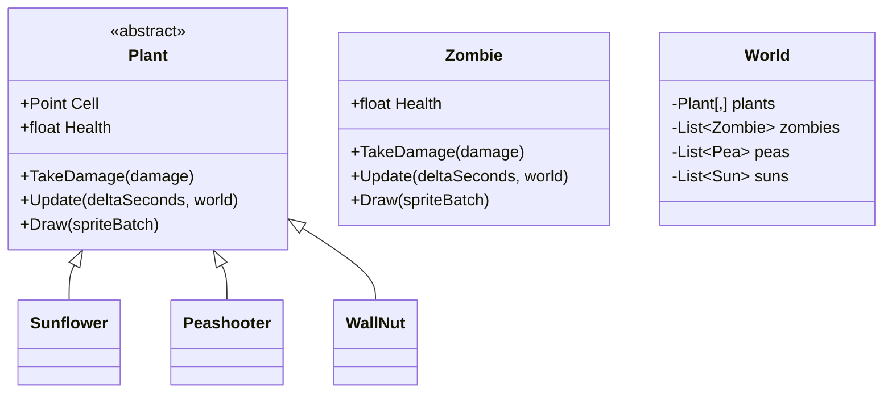
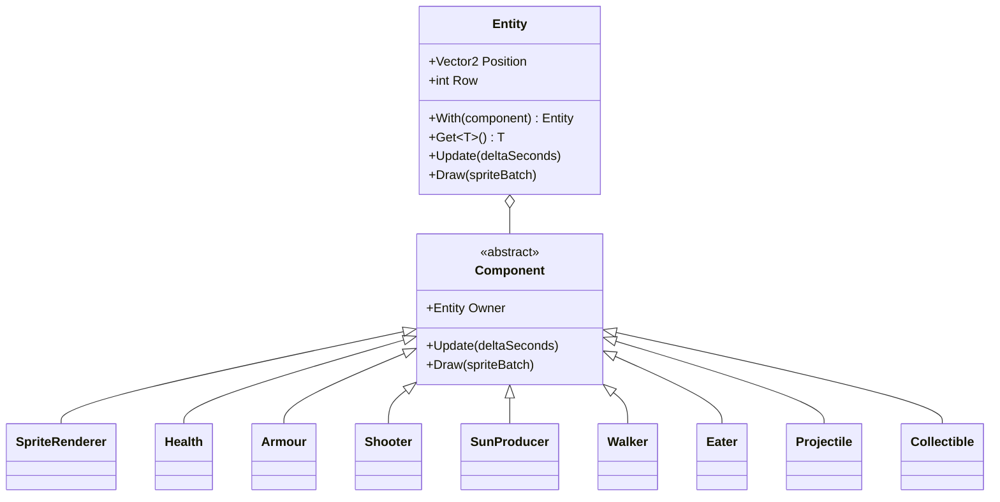

## Today's Goal

Make **Plants vs. Zombies**: zombies walk across a lawn towards your house, one row each.
Plant sunflowers to make sun, and spend the sun on plants that stop the zombies.

The game has many kinds of plants and zombies, and they mix and match abilities: one plant
shoots, another makes sun, another just blocks; a zombie may wear a cone or a bucket. In
[Zelda](../08-the-legend-of-zelda/#composition-vs-inheritance) we asked whether something
should be a subclass or a part. Here we take that all the way, with the **Component**
pattern. Along the way:

- **Type Object**: plant and zombie types as data, not as classes
- Picking: from a mouse click to a seed packet or a cell on the lawn

**Source code:** [gar-games/09-plants-vs-zombies](https://github.com/Metamate/gar-games/tree/main/09-plants-vs-zombies)

| Step | Topic |
| --- | --- |
| `Pvz0` | Picking: choose a seed packet, click a cell to plant |
| `Pvz1` | Plants and zombies, as a class hierarchy |
| `Pvz2` | The Component pattern |
| `Pvz3` | Type Object: plant and zombie types from JSON |
| `Pvz4` | The whole game: a level from data, sun from the sky, winning and losing (the finished game) |

## Prepare

- [Component](https://gameprogrammingpatterns.com/component.html)
- [Type Object](https://gameprogrammingpatterns.com/type-object.html)

## Picking

_Step `Pvz0`_

**Picking** is finding out what the player clicked on. It takes two steps.

First, from the window to the game. The mouse position is in window pixels, but the game
draws at its virtual resolution (1280 x 720), scaled and centred in the window
([Flappy Bird](../02-flappy-bird/)). So the mouse position goes through the screen scale
matrix backwards:

```csharp title="Game1.cs"
private Vector2 MousePosition()
{
    Viewport viewport = GraphicsDevice.Viewport;
    Vector2 mouse = Input.Mouse.Position.ToVector2() - new Vector2(viewport.X, viewport.Y);
    return Vector2.Transform(mouse, Matrix.Invert(ScreenScaleMatrix));
}
```

Then, from a point to a thing. For a grid, that's a division, as in the tilemaps of
[Mario](../06-super-mario-bros/):

```csharp title="Lawn.cs"
public static Point? CellAt(Vector2 position)
{
    if (!Bounds.Contains(position))
        return null;
    return new Point((int)(position.X - Bounds.X) / CellWidth, (int)(position.Y - Bounds.Y) / CellHeight);
}
```

For a few things that aren't on a grid, like the seed packets or a sun, check each one:
is the point inside its rectangle, or within its radius? When things overlap, the order of
the checks decides what the click hits. Here, a sun floating over the lawn is checked
first, then the seed packets, and only then the lawn.

The cell under the mouse is highlighted, with a faint copy of the chosen plant, so the
player sees what a click will do.

## Plants and Zombies, With Inheritance

_Step `Pvz1`_

`Pvz1` is a working game, built the way you might start: a class per kind of thing.



It works, but try adding what the real game has:

- **A Repeater** shoots two peas instead of one. A subclass of `Peashooter` that overrides
  something? Then `Peashooter` needs a way to be overridden that it didn't need before.
- **A Conehead** is a zombie with a cone that takes the first hits. A subclass of `Zombie`,
  fine. But a plant with armour (a pumpkin shell around it) needs the same thing, and a
  plant isn't a zombie.
- **A plant that shoots and makes sun.** Should it inherit from `Peashooter` or from
  `Sunflower`? C# allows one base class. Whichever you choose, the other ability gets
  copied.
- **Health is already copied.** `Zombie` has its own `Health`, `TakeDamage` and drawing,
  because a zombie isn't a plant. Peas and suns need their own lists in `World`, because
  they're different classes too.

Inheritance says what something _is_. But in this game, what matters is what each thing
_can do_, and those abilities combine freely.

## The Component Pattern

_Step `Pvz2`_

> Allow a single entity to span multiple domains without coupling the domains to each
> other. _(Game Programming Patterns)_

An **entity** is just a container: a position, a row, and a list of **components**. Each
component is one ability: `Health`, `Shooter`, `SunProducer`, `Walker`, `Eater`,
`Armour`, `SpriteRenderer`. An entity's behaviour is the sum of its components.

```csharp title="Entity.cs"
public class Entity(World world)
{
    private readonly List<Component> _components = [];

    public Vector2 Position { get; set; }
    public int Row { get; set; }

    public Entity With(Component component) { ... }
    public T Get<T>() where T : Component { ... }

    public void Update(float deltaSeconds)
    {
        foreach (Component component in _components)
            component.Update(deltaSeconds);
    }
}
```



There are no classes for plants or zombies any more. Each kind of thing is a **recipe**: a
list of components.

```csharp title="Recipes.cs"
public Entity Sunflower(World world) => Plant(world, "sunflower", 6).With(new SunProducer(12, 25));
public Entity Peashooter(World world) => Plant(world, "peashooter", 6).With(new Shooter(1.4f, 1, 1));
public Entity Repeater(World world) => Plant(world, "repeater", 6).With(new Shooter(1.4f, 2, 1));

public Entity Zombie(World world)
    => new Entity(world)
        .With(new SpriteRenderer(atlas.GetRegion("zombie")))
        .With(new Health(10))
        .With(new Walker(16))
        .With(new Eater(1));

public Entity Conehead(World world) => Zombie(world).With(new Armour(18, atlas.GetRegion("cone")));
```

The Repeater and the Conehead are new in `Pvz2`, and neither needed a class. A plant that
shoots and makes sun is `.With(new Shooter(...)).With(new SunProducer(...))`. Health is
written once, and used by plants and zombies alike.

### How components work together

Components are small and separate, but an entity's parts still need each other:

- **Through the owner.** A component can ask its entity for another component. `Walker`
  stops while the `Eater` is eating; `Health` lets the `Armour` take the damage first; the
  `SpriteRenderer` flashes red when `Health` was just hit.

  ```csharp title="Walker.cs"
  public override void Update(float deltaSeconds)
  {
      if (Owner.Get<Eater>()?.IsEating == true)
          return;
      Owner.Position -= new Vector2(speed * deltaSeconds, 0);
  }
  ```

- **Through the world.** A component can ask the world about other entities. `Shooter`
  asks whether there's a zombie ahead in its row; `Eater` asks which plant is in front of
  it.

A component only depends on the components it uses, not on what kind of entity it's in.
`Walker` works on any entity; if the entity has no `Eater`, it just keeps walking.

The world got simpler too. It doesn't know what a peashooter or a sun is: one loop updates
every entity, and one loop draws them. It keeps plants, zombies and everything else apart
only so that components can ask it questions ("the first zombie ahead in row 2").

### What components cost

- **Finding each other takes code.** `Owner.Get<Eater>()` looks through a list, and returns
  `null` if there's no eater. With inheritance, the compiler would have known.
- **Order matters.** Components update and draw in the order they were added. The
  `Armour` is drawn after the `SpriteRenderer`, so the cone sits on top of the head.
- **Where does a rule go?** "A pea damages the first zombie it reaches" could be in the
  pea (`Projectile`) or in the zombie. Rules that span many entities get harder to place;
  in [Geometry Wars](../11-geometry-wars/#components-vs-systems), we'll move some of them
  into **systems**.

## Type Object

_Step `Pvz3`_

The recipes are still C#. Every plant type also has data that doesn't belong in any one
plant: its cost, how long its seed packet takes to recharge, its sprite. Where does a
peashooter's _cost_ go? Not in a component: the peashooter on the lawn doesn't have a cost,
its _kind_ does.

> Allow the flexible creation of new "classes" by creating a single class, each instance of
> which represents a different type of object. _(Game Programming Patterns)_

A `PlantType` object represents one **kind** of plant. There's one `PlantType` for all
sunflowers, loaded from `plants.json`:

```json title="plants.json"
{ "name": "Sunflower", "sprite": "sunflower", "cost": 50, "recharge": 7.5, "health": 6,
  "sunProducer": { "interval": 12, "amount": 25 } },
{ "name": "Repeater", "sprite": "repeater", "cost": 200, "recharge": 7.5, "health": 6,
  "shooter": { "interval": 1.4, "shots": 2, "damage": 1 } }
```

And the type builds its own instances, adding a component for each kind of data it has:

```csharp title="Types.cs"
public class PlantType
{
    public string Name { get; init; }
    public int Cost { get; init; }
    public float Recharge { get; init; }
    public ShooterData Shooter { get; init; }
    public SunProducerData SunProducer { get; init; }
    // ...

    public Entity Create(World world)
    {
        var plant = new Entity(world)
            .With(new SpriteRenderer(world.Atlas.GetRegion(Sprite)))
            .With(new Health(Health));

        if (Shooter != null)
            plant.Add(new Shooter(Shooter.Interval, Shooter.Shots, Shooter.Damage));
        if (SunProducer != null)
            plant.Add(new SunProducer(SunProducer.Interval, SunProducer.Amount));
        return plant;
    }
}
```

- **Types and instances.** The `PlantType` holds what all sunflowers share; each entity on
  the lawn holds what's its own (its position, its health so far). A seed packet shows a
  type; clicking the lawn creates an instance.
- **New kinds without code.** A new plant made from existing components is a new block in
  `plants.json`. A Buckethead is a zombie type with `"armour": { "sprite": "bucket",
  "health": 55 }`. A designer can balance the game (costs, health, timings) without
  compiling anything.
- **New abilities with a little code.** The Cherry Bomb explodes, which no component did.
  It took one new component (`Explode`), one new property on `PlantType`, and the data.
  Components and Type Object work together: components are the building blocks, the types
  are the data that combines them.

### Prototype vs. Type Object

In [Angry Birds](../07-angry-birds/#prototype), prefabs also gave us many kinds of things
without a class for each. Both patterns solve that problem, differently:

| | Prototype (Angry Birds) | Type Object (here) |
| --- | --- | --- |
| A kind of thing is… | a configured object of the same class | an object of a separate type class |
| A new thing is made by… | copying the prototype | the type creating an instance |
| Shared data (cost, recharge) | copied into every clone | kept once, in the type |
| An instance knows its kind? | not unless you store it | yes: it can refer to its type |
| Good for | "make more like this one" | kinds with their own data and rules |

## The Whole Game

_Step `Pvz4`_

`Pvz4` reads a level from `level1.json`: the starting sun, how often sun falls from the
sky, and which zombie comes when. Seed packets recharge after planting, and game states
([Flappy Bird](../02-flappy-bird/#state-machines)) end the game when a zombie reaches the
house, or when every zombie is gone.

```json title="level1.json"
{
  "startingSun": 150,
  "skySunInterval": 9,
  "spawns": [
    { "time": 20, "zombie": "Zombie" },
    { "time": 34, "zombie": "Zombie" },
    ...
  ]
}
```

The falling sun is a sun with one more component, `Faller`. Once you have components,
many new things are one component away.

## Exercises

Start from `Pvz4`.

1. **New types:** add a Tall-nut (twice the Wall-nut's health) and a Flag Zombie (faster,
   with a bucket) to the data. Did you need any code?
2. **Snow Pea:** peas that slow the zombie they hit. Which new component do you need, where
   does it go (the pea? the zombie?), and how does the data say which peas are cold?
3. **Pumpkin:** armour for plants. Can you reuse `Armour`? What needs to change?
4. **A shovel:** a tool in the seed bar that removes the plant you click. Where does
   picking a plant fit in?
5. **Refactor (stretch):** `PlantType.Create` has an `if` for every component. Could the
   JSON list components by name, and a registry turn names into components? What do you
   gain, and what do you lose (e.g. the compiler checking the data's shape)?

## Apply It to Your Project

- Draw your game's class hierarchy. Where do subclasses exist only to combine abilities?
- Which abilities could become components, reusable on different kinds of entities?
- Which data belongs to a _kind_ of thing rather than to one thing? Could it come from a
  data file?
- How does your game find out what the player clicked on?

## Check Yourself

<details>
<summary>Why does inheritance break down for Plants vs. Zombies?</summary>

The abilities (shooting, making sun, armour, walking, eating) combine freely, but a class
has one base class. Combinations mean choosing one parent and copying the other ability,
and abilities shared by plants and zombies (health) get copied too.

</details>

<details>
<summary>How do components in the same entity work together without knowing each other's classes in advance?</summary>

They ask their owner for a sibling (`Owner.Get<Eater>()`), and handle it being missing.
For other entities, they ask the world.

</details>

<details>
<summary>What goes in a type object, and what goes in an instance?</summary>

The type holds what all things of that kind share (cost, recharge time, sprite, starting
health, and how to build one). The instance holds what's its own: its position, its current
health, its timers.

</details>

<details>
<summary>How is picking on a grid different from picking a list of objects?</summary>

On a grid, the cell is computed from the position with a division, however many cells
there are. For separate objects, each one is checked, and the order of the checks decides
which of two overlapping objects gets the click.

</details>

Related exam questions: [8](../../exam/#8-data-driven-design--serialization),
[9](../../exam/#9-components-memory--performance).
