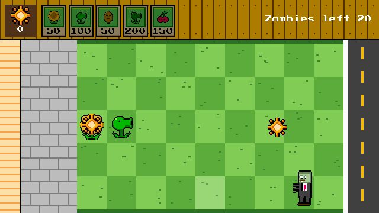
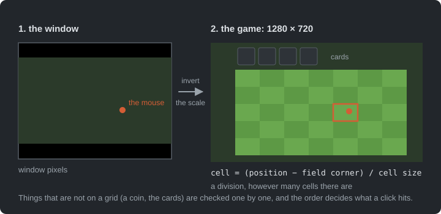
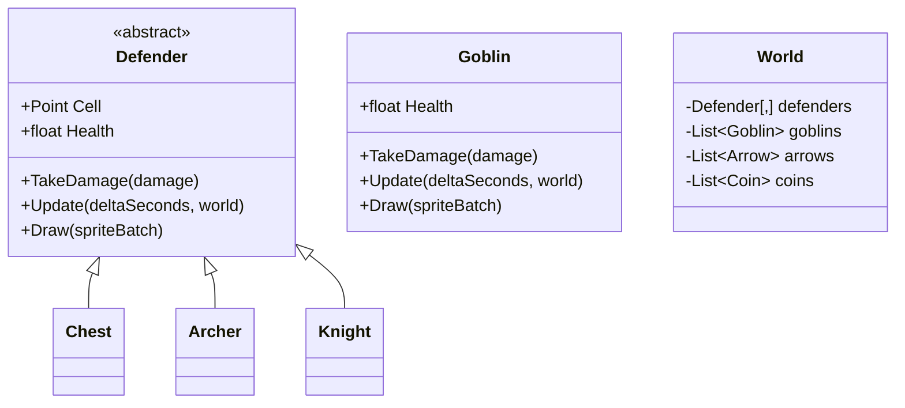
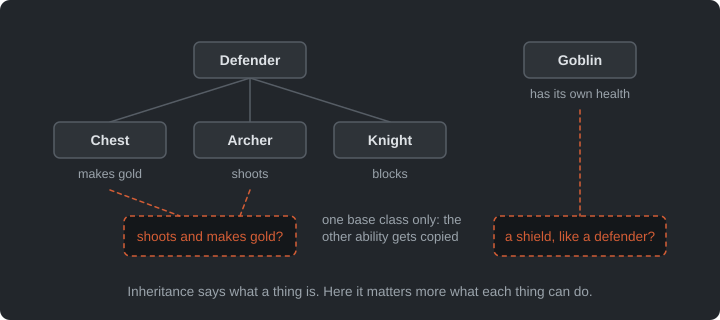
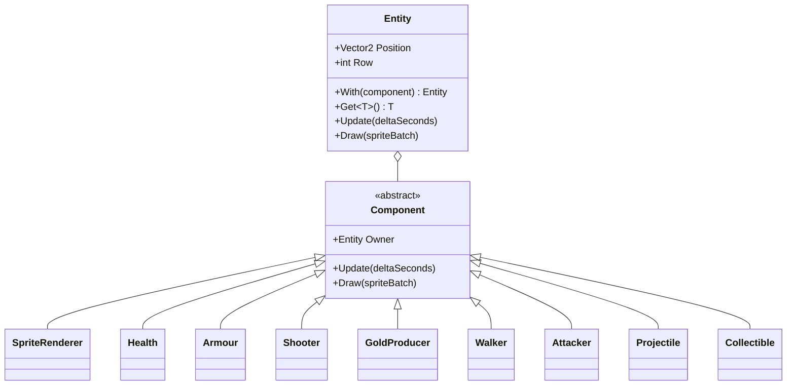
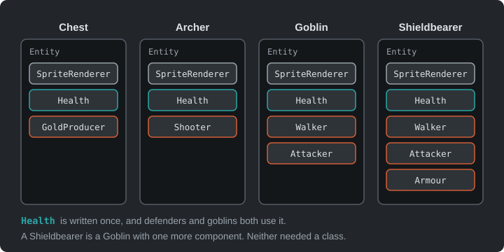
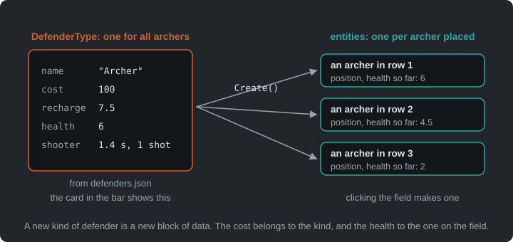

## Today's Goal

Make a **tower defence game**, like Plants vs. Zombies: goblins march across a field towards
your castle, one row each. Set out chests that pay gold, and spend the gold on defenders
that stop the goblins.

<figure class="original">

<figcaption>The original: <em>Plants vs. Zombies</em> (PopCap Games, 2009). Screenshot © PopCap Games.</figcaption>
</figure>

The original has many kinds of plants and zombies, and they mix and match abilities. Ours
moves that idea to a castle. One defender shoots, another earns gold, another just blocks,
and a goblin may carry a wooden or an iron shield. In
[Zelda](../07-the-legend-of-zelda/#composition-vs-inheritance) we asked whether something
should be a subclass or a part. Here we build every game object from parts, with the
**Component** pattern.

The defender and goblin types come from data files, with the **Type Object** pattern.
And since the game is played with the mouse, we start with picking, which turns a click into
a card or a cell on the field.

**Source code:** [gar-games/09-plants-vs-zombies](https://github.com/Metamate/gar-games/tree/main/09-plants-vs-zombies)

## Prepare

- [Component](https://gameprogrammingpatterns.com/component.html)
- [Type Object](https://gameprogrammingpatterns.com/type-object.html)

## Picking

_Step `Pvz0`_

**Picking** is finding out what the player clicked on. It takes two steps.

First, from the window to the game. The mouse position is in window pixels, but the game
draws at its virtual resolution (1280 × 720), scaled and centred in the window
([Flappy Bird](../02-flappy-bird/)). So the mouse position goes through the screen scale
matrix backwards:

```csharp title="Game1.cs"
private Vector2 MousePosition()
{
    Viewport viewport = GraphicsDevice.Viewport;
    Vector2 mouse = Input.Mouse.Position.ToVector2() - new Vector2(viewport.X, viewport.Y);
    return Vector2.Transform(mouse, Matrix.Invert(ScreenScaleMatrix));
}
```

Then, from a point to a thing. For a grid, that's a division, as in the tilemaps of
[Mario](../06-super-mario-bros/):

```csharp title="Field.cs"
public static Point? CellAt(Vector2 position)
{
    if (!Bounds.Contains(position))
        return null;
    return new Point((int)(position.X - Bounds.X) / CellWidth, (int)(position.Y - Bounds.Y) / CellHeight);
}
```

For a few things that aren't on a grid, like the cards or a coin, check each one:
is the point inside its rectangle, or within its radius? When things overlap, the order of
the checks decides what the click hits. Here, a coin floating over the field is checked
first, then the cards, and only then the field.



The cell under the mouse is highlighted, with a faint copy of the chosen defender, so the
player sees what a click will do.

**Try it** (`Pvz0`): show the cell under the mouse in the window title. What does
`CellAt` give you off the field?

## Defenders and Goblins, With Inheritance

_Step `Pvz1`_

`Pvz1` is a working game, built the way you might start, with a class per kind of thing.


```mermaid
classDiagram
    class Defender {
        <<abstract>>
        +Point Cell
        +float Health
        +TakeDamage(damage)
        +Update(deltaSeconds, world)
        +Draw(spriteBatch)
    }
    class Goblin {
        +float Health
        +TakeDamage(damage)
        +Update(deltaSeconds, world)
        +Draw(spriteBatch)
    }
    Defender <|-- Chest
    Defender <|-- Archer
    Defender <|-- Knight
    class World {
        -Defender[,] defenders
        -List~Goblin~ goblins
        -List~Arrow~ arrows
        -List~Coin~ coins
    }
```

It works, but try adding more kinds:

- **A Wizard** shoots two arrows instead of one. A subclass of `Archer` that overrides
  something? Then `Archer` needs a way to be overridden that it didn't need before.
- **A Shieldbearer** is a goblin with a shield that takes the first hits. A subclass of `Goblin`,
  fine. But a defender with a shield of its own needs the same thing, and a
  defender isn't a goblin.
- **A defender that shoots and makes gold.** Should it inherit from `Archer` or from
  `Chest`? C# allows one base class. Whichever you choose, the other ability gets
  copied.
- **Health is already copied.** `Goblin` has its own `Health`, `TakeDamage` and drawing,
  because a goblin isn't a defender. Arrows and coins need their own lists in `World`, because
  they're different classes too.

Inheritance describes what something _is_. In this game, what each thing _can do_ matters
more, and the abilities combine freely.



**Try it** (`Pvz1`): make a Wizard, an Archer that shoots two arrows, as a subclass. How
far do you get before `Archer` has to change?

## The Component Pattern

_Step `Pvz2`_

> Allow a single entity to span multiple domains without coupling the domains to each
> other. _(Game Programming Patterns)_

An **entity** is just a container, holding a position, a row, and a list of
**components**. Each component is one ability, such as `Health`, `Shooter`, `GoldProducer`, `Walker`, `Attacker`,
`Armour`, `SpriteRenderer`. An entity does what its components do.

```csharp title="Entity.cs"
public class Entity(World world)
{
    private readonly List<Component> _components = [];

    public Vector2 Position { get; set; }
    public int Row { get; set; }

    public Entity With(Component component) { ... }
    public T Get<T>() where T : Component { ... }

    public void Update(float deltaSeconds)
    {
        foreach (Component component in _components)
            component.Update(deltaSeconds);
    }
}
```


```mermaid
classDiagram
    class Entity {
        +Vector2 Position
        +int Row
        +With(component) Entity
        +Get~T~() T
        +Update(deltaSeconds)
        +Draw(spriteBatch)
    }
    class Component {
        <<abstract>>
        +Entity Owner
        +Update(deltaSeconds)
        +Draw(spriteBatch)
    }
    Entity o-- Component
    Component <|-- SpriteRenderer
    Component <|-- Health
    Component <|-- Armour
    Component <|-- Shooter
    Component <|-- GoldProducer
    Component <|-- Walker
    Component <|-- Attacker
    Component <|-- Projectile
    Component <|-- Collectible
```

There are no classes for defenders or goblins any more. Each kind of thing is a **recipe**, a
list of components.

```csharp title="Recipes.cs"
public Entity Chest(World world) => Defender(world, "chest", 6).With(new GoldProducer(9, 25));
public Entity Archer(World world) => Defender(world, "archer", 6).With(new Shooter(1.4f, 1, 1));
public Entity Wizard(World world) => Defender(world, "wizard", 6).With(new Shooter(1.4f, 2, 1));

public Entity Goblin(World world)
    => new Entity(world)
        .With(new SpriteRenderer(atlas.GetRegion("goblin")))
        .With(new Health(10))
        .With(new Walker(28))
        .With(new Attacker(1));

public Entity Shieldbearer(World world) => Goblin(world).With(new Armour(18, atlas.GetRegion("wooden-shield")));
```

The Wizard and the Shieldbearer are new in `Pvz2`, and neither needed a class. A defender that
shoots and makes gold is `.With(new Shooter(...)).With(new GoldProducer(...))`. Health is
written once, and used by defenders and goblins alike.



**Try it** (`Pvz2`): add a recipe for a defender that shoots and makes gold, and give it a
card in `Game1`. How much new code did it take?

### How components work together

Components are small and separate, but an entity's parts still need each other:

- **Through the owner.** A component can ask its entity for another component. `Walker`
  stops while the `Attacker` is attacking; `Health` lets the `Armour` take the damage first; the
  `SpriteRenderer` flashes red when `Health` was just hit.

  ```csharp title="Walker.cs"
  public override void Update(float deltaSeconds)
  {
      if (Owner.Get<Attacker>()?.IsAttacking == true)
          return;
      Owner.Position -= new Vector2(speed * deltaSeconds, 0);
  }
  ```

- **Through the world.** A component can ask the world about other entities. `Shooter`
  asks whether there's a goblin ahead in its row; `Attacker` asks which defender is in front of
  it.

A component only depends on the components it uses. It doesn't care what kind of entity
it's in. `Walker` works on any entity; if the entity has no `Attacker`, it just keeps walking.

The world got simpler too. It doesn't know what an archer or a coin is. One loop updates
every entity, and one loop draws them. It keeps defenders, goblins and everything else apart
only so that components can ask it questions ("the first goblin ahead in row 2").

### What components cost

- **Finding each other takes code.** `Owner.Get<Attacker>()` looks through a list, and returns
  `null` if there's no attacker. With inheritance, the compiler would have known.
- **Order matters.** Components update and draw in the order they were added. The
  `Armour` is drawn after the `SpriteRenderer`, so the shield is drawn over the goblin.
- **Where does a rule go?** "An arrow damages the first goblin it reaches" could be in the
  arrow (`Projectile`) or in the goblin. Rules that span many entities get harder to place;
  in [Geometry Wars](../11-geometry-wars/#components-vs-systems), we'll move some of them
  into **systems**.

### Testing a component

_Project `Pvz.Tests`_

A component that does one job can be tested on its own. A test builds an entity with only
the parts it needs. It doesn't need the field, the textures or a running game, just as the
rules in [Sokoban](../04-sokoban/#unit-tests) were tested without a window:

```csharp title="ComponentTests.cs"
[Fact]
public void Armour_takes_the_damage_first_and_passes_on_the_rest()
{
    var shieldbearer = new Entity(null);
    Armour shield = shieldbearer.Add(new Armour(5, null));
    Health health = shieldbearer.Add(new Health(10));

    health.Damage(8);

    Assert.False(shield.IsIntact);
    Assert.Equal(7, health.Current);
}
```

The world is `null` because neither component uses it. With a class per goblin, the same
test would need a `ShieldbearerGoblin`, and everything its base classes need.

**Try it** (`Pvz.Tests`): add a test for a goblin with armour 20 and health 10. Is it still
standing after two hits of 12? Run `dotnet test`.

## Type Object

_Step `Pvz3`_

The recipes are still C#. Every defender type also has data that doesn't belong in any one
defender: its cost, how long its card takes to recharge, its sprite. An archer's
_cost_ doesn't fit in a component, because the archer on the field has no cost. Only its
_kind_ has one.

> Allow the flexible creation of new "classes" by creating a single class, each instance of
> which represents a different type of object. _(Game Programming Patterns)_

A `DefenderType` object represents one **kind** of defender. There's one `DefenderType` for all
chests, loaded from `defenders.json`:

```json title="defenders.json"
{ "name": "Chest", "sprite": "chest", "cost": 50, "recharge": 7.5, "health": 6,
  "goldProducer": { "interval": 9, "amount": 25 } },
{ "name": "Wizard", "sprite": "wizard", "cost": 200, "recharge": 7.5, "health": 6,
  "shooter": { "interval": 1.4, "shots": 2, "damage": 1 } }
```

And the type builds its own instances, adding a component for each kind of data it has:

```csharp title="Types.cs"
public class DefenderType
{
    public string Name { get; init; }
    public int Cost { get; init; }
    public float Recharge { get; init; }
    public ShooterData Shooter { get; init; }
    public GoldProducerData GoldProducer { get; init; }
    // ...

    public Entity Create(World world)
    {
        var defender = new Entity(world)
            .With(new SpriteRenderer(world.Atlas.GetRegion(Sprite)))
            .With(new Health(Health));

        if (Shooter != null)
            defender.Add(new Shooter(Shooter.Interval, Shooter.Shots, Shooter.Damage));
        if (GoldProducer != null)
            defender.Add(new GoldProducer(GoldProducer.Interval, GoldProducer.Amount));
        return defender;
    }
}
```

- **Types and instances.** The `DefenderType` holds what all chests share; each entity on
  the field holds what's its own (its position, its health so far). A card shows a
  type; clicking the field creates an instance.
- **New kinds without code.** A new defender made from existing components is a new block in
  `defenders.json`. An Ironclad is a goblin type with `"armour": { "sprite": "iron-shield",
  "health": 55 }`. A designer can balance the game (costs, health, timings) without
  compiling anything.
- **New abilities with a little code.** The Bomb explodes, which no component did.
  It took one new component (`Explode`), one new property on `DefenderType`, and the data.
  Components and Type Object work together. Components are the building blocks, and the
  types are the data that combines them.



**Try it** (`Pvz3`): in `defenders.json`, make a Knight that costs 25 with twice the health,
and a Chest that makes 50 gold. Did you compile anything?

### Prototype vs. Type Object

In [Angry Birds](../08-angry-birds/#prototype), prefabs also gave us many kinds of things
without a class for each. The two patterns solve that problem in different ways:

| | Prototype (Angry Birds) | Type Object (here) |
| --- | --- | --- |
| A kind of thing is… | a configured object of the same class | an object of a separate type class |
| A new thing is made by… | copying the prototype | the type creating an instance |
| Shared data (cost, recharge) | copied into every clone | kept once, in the type |
| An instance knows its kind? | not unless you store it | yes: it can refer to its type |
| Good for | "make more like this one" | kinds with their own data and rules |

## The Whole Game

_Step `Pvz4`_

`Pvz4` reads a level from `level1.json`: the starting gold, how often gold falls from the
sky, and which goblin comes when. Cards recharge after use, and game states
([Flappy Bird](../02-flappy-bird/#state-machines)) end the game when a goblin reaches the
castle, or when every goblin is gone.

```json title="level1.json"
{
  "startingGold": 150,
  "skyGoldInterval": 7,
  "spawns": [
    { "time": 6, "goblin": "Goblin" },
    { "time": 14, "goblin": "Goblin" },
    ...
  ]
}
```

The falling coin is a coin with one more component, `Faller`. With components in place, many
new features take a single new component.

## Exercises

Start from `Pvz4`. The art for the exercises is already in `images/sprites.png`, but not in
`atlas-definition.xml`: a Guard (80 × 80 at x = 375, y = 85), a Frost Wizard (80 × 80 at
x = 460, y = 85), an ice arrow (75 × 25 at x = 545, y = 85) and a pitchfork (80 × 80 at
x = 0, y = 240). Describing them is part of each exercise.

1. **New types:** add a Guard (twice the Knight's health) and a Runner (a faster goblin,
   with an iron shield) to the data, and send a few Runners in `level1.json`. Did you need
   any code? In [Angry Birds](../08-angry-birds/#prototype), a new kind was a new prefab. What
   does a prefab copy, and what does a type share?
2. **Frost Wizard:** a defender whose arrows slow the goblin they hit. Which new component do you need,
   where does it go (the arrow? the goblin?), and how does the data say which arrows are cold?
   Write a test for the new component first, next to the others in `Pvz.Tests`.
3. **A shield for defenders:** armour for the people on your side too. Can you reuse
   `Armour`? What needs to change?
4. **A pitchfork:** a tool in the card bar that sends the defender you click back into the
   castle, which takes it off the field and frees its cell. Where does picking a defender
   fit in?
5. **Refactor (stretch):** `DefenderType.Create` has an `if` for every component. Could the
   JSON list components by name, and a registry turn names into components? What do you
   gain, and what do you lose (e.g. the compiler checking the data's shape)?

## Apply It to Your Project

- Draw your game's class hierarchy. Where do subclasses exist only to combine abilities?
- Which abilities could become components, reusable on different kinds of entities?
- Which data belongs to a _kind_ of thing? Could it come from a
  data file?
- How does your game find out what the player clicked on?

## Check Yourself

<details>
<summary>Why does inheritance break down for Plants vs. Zombies?</summary>

The abilities (shooting, making gold, armour, walking, attacking) combine freely, but a class
has one base class. Combinations mean choosing one parent and copying the other ability,
and abilities shared by defenders and goblins (health) get copied too.

</details>

<details>
<summary>How do components in the same entity work together without knowing each other's classes in advance?</summary>

They ask their owner for a sibling (`Owner.Get<Attacker>()`), and handle it being missing.
For other entities, they ask the world.

</details>

<details>
<summary>What goes in a type object, and what goes in an instance?</summary>

The type holds what all things of that kind share (cost, recharge time, sprite, starting
health, and how to build one). The instance holds what's its own: its position, its current
health, its timers.

</details>

<details>
<summary>How is picking on a grid different from picking a list of objects?</summary>

On a grid, the cell is computed from the position with a division, however many cells
there are. For separate objects, each one is checked, and the order of the checks decides
which of two overlapping objects gets the click.

</details>

Related exam questions: [8](../../exam/#8-data-driven-design--serialization),
[9](../../exam/#9-components--systems).
