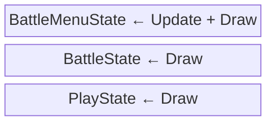

## Today's Goal

Make a **turn-based RPG**.

We go through the fundamental steps of a primitive Pokémon clone. The main topic is
**scenes and UI**: an RPG is a stack of screens on top of each other (the overworld, a
battle, a menu, a dialogue box), built from reusable UI widgets. Along the way:

- Separating UI from game data
- Turn-based battles
- The Service Locator pattern
- Saving and loading

**Source code:** [Metamate/gmd2-pokemon](https://github.com/Metamate/gmd2-pokemon)
(walkthrough in the README)

The code is split into steps, one project per concept. Each section below names the step
that introduces it. Compare neighbouring steps to see exactly what changed.

| Step | Topic |
| --- | --- |
| `Pokemon0` | The overworld: tile-based movement with tweens |
| `Pokemon1` | The state stack: title, fades and dialogue |
| `Pokemon2` | Battles: encounters, the battle scene and menus (run only) |
| `Pokemon3` | Turn-based combat and RPG mechanics |
| `Pokemon4` | Audio through the service locator (the finished game) |

## Prepare

- [19: User Interface Fundamentals](https://docs.monogame.net/articles/tutorials/building_2d_games/19_user_interface_fundamentals)
- [20: Implementing UI with Gum](https://docs.monogame.net/articles/tutorials/building_2d_games/20_implementing_ui_with_gum)
- [21: Customizing Gum UI](https://docs.monogame.net/articles/tutorials/building_2d_games/21_customizing_gum_ui)
- [Pushdown Automata](https://gameprogrammingpatterns.com/state.html#pushdown-automata)
- [Service Locator](https://gameprogrammingpatterns.com/service-locator.html)
- [Components & Services in MonoGame](https://gavsdevblog.wordpress.com/2016/09/04/monogame-components-and-services)

## Explore the Codebase

Take about 10 minutes with the finished game, `Pokemon4`:

- Clone, build and play the game. Go through a few encounters to level up your monster.
- How is the codebase split between the core library and the Pokémon-specific project?

## State Stack

_Steps `Pokemon1` → `Pokemon2`_

A finite state machine has exactly one current state. A **state stack** (a _pushdown
automaton_) lets us **push** a state on top of others and **pop** it to return to exactly
where we were.

- Only the **top** state receives `Update` (this could be changed if we wanted).
- **All** states draw, bottom to top, so states underneath stay visible.

This lets us layer screens:

- **Fades:** push a colour overlay, animate it, pop it.
- **Dialogue:** a message box sits on top of the battle scene.
- **Battles:** the field (`PlayState`) is still there, untouched, when the battle ends.



### Trace it

Files: `StateStack.cs`, `BattleState.cs`, `BattleMenuState.cs`, `FadeState.cs`

- A battle just triggered. List every state on the stack (bottom to top) once
  `BattleMenuState` is showing. Which state gets `Update`? Which states still `Draw`?
- `FadeState` pushes itself on top, animates, then pops. What would break if it
  _replaced_ the current state instead?
- Design a `PauseState`. Where do you push and pop it?

## Tweens Everywhere

_Step `Pokemon0` onwards_

Pokemon leans heavily on the tween system from [Zelda](../08-the-legend-of-zelda/#screen-scrolling--tweening):
walking between tiles, fades, the HP bar. A battle attack is a chain of tweens: pause →
lunge → hit sound → blink → HP bar drops. Each step's `.Finish()` starts the next, and a
callback can push or pop a state, with no `if`/`else` chain.

## GUIs

_Steps `Pokemon1` → `Pokemon2`_

A GUI is built from reusable widgets:

- **Panel:** background box for all UI
- **ProgressBar:** fills based on current/max (HP, EXP)
- **Textbox:** wraps text in a panel and pages through it on Confirm
- **Selection/Menu:** a list of labelled options with actions; handles navigation and the
  cursor. Adding an option is one line.

For inspiration, see [Interface in Game](https://interfaceingame.com/games/). For larger
UIs, a library such as [Gum](https://docs.monogame.net/articles/tutorials/building_2d_games/20_implementing_ui_with_gum)
saves a lot of work.

### Separating UI from game data

The HP bar should _show_ a monster's health, but the monster shouldn't know the HP bar
exists. Keep game data and rules (the _model_) separate from the UI (the _view_), and let
the view observe the model through events (see
[Observer](../08-the-legend-of-zelda/#events--the-observer-pattern)). Architectural
patterns such as [MVP](https://en.wikipedia.org/wiki/Model%E2%80%93view%E2%80%93presenter)
and [MVVM](https://en.wikipedia.org/wiki/Model%E2%80%93view%E2%80%93viewmodel) formalize
this idea.

## Overworld & Turn-Based Battles

_Steps `Pokemon0`, `Pokemon2` and `Pokemon3`_

- **Tile-based movement:** entities have a tile position (`MapX`/`MapY`, used for logic)
  and a pixel position (`X`/`Y`, tweened between tiles for smooth movement).
- **Random encounters:** each step in tall grass rolls for a battle. The transition (stop
  field music, start battle music, fade, push `BattleState`, fade in) is all push/pop.
- **Battle flow:** `BattleMenuState` (Fight/Run) → `TakeTurnState` (faster monster
  attacks first) → back to the menu if both are alive, otherwise victory/defeat.

### RPG mechanics

- `PokemonSpecies` defines a species: name, base stats, growth rates, sprites.
- `Mon` is one actual monster with its own level, stats and HP.
- Damage: `(Attack × BasePower / 10) − Defense`, minimum 1.
- Beating a monster gives EXP. `LevelUp()` returns the stat increases so the UI can show
  them.
- `Party` holds your team; `Party.Current` is the one in battle.

`PokemonSpecies` vs. `Mon` is the [Type Object](../09-plants-vs-zombies/) pattern again:
the species are defined in `pokemon_definitions.json`, as the plants were in Plants vs.
Zombies.

## Save & Load

_The species definitions from `Pokemon0`; saving is [exercise 4](#exercises)_

**Serialization** is converting an object into a format that can be stored or sent (JSON
text, bytes), and **deserialization** turns it back into an object. Loading the species
definitions with `System.Text.Json` is deserialization. **Saving the game** is the same
process in reverse:

```csharp
public record SaveData(List<MonSaveData> Party, int MapX, int MapY);

string json = JsonSerializer.Serialize(saveData);
File.WriteAllText(SavePath, json);

SaveData loaded = JsonSerializer.Deserialize<SaveData>(File.ReadAllText(SavePath));
```

Save _data_, not objects. Store what you need to rebuild the game state (species name,
level, current HP), not textures or references to other game objects.

## Service Locator

_Steps `Pokemon0` and `Pokemon4`_

From `Pokemon0`, the locator hands out the tween manager and the game's assets. In
`Pokemon4`, audio is added as one more service: every class that plays a sound asks the
locator for an `IAudio`, and `Game1` registers the real `SoundManager`.

Many classes need shared services such as audio, tweens and assets. How do they find them?

- **Pass them in** (dependency injection): explicit and testable, but tedious when a
  service is needed deep in the object graph.
- **Singleton:** easy, but couples every caller to one concrete class
  ([Flappy Bird](../02-flappy-bird/#singleton-pattern)).
- **Service Locator:** a central registry that hands out services by _interface_.

```csharp
public static class Locator
{
    public static IAudio Audio { get; private set; } = new NullAudio();
    public static void Provide(IAudio audio) => Audio = audio ?? new NullAudio();
}

// At startup
Locator.Provide(new GameAudio(content));

// Anywhere
Locator.Audio.PlayHit();
```

- Callers depend on `IAudio`, not on a concrete class, so the implementation can be
  swapped (e.g. a logging or muted audio service).
- **Null object:** before a real service is registered, `NullAudio` (which does nothing)
  stands in, so callers never need null checks.
- Dependencies are still hidden: you can't see from a constructor what a class uses.

MonoGame has a built-in locator, `Game.Services`
(`Services.AddService<IAudio>(audio)`, `Services.GetService<IAudio>()`). We roll our own
here to see how it works.

## Exercises

Start from `Pokemon4`.

1. **Overworld encounters:** find where the game goes from `PlayState` to `BattleState`.
   Which states are on the stack at that moment? What happens when a battle ends?
2. **Battles:** trace a single turn from choosing an action to showing the result. Where
   is damage calculated? How does the game decide the battle is over?
3. **Data-driven definitions:**
   - Add a new species to `pokemon_definitions.json`: a glass cannon with high attack and
     low defence. Run the game and fight it.
   - Add a `type` field (Fire/Water/Grass) to the JSON and to `PokemonSpecies`. Make
     attacks take the defender's type into account (super effective / not very effective).
4. **Save & load:** save the player's party and position to a JSON file (e.g. on a key
   press), and load it on startup if it exists.
5. **Pause:** add a `PauseState` using the state stack.

## Apply It to Your Project

- Would your game benefit from layered states (pause menus, dialogue, transitions)?
- Which services do many of your classes need? How do they get them today?
- What would your game need to save to resume a session later?

## Check Yourself

<details>
<summary>When is a state stack better than a state machine that replaces states?</summary>

When you need to return to a previous state exactly as you left it (a pause menu, a
battle, a dialogue box), or draw several states on top of each other.

</details>

<details>
<summary>How does a Service Locator differ from a Singleton?</summary>

Callers depend on an interface rather than a concrete class, and the implementation can be
swapped at runtime (e.g. a null or logging service). It is still global access, so
dependencies stay hidden.

</details>

<details>
<summary>When would you prefer dependency injection over a Service Locator?</summary>

When a class has few dependencies and they are needed close to where the object is
created. Constructor parameters make dependencies explicit and easy to replace in tests.

</details>

Related exam questions: [2](../../exam/#2-state-pattern--state-stack),
[3](../../exam/#3-singleton--service-locator),
[5](../../exam/#5-observer-pattern-events--ui),
[8](../../exam/#8-data-driven-design--serialization).
