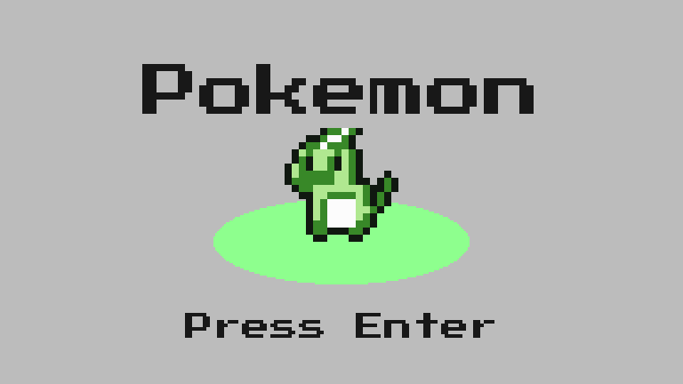
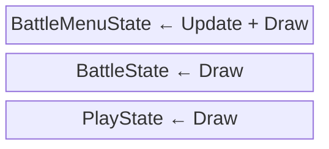

## Today's Goal

Make a **turn-based RPG**.

<figure class="original">

<figcaption>The original: the first <em>Pokémon</em> games (Game Freak, 1996). Screenshot © Nintendo / Game Freak.</figcaption>
</figure>

We go through the fundamental steps of a primitive Pokémon clone. The main topic is
**scenes and UI**: an RPG is a stack of screens on top of each other (the overworld, a
battle, a menu, a dialogue box), built from reusable UI widgets. Along the way:

- Separating UI from game data
- Turn-based battles
- The Service Locator pattern
- Saving and loading

**Source code:** [gar-games/10-pokemon](https://github.com/Metamate/gar-games/tree/main/10-pokemon).
Its README lists the steps (`Pokemon0` to `Pokemon4`, one project per concept), maps the
code and suggests an order to read it in. Each section below names the steps that introduce
it; compare neighbouring steps to see exactly what changed.

## Prepare

- [19: User Interface Fundamentals](https://docs.monogame.net/articles/tutorials/building_2d_games/19_user_interface_fundamentals)
- [Pushdown Automata](https://gameprogrammingpatterns.com/state.html#pushdown-automata)
- [Service Locator](https://gameprogrammingpatterns.com/service-locator.html)
- [Components & Services in MonoGame](https://gavsdevblog.wordpress.com/2016/09/04/monogame-components-and-services)

## Explore the Codebase

Take about 10 minutes with the finished game, `Pokemon4`:

- Clone, build and play the game. Go through a few encounters to level up your monster.
- How is the codebase split between the core library and the Pokémon-specific project?

The rule of thumb for that split: a class that mentions monsters, grass, battles or
levelling belongs to the game. A class you could use unchanged in another game (the state
stack, the tweens, a panel, a progress bar) belongs to GMDCore.

## State Stack

_Steps `Pokemon1` → `Pokemon2`_

A finite state machine has exactly one current state. A **state stack** (a _pushdown
automaton_) lets us **push** a state on top of others and **pop** it to return to exactly
where we were.

- Only the **top** state receives `Update` (this could be changed if we wanted).
- **All** states draw, bottom to top, so states underneath stay visible.

This lets us layer screens:

- **Fades:** push a colour overlay, animate it, pop it.
- **Dialogue:** a message box sits on top of the battle scene.
- **Battles:** the field (`PlayState`) is still there, untouched, when the battle ends.


```mermaid
block-beta
    columns 1
    top["BattleMenuState  ← Update + Draw"]
    battle["BattleState  ← Draw"]
    play["PlayState  ← Draw"]
```

### Trace it

Files: `StateStack.cs`, `BattleState.cs`, `BattleMenuState.cs`, `FadeState.cs`

- A battle just triggered. List every state on the stack (bottom to top) once
  `BattleMenuState` is showing. Which state gets `Update`? Which states still `Draw`?
- `FadeState` pushes itself on top, animates, then pops. What would break if it
  _replaced_ the current state instead?
- Design a `PauseState`. Where do you push and pop it?

## Tweens Everywhere

_Step `Pokemon0` onwards_

Pokemon leans heavily on the tween system from [Zelda](../07-the-legend-of-zelda/#screen-scrolling--tweening):
walking between tiles, fades, the HP bar. A battle attack is a chain of tweens: pause →
lunge → hit sound → blink → HP bar drops. Each step's `.Finish()` starts the next, and a
callback can push or pop a state, with no `if`/`else` chain.

Two details make this safe:

- **Order of updates:** every frame, the game updates the tweens _before_ the state stack.
  A tween that finishes and pushes a state has done so before the states run, so the new
  state is live in the same frame.
- **New tweens wait a frame:** a callback that starts a tween doesn't add it to the list
  that is being updated; the manager adds new tweens at the start of the next update.
  Changing a list while looping over it is a classic bug (see the re-entrancy pitfall in
  [Zelda](../07-the-legend-of-zelda/#pitfalls)).

## GUIs

_Steps `Pokemon1` → `Pokemon2`_

A GUI is built from reusable widgets:

- **Panel:** background box for all UI
- **ProgressBar:** fills based on current/max (HP, EXP)
- **Textbox:** wraps text in a panel and pages through it on Confirm
- **Selection/Menu:** a list of labelled options with actions; handles navigation and the
  cursor. Adding an option is one line.

For inspiration, see [Interface in Game](https://interfaceingame.com/games/).

### UI samples

_Project `UiSamples`_

Next to the steps, `UiSamples` puts the widgets on one screen, each on its own: a menu whose
options do something you can see, a panel, a progress bar that tweens to its new value, and
a textbox that pages through a message. While the textbox is open, it has the input to
itself and the menu waits: only one widget at a time listens to the keys, the one with the
_focus_. The samples use the game's own widgets, so what you change there changes in the
game too. Run them with `dotnet run --project UiSamples`.

**Try it** (`UiSamples`): add a fifth option that fills the bar again, and make the bar turn
red when it drops below a quarter. Which class did each change need?

### When to use a UI library

Our widgets are small enough to read in one sitting, and building them shows what a UI
needs: drawing, layout, input and focus. A library such as
[Gum](https://docs.monogame.net/articles/tutorials/building_2d_games/20_implementing_ui_with_gum)
does all of that for you, and more: layouts that adapt to the screen, scrolling lists, text
input, and a visual editor ([customizing it](https://docs.monogame.net/articles/tutorials/building_2d_games/21_customizing_gum_ui)).
The cost is a dependency, and a way of working you have to learn. For your project, a few
menus and bars are quick to build yourself; a settings screen or an inventory with
scrolling is a good reason to reach for Gum.

### Separating UI from game data

The HP bar should _show_ a monster's health, but the monster shouldn't know the HP bar
exists. Keep game data and rules (the _model_) separate from the UI (the _view_), and let
the view observe the model through events (see
[Observer](../07-the-legend-of-zelda/#events--the-observer-pattern)). Architectural
patterns such as [MVP](https://en.wikipedia.org/wiki/Model%E2%80%93view%E2%80%93presenter)
and [MVVM](https://en.wikipedia.org/wiki/Model%E2%80%93view%E2%80%93viewmodel) formalize
this idea.

## Overworld & Turn-Based Battles

_Steps `Pokemon0`, `Pokemon2` and `Pokemon3`_

- **Tile-based movement:** entities have a tile position (`MapX`/`MapY`, used for logic)
  and a pixel position (`X`/`Y`, tweened between tiles for smooth movement). The logic moves
  first: a step sets the new tile at once, and the sprite catches up over half a second.
  When it arrives, the walk state checks for an encounter, then keeps walking if a
  direction is still held.
- **Random encounters:** each step in tall grass rolls for a battle. The transition (stop
  field music, start battle music, fade, push `BattleState`, fade in) is all push/pop.
- **Battle flow:** `BattleMenuState` (Fight/Run) → `TakeTurnState` (faster monster
  attacks first) → back to the menu if both are alive, otherwise victory/defeat.

Each phase of a battle is its own state, with one job:

| State | Owns |
| --- | --- |
| `BattleState` | The scene: sprites, HP and EXP bars. It stays at the bottom and keeps drawing. |
| `BattleMenuState` | The player's choice |
| `TakeTurnState` | The order of events in one turn |
| `BattleMessageState` | A message on top, until the player confirms |

Each class stays small because it has one reason to change, and none of them needs to know
which state comes next: they push and pop.

### RPG mechanics

- `PokemonSpecies` defines a species: name, base stats, growth rates, sprites.
- `Mon` is one actual monster with its own level, stats and HP.
- Stats follow from the level: each stat is the species' base value plus half its growth
  value (1 to 5) per level. There is no randomness, so a level 5 Cindrel always has the
  same stats, and a battle can be worked out on paper.
- Damage: `(Attack × BasePower / 10) − Defense`, minimum 1.
- Beating a monster gives 5 EXP per level of the loser, and the next level takes 10 EXP per
  current level, so two wins against a monster of your own level make a level.
  `LevelUp()` returns the stat increases so the UI can show them.
- Walking onto the spring in the field heals the monster in front of the party.
- `Party` holds your team; `Party.Current` is the one in battle.

`PokemonSpecies` vs. `Mon` is the [Type Object](../09-plants-vs-zombies/) pattern again:
the species are defined in `pokemon_definitions.json`, as the plants were in Plants vs.
Zombies.

## Save & Load

_The species definitions from `Pokemon0`; saving is [exercise 4](#exercises)_

**Serialization** is converting an object into a format that can be stored or sent (JSON
text, bytes), and **deserialization** turns it back into an object. Loading the species
definitions with `System.Text.Json` is deserialization. **Saving the game** is the same
process in reverse:

```csharp
public record SaveData(List<MonSaveData> Party, int MapX, int MapY);

string json = JsonSerializer.Serialize(saveData);
File.WriteAllText(SavePath, json);

SaveData loaded = JsonSerializer.Deserialize<SaveData>(File.ReadAllText(SavePath));
```

Save _data_, not objects. Store what you need to rebuild the game state (species name,
level, current HP), not textures or references to other game objects.

The game already reads its data this way: the JSON is deserialized into small `record`
types that mirror the file's shape exactly, and the game builds its real objects from
those. Records suit this: they are plain data, and their constructors match the JSON's
fields.

Saving is also easy to get subtly wrong: a field you forgot to save only shows up the next
time someone loads the game. A **round-trip test** catches it: save some data, load it back,
and check that you got the same values. It's a unit test like the ones in
[Sokoban](../04-sokoban/#unit-tests), and it needs no window or battle, only the save data:

```csharp
[Fact]
public void A_saved_party_loads_back_the_same()
{
    var saved = new SaveData([new MonSaveData("Cindrel", Level: 5, CurrentHp: 12)], MapX: 3, MapY: 7);

    SaveData loaded = JsonSerializer.Deserialize<SaveData>(JsonSerializer.Serialize(saved));

    Assert.Equal(saved.Party, loaded.Party);
    Assert.Equal(saved.MapX, loaded.MapX);
    Assert.Equal(saved.MapY, loaded.MapY);
}
```

## Service Locator

_Steps `Pokemon0` and `Pokemon4`_

From `Pokemon0`, the locator hands out the tween manager and the game's assets. In
`Pokemon4`, audio is added as one more service: every class that plays a sound asks the
locator for an `IAudio`, and `Game1` registers the real `SoundManager`.

Many classes need shared services such as audio, tweens and assets. There are three common
ways for them to get one:

- **Pass them in** (dependency injection): explicit and testable, but tedious when a
  service is needed deep in the object graph.
- **Singleton:** easy, but couples every caller to one concrete class
  ([Flappy Bird](../02-flappy-bird/#singleton-pattern)).
- **Service Locator:** a central registry that hands out services by _interface_.

```csharp
public static class Locator
{
    public static IAudio Audio { get; private set; } = new NullAudio();
    public static void Provide(IAudio audio) => Audio = audio ?? new NullAudio();
}

// At startup
Locator.Provide(new GameAudio(content));

// Anywhere
Locator.Audio.PlayHit();
```

- Callers depend on `IAudio`, not on a concrete class, so the implementation can be
  swapped (e.g. a logging or muted audio service).
- **Null object:** before a real service is registered, `NullAudio` (which does nothing)
  stands in, so callers never need null checks.
- Dependencies are still hidden: you can't see from a constructor what a class uses.

MonoGame has a built-in locator, `Game.Services`
(`Services.AddService<IAudio>(audio)`, `Services.GetService<IAudio>()`). We roll our own
here to see how it works.

## Exercises

Start from `Pokemon4`.

1. **Overworld encounters:** find where the game goes from `PlayState` to `BattleState`.
   Which states are on the stack at that moment? What happens when a battle ends?
2. **Battles:** trace a single turn from choosing an action to showing the result. Where
   is damage calculated? How does the game decide the battle is over?
3. **Data-driven definitions:**
   - Add a new species to `pokemon_definitions.json`: a glass cannon with high attack and
     low defence. Its battle sprites are ready in `images/pokemon/` (`shardling-front` and
     `shardling-back`). Run the game and fight it.
   - Add a `type` field (Fire/Water/Grass) to the JSON and to `PokemonSpecies`. Make
     attacks take the defender's type into account (super effective / not very effective).
4. **Save & load:** save the player's party and position to a JSON file (e.g. on a key
   press), and load it on startup if it exists. Then add a `Pokemon.Tests` project, set up
   like `Sokoban.Tests`, with a round-trip test for your save data.
5. **Pause:** add a `PauseState` using the state stack.

**Going further (optional):** catching. Add a Catch option to the battle menu that can add a weakened wild monster to your party (more likely the lower its HP), and a field menu to choose who goes first. Which states do you add, and which existing ones change?

## Apply It to Your Project

- Would your game benefit from layered states (pause menus, dialogue, transitions)?
- Which services do many of your classes need? How do they get them today?
- What would your game need to save to resume a session later?

## Check Yourself

<details>
<summary>When is a state stack better than a state machine that replaces states?</summary>

When you need to return to a previous state exactly as you left it (a pause menu, a
battle, a dialogue box), or draw several states on top of each other.

</details>

<details>
<summary>How does a Service Locator differ from a Singleton?</summary>

Callers depend on an interface rather than a concrete class, and the implementation can be
swapped at runtime (e.g. a null or logging service). It is still global access, so
dependencies stay hidden.

</details>

<details>
<summary>When would you prefer dependency injection over a Service Locator?</summary>

When a class has few dependencies and they are needed close to where the object is
created. Constructor parameters make dependencies explicit and easy to replace in tests.

</details>

Related exam questions: [2](../../exam/#2-state-pattern--state-stack),
[3](../../exam/#3-singleton--service-locator),
[5](../../exam/#5-observer-pattern-events--ui),
[8](../../exam/#8-data-driven-design--serialization).
