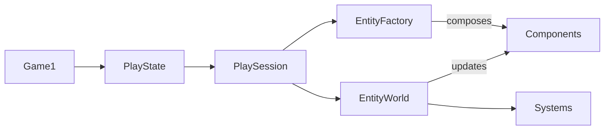

## Today's Goal

Make a **top-down shooter**.

Geometry Wars puts thousands of entities on screen: the player, enemies, bullets,
particles and a warping grid. Its entities are built from components, as in
[Plants vs. Zombies](../09-plants-vs-zombies/), but at this size a new question matters:
**which behaviour belongs in a component, and which in a system?** Along the way:

- Dependency injection, compared with the Service Locator, and testing with fakes
- Object Pool
- Flyweight
- Particles as a system

**Source code:** [gar-games/11-geometry-wars](https://github.com/Metamate/gar-games/tree/main/11-geometry-wars)
(walkthrough in the README)

The goal isn't to understand every system in the codebase, but the overall architecture.

The code is split into steps. Each step adds components to the entity recipes in
`EntityFactory`, plus the systems they need. Each section below names the step that
introduces it.

| Step | Topic |
| --- | --- |
| `GeometryWars0` | Entities & components: the player ship |
| `GeometryWars1` | Shooting & Object Pool |
| `GeometryWars2` | Enemies, collisions, score and lives |
| `GeometryWars3` | Particles |
| `GeometryWars4` | The spring grid and black holes |
| `GeometryWars5` | Bloom |
| `GeometryWars6` | Audio (the finished game) |
| `GeometryWars.Tests` | Unit tests that pass in fake services |

## Prepare

- [Component](https://gameprogrammingpatterns.com/component.html) (review from Plants vs. Zombies)
- [Dependency injection in .NET](https://learn.microsoft.com/en-us/dotnet/core/extensions/dependency-injection) (the idea; we do it by hand)
- [Object Pool](https://gameprogrammingpatterns.com/object-pool.html)
- [Flyweight](https://gameprogrammingpatterns.com/flyweight.html)

## Explore the Codebase

Take about 10 minutes with the finished game, `GeometryWars6`:

- Clone, build and play the game. How high a score can you get?
- How is the codebase split between the core library and the Geometry Wars project?

## High-Level Architecture



- `Game1` owns the application shell.
- `PlayState` owns one active gameplay state.
- `PlaySession` owns one run of the game.
- `EntityWorld` updates entities and collisions.
- `EntityFactory` builds entities by composing components.
- **Components** implement the actual behaviour.
- **Systems** handle concerns that cut across components.

## Components at Scale

_Step `GeometryWars0` onwards_

Every entity is a bag of components, composed in one place, `EntityFactory`. There is no
class per enemy type: an enemy is an entity with the components it needs. Each component
represents one clear capability, such as `Health`, `FaceVelocity`, `ApplyMovementInput` or
`TakeDamageOnBulletCollision`.

In the codebase: `GMDCore/ECS/Entity.cs`, `GMDCore/ECS/Components/Component.cs`,
`Systems/EntityFactory.cs`.

## Components vs. Systems

_Steps `GeometryWars0` → `GeometryWars4`_

Not all behaviour fits in a component. A component is about **its owner**: its own state,
and what happens to it. But some rules span **many entities** or the **whole run**: which
pairs of entities collide, when the next enemies spawn, what happens to the arena when the
player dies. Putting those in a component means one entity reaching into all the others.
They belong in **systems**.

A rule of thumb from the codebase:

| Use a component when the logic… | Use a system when the logic… |
| --- | --- |
| is mostly about its owner and its own state | touches many entities |
| can be reused on other entities | owns game or session rules |
| | needs a central order, or processes entities in bulk |
| `Health`, `Weapon`, `FaceVelocity`, `SeekTarget` | `CollisionSystem`, `EnemyDirector`, `BulletSpawner`, `PlaySession` |

For example, `BeginRespawnOnLethalCollision` is a component: it only decides when _its_
player has taken a lethal hit. `PlaySession` handles the consequences for the whole arena
(clearing enemies, resetting spawning), because those are rules of the run, not of the
player.

The **particles** (`GeometryWars3`) are the extreme case. Thousands of short-lived sparks
aren't entities with components at all: one `ParticleManager` system owns all of them and
updates them in bulk. That's a step towards data-oriented design, which
[Vampire Survivors](../12-vampire-survivors/) takes all the way.

:::note[ECS]
Taken to the end, this becomes an **Entity Component System**: entities are only IDs,
components are pure data, and all behaviour lives in systems. Geometry Wars is a hybrid:
components may contain behaviour, as long as it is local to one entity.
:::

## Dependency Injection

_Step `GeometryWars0` onwards_

Components need shared services: the input, the assets, the audio, the frame time.
[Pokemon](../10-pokemon/#service-locator) found them through a Service Locator. Geometry
Wars **passes them in**: `Game1` creates the services once, bundles them in a
`PlayContext`, and hands it to the code that builds and runs gameplay.

```csharp title="PlayContext.cs"
public sealed class PlayContext
{
    public FrameInfo Frame { get; }
    public GameController Controller { get; }
    public GameAssets Assets { get; }
    public AudioManager Audio { get; }
    public PerformanceMonitor Performance { get; }

    public PlayContext(FrameInfo frame, GameController controller, GameAssets assets,
        AudioManager audio, PerformanceMonitor performance)
    {
        // ...
    }
}
```

- **Explicit:** a constructor shows exactly what a class depends on.
- **Testable:** a test can pass in its own services, including fakes (see below).
- **The cost:** everything that needs a service must be given it, so the context is passed
  through several layers.

Three ways to reach a shared service, each seen in this course:

| | Singleton ([Flappy Bird](../02-flappy-bird/)) | Service Locator ([Pokemon](../10-pokemon/)) | Dependency injection (here) |
| --- | --- | --- | --- |
| How code gets it | `Audio.Instance` | `Locator.Audio` | passed in |
| Depends on | one concrete class | an interface | whatever is passed |
| Dependencies visible? | no | no | yes, in the constructor |
| Easy to replace? | no | yes, at runtime | yes, when constructing |

### Testing With Fakes

_Project `GeometryWars.Tests`_

In [Sokoban](../04-sokoban/#unit-tests), `Level` needed nothing, so testing it was easy. Most
code needs something. `AwardScoreOnDestroyed` needs a score tracker, and the real one saves
a high-score file and belongs to a whole play session. But the component doesn't create it
or look it up: it gets an `IScoreTracker` in its constructor. So a test can hand it a
**fake**, a small class that only records what it was asked to do:

```csharp title="FakeScoreTracker.cs"
public sealed class FakeScoreTracker : IScoreTracker
{
    public List<int> PointsAdded { get; } = [];
    public int MultiplierIncreases { get; private set; }

    public bool IsGameOver => false;
    public void AddPoints(int basePoints) => PointsAdded.Add(basePoints);
    public void IncreaseMultiplier() => MultiplierIncreases++;
    public void RemoveLife() { }
}
```

```csharp title="AwardScoreOnDestroyedTests.cs"
[Fact]
public void Destroying_the_enemy_awards_its_points()
{
    var score = new FakeScoreTracker();
    var enemy = new Entity();
    var destroyable = enemy.AddComponent(new Destroyable());
    enemy.AddComponent(new AwardScoreOnDestroyed(score, 50));
    enemy.Start();

    destroyable.Destroy();

    Assert.Equal([50], score.PointsAdded);
    Assert.Equal(1, score.MultiplierIncreases);
}
```

One entity, two components, no world, no graphics. The same goes for time: `ScoreTracker`
gets the frame time through the `FrameInfo` passed into its constructor, so
`ScoreTrackerTests` decides how much time passes, and checks that the multiplier expires
without waiting for it.

Compare the other two ways to reach a service. With `Audio.Instance` or
`Locator.Audio`, the dependency is hidden inside the class. A test can only replace a
Service Locator's service by changing global state, and a Singleton not at all. With
dependency injection, the test simply passes something else in.

## Object Pool

_Step `GeometryWars1`_

**The problem.** 20 bullets per second, 30 particles per hit, 50 debris pieces per enemy:
thousands of short-lived allocations per second. In C#, every `new` object will
eventually be collected by the garbage collector, and GC pauses are unpredictable. A
stutter every few seconds is the telltale sign of allocation in a hot loop.

**The solution.** Allocate everything up front and reuse inactive objects:

```csharp
public class ParticlePool
{
    private readonly Particle[] _items = new Particle[5000];

    public ParticlePool()
    {
        for (int i = 0; i < _items.Length; i++)
            _items[i] = new Particle();
    }

    public Particle Spawn(Vector2 position)
    {
        foreach (var particle in _items)
        {
            if (!particle.Active)
            {
                particle.Reset(position);
                particle.Active = true;
                return particle;
            }
        }
        return null; // Pool exhausted: size it generously
    }
}
```

Pooled objects must be fully **reset** when reused, or old state leaks into the new
"instance".

In the codebase: `ObjectPool.cs`, `BulletSpawner.cs`.

## Flyweight

_Step `GeometryWars0` onwards_

**Share what's shared, store what's unique.** 500 enemies on screen, all using the same
sprite and stats.

- **Intrinsic state** is shared and immutable: the texture and the stats template.
- **Extrinsic state** is per instance: position, velocity, current HP.

```csharp
// Intrinsic (shared): one instance, referenced by every enemy of this type
public class EnemyType
{
    public Texture2D Texture;
    public float MaxSpeed, SpawnHP;
    public int ScoreValue;
}

// Extrinsic (per instance)
public struct EnemyInstance
{
    public EnemyType Type;
    public Vector2 Position, Velocity;
    public int CurrentHP;
}
```

500 enemies hold 500 references to one texture, not 500 copies of it.

In the codebase: `GameAssets.cs`, `GameplayDefinitions.cs`.

## Shaders (Showcase)

_Step `GeometryWars5`_

Geometry Wars' neon glow and warping grid are shader work. We look at it as a demo; it
isn't required for your project.

- **Vertex shaders** run once per vertex; **pixel shaders** run once per pixel. The GPU
  runs thousands of them in parallel.
- MonoGame uses HLSL `.fx` files. See [24: Shaders](https://docs.monogame.net/articles/tutorials/building_2d_games/24_shaders/).
- **Bloom:** render the scene to a `RenderTarget2D`, keep only the bright pixels, blur
  them (horizontal, then vertical), and add them back over the scene.

## Summary

| Concern | Answer |
| --- | --- |
| What an entity _is_ | Components |
| Where behaviour across entities lives | Systems |
| How code gets shared services | Dependency injection |
| When entities are allocated | Object Pool |
| What entities share | Flyweight |
| How entities look | Shaders (demo) |

## Exercises

Start from `GeometryWars6`.

1. **Composition:** create a new enemy type purely by combining existing components in
   `EntityFactory`. Then add one new component (e.g. a shield that absorbs one hit) and
   give it to an existing enemy.
2. **Component or system?** Add a bomb (one per life, on a key) that destroys every enemy
   on screen. Which parts are components, and which belong in a system? Where does "one
   per life" live?
3. **Dependency injection:** add a screen-shake service to `PlayContext`, and shake the
   screen when the player dies. Which classes had to change? What would change with a
   Service Locator instead?
4. **Test with a fake:** `SpawnTwinBulletsOnFired` gets an `IBulletSpawner` in its
   constructor. Write a `FakeBulletSpawner` and a test that checks that firing the weapon
   spawns two bullets. What makes this harder to test than the score? (Hint: the spread
   uses `Random.Shared`.)
5. **Measure pooling:** add an on-screen counter of allocated bytes and gen-0 GCs per
   second (`F3` already shows the memory). Temporarily replace the bullet pool with `new`
   and compare.

## Apply It to Your Project

- Which of your game's rules are about one entity, and which span many? Where do they
  live today?
- How do your classes get shared services (audio, assets, input)? Would passing them in
  make the dependencies clearer, and let you test the class with a fake?
- Does anything in your game allocate every frame?
- Which data is shared between many instances, and which is unique?

## Check Yourself

<details>
<summary>When should behaviour live in a system rather than a component?</summary>

When it spans many entities, owns rules of the whole game or session, or needs a central
order. A component should be about its owner; otherwise it ends up reaching into other
entities.

</details>

<details>
<summary>What does dependency injection give you that a Service Locator doesn't?</summary>

The dependencies are explicit: a constructor shows what a class needs, and a test can pass
in a replacement. The cost is that services must be passed through every layer that needs
them.

</details>

<details>
<summary>What is a fake, and why does dependency injection make it easy to use one?</summary>

A small stand-in for a real dependency, written for a test, that records what it was asked
to do. When a class gets its dependencies through its constructor, the test simply passes
the fake in. When the class finds them itself (a Singleton or a Service Locator), the fake
has to replace global state, or can't be used at all.

</details>

<details>
<summary>What is the difference between Object Pool and Flyweight?</summary>

Object Pool reuses _instances_ to avoid allocation over time. Flyweight shares _data_
between many instances to avoid duplicating it.

</details>

Related exam questions: [1](../../exam/#1-game-loop--update-method),
[3](../../exam/#3-singleton--service-locator),
[9](../../exam/#9-components--systems),
[10](../../exam/#10-memory--performance).
